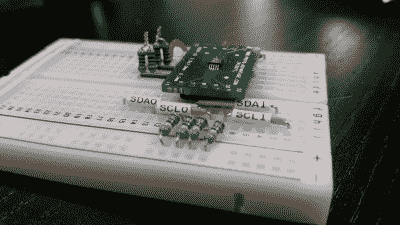
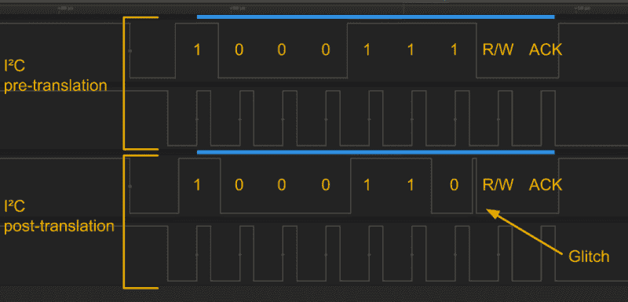

# LTC4316 是 I2C 的巴别鱼

> 原文：<https://hackaday.com/2017/02/17/ltc4316-is-the-i2c-babelfish/>

LTC4316 很特别。它是一个 I C 地址转换器，可以改变一个设备的地址，否则它会与同一条 I C 总线上的另一个设备发生冲突。不是黑客？没那么快。这个芯片到底是如何完成这个把戏的，这已经足够聪明了，我忍不住给它一个它应该得到的位置。

### 即时翻译

有什么特别的？这种芯片动态翻译地址，使其对 I2C 协议透明。到目前为止，我们解决地址冲突的最好办法是将冲突芯片放在一个独立的 I C 总线上，该总线可以有选择地启用或禁用。在那个部门，有 PCA9543 和 PCA9547 解复用器，我们在之前已经见过[。这两种装置本质上都像单向止回阀。要寻址任何下游器件，我们必须首先寻址多路复用器并选择相应的总线。虽然这些芯片解决了我们的地址冲突问题，虽然在技术上有办法解决](https://hackaday.com/2015/08/12/i2c-bus-splitting-with-a-more-professional-touch/)*[非常多的设备](http://mindbleach.com/words/i2c-and-device-limits/)* 如果我们没有时间限制，解决各种总线深度所需的控制逻辑对于嵌套的解复用器来说会变得笨拙。

LTC4316 的经典之处在于，它通过将所有设备保持在同一总线上来保持简单性。它使我们不必编写复杂的软件程序来处理多路分解的 I2C 总线的各个部分。简而言之，由于是*协议透明的*，LTC4316 使我们的 I C 主机的控制逻辑保持简单。

### 它是如何工作的

我模拟了一个快速测试设置，在现实生活中尝试一下这个芯片。



and, by-golly, do I love that heat-shrink tubing labeler….

LTC4316 位于我们的地址冲突设备和 I C 总线的其余部分之间，充当临时止回阀。当一个地址沿着线路发送时，它会被传输到地址冲突设备看到的“私有”SDA 线路。

一旦所有七个地址位流过，专用 SDA 线立即重新连接到系统 I C 总线(不再有止回阀),这样，如果总线主控器选择了地址冲突器件，它就可以应答应答。如果选择了*,通话正常进行，直到传输结束，此时专用 SDA 线路再次断开，以设置下一次 I C 传输。至于这种断开的确切时间，数据手册没有具体说明，尽管我怀疑是在 I C 传输完成之后。*

 *

设置适当的地址就是在引脚 XORL 和 XORH 上指定正确的电压。每个电压决定器件内部 XOR 逻辑的高三位和低四位转换位。为了确定我们想要的确切翻译字节，我们遵循两个步骤。首先弄清楚我们希望我们的系统总线使用什么地址来与地址冲突设备对话。然后我们需要知道地址冲突设备的默认地址。有了这两个地址，我们就可以得出等式:

```
new_address ^ translation_byte = default_address
```

…这意味着我们需要执行反向 XOR 运算来获得我们的翻译字节。幸运的是，XOR 的逆运算是 XOR，所以我们只需要求解:

```
new_address ^ default_address = translation_byte
```

唷——这并不太难。

为了设置正确的电压，数据手册建议使用分压器。乍一看，这个选项似乎有些低效。幸运的是，数据手册建议电阻在 100 千欧范围内，这对于除了最严格的功率限制之外的所有情况都足够了。

### 已知错误

地址转换后，SDA 线有微小的机会出现“毛刺”,并在短时间内吐出一个额外的逻辑高电平(如上所示)。

该问题记录在数据手册的“毛刺”部分。幸运的是，这并不妨碍交易。由于 SDA 数据仅在 SCL 时钟线的上升沿后读取，因此多余数据不会被检测到。至于这个小故障从何而来，数据表没有明确说。然而，我有一种预感，这个小故障与 LTC4316 断开其 XOR 电路并将专用 SDA 线重新连接到系统 SDA 线的时间重合。

### 为什么现在翻译？

I C 已经存在了 30 多年，但 LTC4316 直到 2015 年才出现在我们的试验板上。为什么一个看起来如此有用的芯片会有如此大的延迟？这里没有明确的答案，但这是我最好的猜测…

I C 最初是由飞利浦(现在的恩智浦)开发的，作为主要用于消费电子产品的引脚受限设备的低速协议。这里的思维模式是许多消费设备都有相似的界面(lcd 显示屏、按钮面板等)。)可以由专用设备处理，该专用设备然后可以根据请求将它们的结果传送到别处。这个概念是模块化的最好体现。在这里，复杂的功能由专用设备处理，释放了主控制器的负载。

I C 器件产品组合已经发展到可以容纳数百种新器件。不过，在大多数情况下，如果我们想在一个系统中使用任何给定设备的一个或多个副本，制造商几乎肯定已经启用了某种方式来配置一个或多个设备地址位。这就是为什么我们这么久都不会看到地址转换芯片出现的第一个原因:制造商可能已经预测到了我们的需求，并在设备中内置了地址转换功能。想多用一两个 [PCA9685](https://cdn-shop.adafruit.com/datasheets/PCA9685.pdf) 十六路 LED 驱动器？没问题。只需切换六个可用地址引脚之一。您的 BMA180 加速度计地址是否与另一个 I C 设备地址冲突？没问题。只需将引脚 1 连接到逻辑低电平或逻辑高电平，即可将地址交换给备用引脚。

接下来，对于我们想要处理一个设备的多个副本的情况，已经有一个现成的解决方案:把那个设备放在一个隔离的总线上，就像我们前面讨论的那样。是的，软件的复杂性有所提高，但是除非我们解决总线多路分解器的嵌套层次，否则软件仍然相当简单。从这个意义上来说，当你可以将冲突设备碰撞到另一条总线上时，为什么要改变 I C 地址呢？

在我看来，I C 地址转换的最大应用可能是重新利用智能手机 MEMs 传感器。像 BNO055 IMU 或 VL530X 绝对距离传感器这样的传感器可能会在机器人领域的大阵列中获得第二次生命。假设这些地址是固定的，翻译器可能在这里有它的第一个用例。

至于这个芯片一般的实际用途，谁知道呢？然而，当有一天地址翻译进入我们的视线时，我们会准备好处理它。*