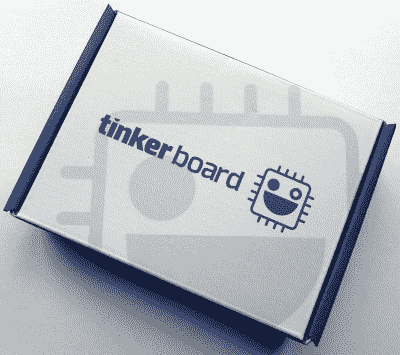
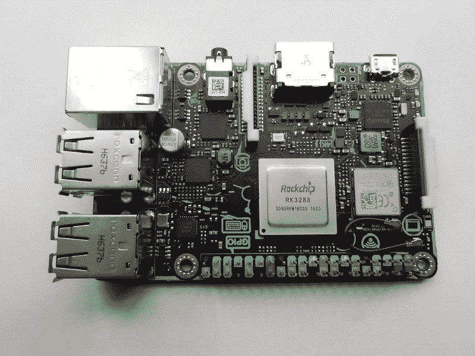
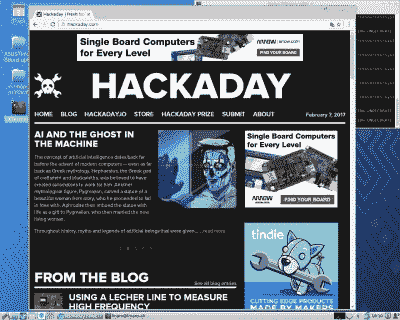
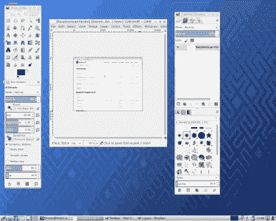
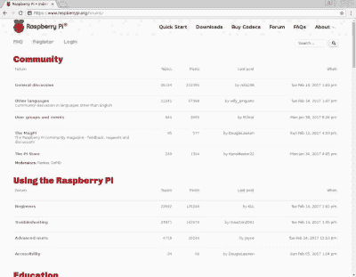

# 评论:华硕修补板(更新)

> 原文：<https://hackaday.com/2017/02/15/review-the-asus-tinker-board/>

自从最初的 Raspberry Pi 发布以来，我们已经看到这个基于 ARM 的英国小主板成为业余爱好者、制造商和黑客社区中更受欢迎的单板计算机之一。尽管其他制造商尽了最大努力，它仍然保持了这一地位，我们已经看到一系列竞争对手的主板通过模仿它的外形直接复制它。它们中没有一个对 Pi 享有的销售数字有显著影响，但是它们继续定期出现。

我们最近为您带来了这个领域最新挑战者的消息，以华硕修补板的形式出现。这是一个让我们刮目相看的董事会，因为与之前的玩家不同，这次我们有一个来自行业巨头的产品。我们大多数人都可能拥有至少一个华硕产品，事实上你很有可能正在华硕的电脑或显示器上阅读这篇文章。华硕在他们的时代制造了一些非常高质量的硬件，所以也许这款产品会继承一些遗产。因此，我们怀着一种期待的心情订购了第一批修补板中的一个，并急切地等待着邮递员。

### 更新:

华硕营销团队的一名成员阅读了这篇评论，并联系了 Hackaday，提供了一些更新的信息。根据我们的讨论，修补板还没有正式推出。这很好地解释了修补板的现状。正如 Jenny 在她下面的评论中提到的，对主板的软件支持尚未到位，并且正如评论中提到的，您不能在美国和大多数其他市场购买。CES 之后不久，SlideShare 上泄露了一张内部幻灯片(这解释了我们之前的报道),随后英国市场的一家零售商在华硕发布日期之前出售了这些主板(这就是我们如何得到这款产品的)。

华硕告诉我们，他们的目标是在 2 月底推出日期，也许最快在 26 日为美国，英国和台湾。其他市场可能会有一些变化，所有这些都取决于与地区经销商的协议以及向他们进货。随着发布，将会有最终的操作系统发行版(基于 Debian 的 TinkerOS)、原理图、机械框图等。华硕告诉 Hackaday，为 Tinker 板上的 Rockchip 提供硬件视频加速是重中之重。将该特性与 Linux 挂钩的主板支持包尚未完成，但将在发布日或之后不久推出。更新到此结束，请欣赏下面珍妮列表的完整评论。

### 第一印象

Just what you want the postman to deliver!

包装就像你期望的那样专业，来自这样一个大制造商，一个顶上有修补板标志的小纸箱。打开它，主板被一个防静电袋包裹在纸板托盘上。托盘下面是一本薄薄的说明书，还有一个贴在修补板处理器上的散热器。

打开电路板包装，很明显它是 Raspberry Pi 外形的忠实物理克隆。不同于一些 PI 克隆，如 Odroid 板，它在与 Pi 完全相同的位置上具有微型 SD 卡、相机和 LCD 连接器，并复制所有 Pi 的外部连接。这是一个安全的赌注，这将适合大多数的覆盆子 Pi 案件。不过，它确实设法适应了一点额外的东西，有一个用于 onbard 无线芯片组的可拆卸天线连接器，隐藏在 LAN 和 USB 连接器之间的是一对用于 PWM 和 SPD/IF 音频的未填充孔。

The Tinker Board in all its glory.

在电路板上，除了 Rockchip RK3288 片上系统之外，还有一个 Rockchip RK808 电源管理/时钟芯片、Realtek 以太网和音频编解码器芯片以及一个 Genesys USB 集线器芯片。还有一个带可拆卸天线的无线模块，支持 802.11 和蓝牙。在底部是内存芯片，和 SD 卡插座。

美观的设计非常引人注目，主板上有每个连接器的图案和标签。一个特别好的触摸来自 GPIO 头，它的塑料是彩色编码的，以识别不同类型的引脚。

开始使用修补板的过程与在 Raspberry Pi 上的过程非常相似。将一个功能强大的微型 USB 充电器连接到它的电源端口，添加一个 HDMI 显示器和一个 USB 键盘和鼠标组合，你就可以从微型 SD 卡启动操作系统。

### 路上的几个坑洼

不过，在这一点上，我们遇到了一个障碍。覆盆子 Pi 的所有者习惯于访问网站，点击下载链接，选择一个操作系统映像，并遵循全面的说明，但华硕校场板用户会在他们的传单上看到以下说明:

> 从 Tinker Board 网站下载操作系统映像，并使用第三方 ISO 软件(如 Win32DiskImager)将其刻录到 micro SD 卡中。

这一切听起来非常有希望，但有一个不幸的遗漏。**没有修补板网站**。没错，一家大型跨国硬件公司生产了一款高质量的产品，却忽略了创建与之配套的在线组件。

对于那些准备搜索的人来说，华硕驱动程序下载网站现在有一个部分[，在那里你可以找到一些可下载的资源，包括一对操作系统映像。这在产品上市后的一段时间内是看不到的，但在包裹开始落在门垫上之前就出现了。想必华硕的某些人已经意识到，提供一款没有软件的产品可能会遭到严厉批评，这是他们能做的最好的事情。我们猜测大多数 Hackaday 读者会发现将下载的图像安装到 SD 卡上没有问题，这很方便，因为华硕没有提供任何说明。幸运的是，](https://www.asus.com/uk/supportonly/TInker%20Board2GB/HelpDesk_Download/)[树莓基金会的指示](https://www.raspberrypi.org/documentation/installation/installing-images/README.md)也适用于董事会。

### 作为台式电脑的修补板

The most important test for a new computer.

因此，在探索了华硕支持系统中 Debian 映像的凹处之后，我们的修补板就被激活了。在一个非常快速的启动序列之后，我们得到了一个 LXDE 桌面，上面有几个包含 GPIO 和 WiringPi 软件的文件夹，可以帮助我们开始与硬件对话。连接一根以太网电缆并启动 Chromium 给了我们一个相当快速的通用网络浏览平台，明显比在 Raspberry Pi 3 或 Odroid C2 上的相同体验要快。

使用几分钟后，一个奇怪的问题变得很明显，任何输入的东西都有损坏。这是通过我们的台式键盘的外围设备替代物追踪到的，这是一个老式的 IBM 型键盘。它是这里的标准输入设备，多年来一直如此，它和一个微软鼠标被永久地插入一个 PS/2 到 USB 适配器，该适配器悬挂在台式 USB 集线器上，以避免计算机必须提供 M 型的巨大功率需求。这些年来，这个组合已经在无数各种各样的计算机上运行过，但是由于某种原因，修补板第一个拒绝了它。USB 键盘和鼠标的替代品解决了这个问题，但它指出了主板对 USB 外设的处理有问题。

The GIMP is as smooth as you’d expect it to be on your PC.

有了可用的键盘，修补板就成了一台非常强大的台式机。当 Raspberry Pi 3 去年发布时，[Brian Benchoff]称赞它是单板计算机系列可以拥有一台可信的桌面计算机而不是业余爱好者的玩具的时刻，但尽管这在今天仍然是真实的，但一个普通的 Pi 3 桌面用户仍然会经常发现自己被提醒他们已经接近他们设备的能力极限。

修补板在桌面上真正展示了它额外的力量。虽然它永远无法与高端 PC 工作站相媲美，但您可以在它上面正常工作，而不会感到受到阻碍。

### 那些别针怎么样？

拥有一个 Linux 桌面是非常好的，但是我们中的许多人会对 GPIO 线更感兴趣。打开包含 Python GPIO 库的文件夹，很明显它是 RPi 的衍生物。Raspberry Pi 用户将会习惯的 GPIO 库。将一个快速测试脚本放在一起以摆动一个 GPIO，结果显示没有那个名字的库，但是在快速运行安装过程以确保库在适当的位置之后，发现名字是 ASUS.GPIO。GPIO as GPIO”产生了一个脚本，其行为与您对其 Pi 祖先的预期完全一样。

自述文件警告说，SPI、I2C、单线、硬件 PWM 和串行功能尚未实现，但建议我们关注这一领域。鉴于该产品的网络支持乏善可陈，看看他们是否会兑现承诺将会很有趣。

修补板使用测试的最后一点来自我们的温度测量。无论我们如何努力，我们可靠的辐射温度计都无法记录 SoC 中任何超过 27 摄氏度的温度。这与之前在 44 度没有散热器的树莓 Pi 和我们在 37 度测量的 Odroid C2 的散热器相比非常有利。因此，提供的粘贴式散热器感觉几乎是多余的，我们当然认为没有必要将其安装到我们的测试设备上。

这款主板和 Raspberry Pi 3 的性能指标评测已经在其他地方做得很烂了，所以我们在这里重复它们没有什么意义。可以说，人们很容易相信 Tinker Board 的速度是其竞争对手的两倍。批评者指出 RK3288 是一款比平板电脑市场前沿产品略旧的 SoC，但在这种应用中，其 1.8GHz 的时钟速度和 2GB 的内存足以将 Pi 3 的 1.2GHz 和 1GB 抛在身后。然而，这并不是全部，因为 Tinker Board 的 Rockchip 有一个 Cortex A17 32 位处理器，而 Pi 的 Cortex A53 有 64 位能力。因此，如果 Pi 运行的是 64 位操作系统，而不是 32 位的 Raspbian，两者之间的竞争可能会更加激烈。

由于缺少可用的显示器，我们无法测试 Tinker Board 的一个特性是高分辨率性能。该委员会支持 4K 之前的决议。

### 购买的理由和避免的理由

那么，在对廷克董事会的经历进行了如此详尽的描述之后，我们的结论会是什么呢？

对于硬件来说，Tinker 板肯定是一个令人印象深刻且执行非常好的板。它很快，看起来很漂亮，虽然它绝不是同类产品中最便宜的单板计算机，但也不是最贵的。华硕充分展示了他们在生产高质量硬件方面的专业知识，结果是一个克隆的树莓派硬件，几乎在所有方面都比真正的树莓派好得多。我们甚至会原谅它拒绝处理我们使用了三十年的个人电脑键盘。

编者按:请阅读从本文第三段开始的更新，并在阅读下面的批评时将它放在上下文中。

The community is the true added value in a Raspberry Pi.

但在华硕公关部门疯狂地将这句话与 Pi 相提并论之前，还有一个障碍。对于一台好的单板计算机来说，不仅仅是硬件，我们还要考虑软件和支持。这种板不仅会被 Linux 专家使用，它最终也会被对计算感兴趣的普通人使用。其中一些甚至可能最终落入年轻人手中，对于这些市场来说，购买的无形方面比有形硬件更重要。当你买一个树莓派的时候，在大多数情况下，你是把它作为 Raspbian 的工具来买的，当你迷路的时候，你也买了树莓派论坛和它的社区，他们会为你提供重新开始所需的答案。

乍一看，似乎华硕在这方面做得很好，毕竟 Debian 发行版没有你在例如 Odroid C2 的 Ubuntu Mate 发行版中发现的粗糙边缘。它没有附带 Raspbian 预装的一些桌面软件，但所有这些都只是一个权宜之计。

不幸的是，如果你也不得不自己寻找并下载发行版，你就会明白华硕在克隆树莓派上的失败之处。可以理解的是，他们不能立即复制围绕 Pi 的巨大社区，但甚至不用为该产品的网站费心，这令人难以置信。有一个关于硬件公司在软件方面有时毫无用处的故事，正如我们在智能电视机上看到的糟糕界面所证明的那样。但是你可能会期望他们看到他们正在复制的产品，至少*会试着*去理解它不仅仅是电路板。发布如此完美的硬件，却不提供最基本的在线支持服务，这是一个我们已经见过很多次的错误。这是一个华硕应该立即采取措施来补救，如果他们希望这种板出售给更多的硬件爱好者。

所以我们会建议你买一块修补板吗？我们当然会，这是一个神奇的硬件，作为一个 Hackaday 读者，你可能会从中获得最大收益。我们会建议您在没有有意义的支持服务支持的情况下将它推荐给其他人吗？当然不是，除非你想成为那个人的私人支持热线。告诉他们买一个树莓 Pi 3 代替。但也不一定总是这样。华硕，这取决于你通过提供用户需要的框架来完成这个旅程，然后他们才能开始喜欢和崇拜 Tinker Board。