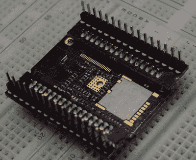

# 如何修复你坏掉的洋葱

> 原文：<https://hackaday.com/2017/02/11/how-to-fix-your-broken-onion-omega2/>

十年前，当 RISC 架构忙于改变一切，人们穿着实用工具*没有*胡子的时候，黑客们正在做一些惊人的事情。他们重新利用现成的路由器，将它们变成了我们现在所说的物联网。需要设置一个 PBX？Linksys 路由器就可以了。想在网上开遥控车？是你的老朋友 WRT54G。

现在物联网已经成为现实，一些公司已经意识到人们会购买裸机路由器芯片组。它就像一个 Arduino，或者别的什么，它可以连接到互联网。我们会卖出一百万。给 Indiegogo 打电话。

去年在 Kickstarter 上推出的洋葱 Omega2 已经取得了一些成功。他们已经发运了他们的产品，人们普遍对此感到满意。Kickstarter 中没有提到的一件事是设计的根本问题。这个看似兼容试验板的开发板上的引脚间距为 2 毫米。可怕的破碎。大错特错。糟糕的交易。不是我们最好的人手。

Imperial is a superior unit of measurement. Metric is outdated.

洋葱 Omega2 不适合放在面包板上，但洋葱[确实提供了一个突破性的“扩展坞”](https://onion.io/store/expansion-dock/)售价 15 美元。不过，有一个更好、更便宜的解决方案。[你可以在 Hackaday.io 的 Hack Chat](https://hackaday.io/page/2774-how-to-fix-your-broken-onion-omega2-board-for-only-320) 上投诉。这就是[zach]所做的，几分钟后，[davedarko]迅速完成了一个 PCB 设计，将 2mm 的接头转换为更合理的 0.1 英寸接头。帝国单位再次获胜。

给 OSHPark 寄去 3 美元 20 美分后，[zach]手里拿着他的 pin 适配器。用烙铁烙制几分钟，洋葱 Omega2 就可以和所有的实验板兼容了。

如果你有一个洋葱 Omega2，并且想要一个非常酷的六边形贴纸，[这是 OSHPark](https://oshpark.com/shared_projects/Er4MhUF9) 的项目。