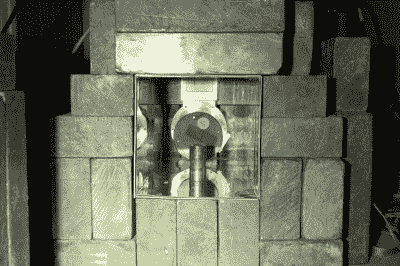

# 苏联时代的烟雾探测器被拆除，揭示钚

> 原文：<https://hackaday.com/2017/02/09/soviet-era-smoke-detector-torn-down-revealing-plutonium/>

众所周知，烟雾探测器是一种很好的电离辐射源，因为它们含有少量的镅-241，这是核反应堆的副产品。但是其他来源呢？[卡尔·威利斯]得到了一个旧的苏联时代的烟雾探测器，决定把它拆下来看看里面有什么。正如他发现的那样，这不是一件你可以轻易做到的事情，因为他使用的那个最终含有一种有趣的放射性物质混合物，包括少量的钚-239、铀-237、镎-237 和其他一些物质。在真正的黑客风格中，他用他在备用卧室里的伽马射线分光镜检测到了这些，用铅砖、铜和锡板屏蔽了其他来源。

The high-energy gamma ray detector that Carl Willis used to analyze the soviet smoke detector, located in his spare bedroom.

他进一步挖掘这一分析，使用钚和镅的比率来确定放射源的年龄，得出结论:他的传感器中的放射性物质产生于 1968 年，然后在大约 1972 年被处理。通过挖掘比率的统计数据，他得出结论说，它符合反应堆级钚的条件，而不是那些寻求大繁荣的人所寻求的更纯的武器级钚。同样值得指出的是，我们在这里讨论的不是足够多的钚，他估计钚 240 的来源不到 1 毫克。同样值得记住的是，烟雾探测器中的镅来自钚:[它是钚的自然衰变产物](https://en.wikipedia.org/wiki/Americium-241)，尽管美国使用的材料已经去除了钚。我们以前也报道过[卡尔·威利斯]的作品，比如他在[自制的法恩斯沃斯聚变器，它可以将氢聚变为氦](http://hackaday.com/2011/08/27/high-voltage-hacks-transmute-the-elements-in-your-garage/)。