# 黑客攻击:你能用打火机和纸伪造一个电视遥控器吗？

> 原文：<https://hackaday.com/2017/02/20/hackbusting-can-you-fake-a-tv-remote-with-a-lighter-and-some-paper/>

我们最近发表了一篇文章，在这篇文章中，显然有人用一个打火机和一张纸模拟一个遥控器来控制他们的电视。这张纸上有一个条形码，像是一个所谓的[“通用待机信号”](https://www.docdroid.net/Vl7wvFO/universal-standy-signal.pdf.html)。这个视频理所当然地吸引了大量的观众，一些人对它的简单感到敬畏，另一些人则对它的说法持怀疑态度。

来自一些通用的“病毒生活帮”制作公司，背景音乐的特点，更适合地下狂欢比技术视频，当然没有做任何好处。任何有一定经验的活动家都会知道，现代电视和遥控器都经过精心设计，以防止此类事故的发生。我们在 Hackaday 的许多人都认为，要欺骗这个系统，需要比荧光体打火机和一张 A4 纸稍微复杂一点的东西。所以我们测试了一下。我们的裁决？不太可能，但也不是不可能。(无论如何，我们很确定这个视频是假的。)但是足够的推测，我们是来做科学的。

 [https://www.youtube.com/embed/S5BE6IVeBbE?version=3&rel=1&showsearch=0&showinfo=1&iv_load_policy=1&fs=1&hl=en-US&autohide=2&wmode=transparent](https://www.youtube.com/embed/S5BE6IVeBbE?version=3&rel=1&showsearch=0&showinfo=1&iv_load_policy=1&fs=1&hl=en-US&autohide=2&wmode=transparent)

## 小心承运人:

视频方法中最明显的不一致是省略了红外遥控器通常使用的 38-40 千赫载波。

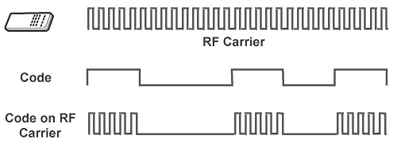

Credits: [http://www.laser.com](http://www.laser.com)

使用载波传输开关信号有两大优势:

1.  将传输频率优化至更适合媒体的频率。这将使产生的失真和损失最小化。
2.  防止虚假传输和噪声背景造成的信号污染

运营商的基本角色使其在电视端的命令解码过程中成为关键。接收器被设计成对一个特定的频率作出反应。如果我们丢弃了航母，这些还能用吗？

## 输入红外接收器:

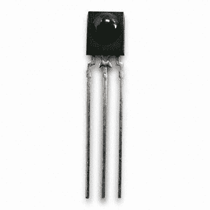

如果你拆开你的电视或任何其他使用红外遥控器的电器，你很可能会看到其中之一。红外接收器通常是 3 针设备，不要与红外光电二极管或红外晶体管混淆。

后者完全不考虑调制方案，而是简单地响应正确的波长。

另一方面，红外接收器包含红外光电二极管(或晶体管)和附加电路，以限制 38-40 kHz 通带以外的信号。一旦出现 AM 型调制载波，它就会被解调并出现在器件的输出引脚上。

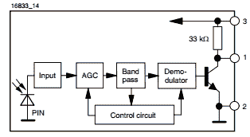

Credits: [Vishay TSOP4838 Datasheet](http://www.farnell.com/datasheets/2049301.pdf?_ga=1.128315660.1410690370.1482156473)

对我们的研究至关重要的元件性能是 AGC(自动增益控制)和带通滤波器。它们防止噪声环境在输出端引起杂散响应。

AGC 的工作是优化周围环境噪声的增益。例如，如果您的荧光灯由于嘈杂的电子镇流器或甚至打火机产生低频位模式而发出一些高频 IR，AGC 将降低接收器的整体灵敏度。一旦该信号通过带通滤波器，它将被充分衰减，从而被解调器拒绝。复杂的红外接收器甚至采用智能控制电路，根据信号长度抑制一些带内噪声。这对黑客来说不太好。

## 黑客有希望吗？

理论上，这种黑客行为看起来已经完成、尘埃落定、彻底失败了！甚至在我们开始翻查数据手册寻找波德图以给出最后一击之前；很明显，带通滤波器必须非常差才能泄漏信号，其频率比标称载波低几个数量级。

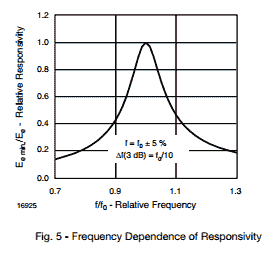

Credits: Vishay TSOP4838 datasheet

乍一看，带通滤波器表现相当不错。图 5 显示了相对于标称频率的响应，接收机对频率的响应。这种红外接收器的 3 dB 带宽约为 4 kHz，只有大约一半的信号在 34 kHz 或 42 kHz 时通过。

不幸的是，该图并没有一直向下延伸到我们感兴趣的低基带频率。我们可以推断，在这些频率下，响应会严重下降。然而，这仍然不能保证带外信号会衰减**足够多**以被后续级成功抑制。我们到底需要多少衰减？

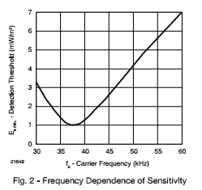

也许，更有启发性的是图 2。它显示了触发给定频率输出所需的辐照度。

距离标称频率几乎一个倍频程，我们只需要七倍的辐照度来触发输出。假设向左进行粗略的线性外推，使用典型的 1 kHz 基带信号，我们需要大约 10 dB 的入射功率增益来直接触发输出。那还不算多！

考虑到光源(如火焰)的辐照度遵循平方反比定律。如果在足够近的地方购买打火机，红外接收器可能只接收基带信号。这真的给黑客带来了一些希望吗？！

## 让我们测试一下

我不想撒谎。我希望这项调查需要一些彻底的“在板凳上”的测试，而不仅仅是贷款本身只是一些书籍工作！图表提供的洞察力当然给了我一个启动示波器的借口！

我决定以一种文明的方式进行，一种不涉及破解一些 A4 纸并制造潜在火灾危险的方式。相反，我会通过理想化所有条件，让他的黑客攻击更容易成功。我们需要一系列测试来证明，无论输入信号是以低频基带形式还是以高频载波嵌入形式呈现，红外接收器都能如实再现输入信号。

### 测试一

[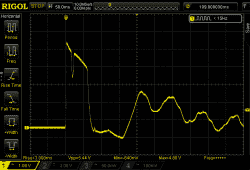](https://hackaday.com/wp-content/uploads/2017/02/ir-transistor-lighter-on.png)

IR Transistor response to a lighter ignition 50cm away

在这个测试中，我想看看一个简单的红外晶体管在有火焰的情况下会有什么反应。我探测了一个红外晶体管的集电极，发现它对打火机完全敏感。打火机一点燃，晶体管就饱和，恢复并继续对火焰做出反应。现在考虑到红外接收器中存在的放大级，这可能会造成严重破坏。

显然，打火机是一个非常强的红外辐射源，这是欺骗红外接收器的理想选择。

### 测试二

让我们继续实际的红外接收器。我的零件箱里有两种型号。我给它们加电，探测输出引脚，点燃打火机。令我惊讶的是，他们都被愚弄到在输出端产生一些位模式。我甚至能听到房间另一头的回应！

然而，灵敏度和响应取决于所用的接收器。有金属屏蔽的手机表现比光秃秃的黑色机身手机差很多。事实上，看看下面的两个范围拍摄。你能区分遥控器和打火机的位模式吗？

[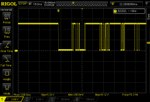](https://hackaday.com/2017/02/20/hackbusting-can-you-fake-a-tv-remote-with-a-lighter-and-some-paper/ir-recevier-output-lighter/)

Lighter

[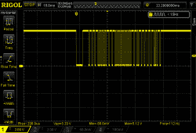](https://hackaday.com/2017/02/20/hackbusting-can-you-fake-a-tv-remote-with-a-lighter-and-some-paper/ir-recevier-output-remote/)

TV Remote

有趣的是，在最初点火后，红外接收器对打火机没有反应。这主要归因于 AGC 最终补偿了眩目的 IR 源和通过 IR 接收器的全部高衰减低频信号。

无论如何，这让调查变得有趣了。很明显，使用打火机可以产生某种位模式！但是这能被用来产生一个有意的模式吗？或者我们总是局限于容易出错的胡言乱语吗？让我们建立一个测试平台来弄清楚这一点！

### 测试三

第二次测试的结果有点出乎意料。我们现在需要测试一个可靠的比特流是否可以用一个较轻的或任何其他故意的低频 IR 扰动产生。让我们测试一下理想情况:一个大功率红外 LED 在红外接收器附近输出基带(无载波)比特流。我们在接收器输出端得到精确的副本了吗？

为了让测试数据尽可能真实，我在 STM32 上编写了一个快速程序，从我的遥控器读取比特流，并输出到红外 LED，但不包括载波。然后，我用胶带将红外接收器和红外 led 粘在一起，并将整个装置放在纸板面纱中。将红外接收器的输出与这个发射的比特流进行比较将决定这次黑客攻击的命运。

[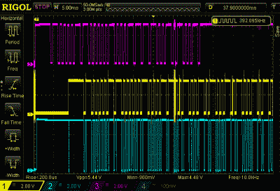](https://hackaday.com/wp-content/uploads/2017/02/ir-receiver-test-jig-results.png)

顶部的轨迹是我的电视遥控器产生的解调信号。中间的轨迹是由 MCU 驱动的 IR LED 的输出。最后，底部的轨迹是红外接收器的输出。乍一看，它似乎起作用了！

这是第二条和第三条轨迹的放大部分。它们必须完全相同，黑客才能成功:

[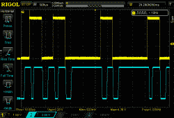](https://hackaday.com/wp-content/uploads/2017/02/ir-receiver-test-jig-results2.png)

呃哦。显然，它们是不一样的。多次重复这个实验，甚至使用不同种类的 IR 接收器，我注意到错误率极高，并且产生的位模式在没有载波的情况下是绝对不可重复的。在这种情况下，我们看到每一个输入跳变对应两个输出跳变。我怀疑，这是解调器对带外频率不满意造成的假象。

即使这两个信号之间有很强的相关性，但这肯定不足以欺骗一台电视。我试着把这个红外 LED 指向我的三台电视机，它们都纹丝不动。

## 障碍物能产生任何位模式吗？

最后要测试的是使用障碍物产生某种位模式。这有点多余，因为上一次测试已经表明，低频信号无论如何都会在接收器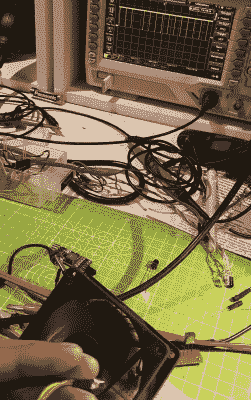输出端产生错误数据。操纵它来获得一个有效的代码是困难的或者不可能的。

红外接收器是非常敏感的设备。例如，试图通过遮盖 LED 来防止您的电视注册远程按压并不容易。除非你非常努力，否则是无法阻挡的。因此，很有可能在没有关闭强红外源的情况下，一个简单的基于剪切的障碍物对于接收器来说看起来就像一个平坦的、始终开启的信号。

为了测试这一点，我在一个恒定的红外 LED 和打火机前面尝试了各种基于卡的障碍物。来回移动卡片几次，我一无所获。

为了把事情提高一个档次，我决定使用一个 PC 风扇作为障碍的来源。用七个叶片以大于 2000 RPM 的速度旋转，产生 250-300 Hz 的频率。这在没有载体的情况下工作得很好，但是在示波器上产生了错误的位模式。

接下来，为了模拟一个载体，我用函数发生器使红外 LED 闪烁，而不是一直亮着。我将闪光频率设置为 38 kHz，瞧，风扇产生的完美解调的 300Hz 信号出现在示波器上！然而，如果我现在偏离载波一个八度左右，我会再次看到一个错误的模式。

下面的照片显示了我用过的性能最差的红外接收器如何解调由风扇产生的 300 Hz 输入信号。只有 10 千赫和 38 千赫的载波被成功解调，以显示潜在的 300 赫兹信号。

[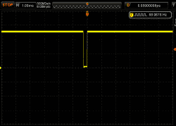](https://hackaday.com/wp-content/uploads/2017/02/ir-output-100hz-carrier.png)

300 Hz signal with a 100 Hz carrier

[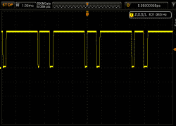](https://hackaday.com/wp-content/uploads/2017/02/ir-output-1000hz-carrier.png)

300 Hz signal with a 1000 Hz carrier

[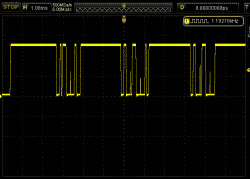](https://hackaday.com/wp-content/uploads/2017/02/ir-output-4000hz-carrier.png)

300 Hz signal with a 4000 Hz carrier

[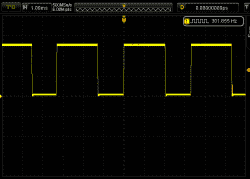](https://hackaday.com/wp-content/uploads/2017/02/ir-output-10000hz-carrier.png)

300 Hz signal with a 10 kHz carrier

[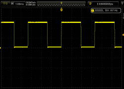](https://hackaday.com/wp-content/uploads/2017/02/ir-output-38000hz-carrier.png)

300 Hz signal with a 38 kHz carrier

## 判决

视频是假的吗？我们会把钱押在上面。但是，使用障碍物和像打火机这样的红外光源，有可能在红外接收器的输出上产生位模式吗？是的，我们已经演示过了。以这种方式产生的位模式是可重复的和无错误的吗？不，这是我们怀疑的关键。考虑到市场上红外接收器的种类繁多，这种方法是否有一线希望？机会渺茫，但绝对有机会。如果红外接收器具有可疑的带通滤波器特性，并乐于在低得多的载波下工作，这可能只是*似是而非。*但这并不容易，也不是生活帮，不管那是什么意思。