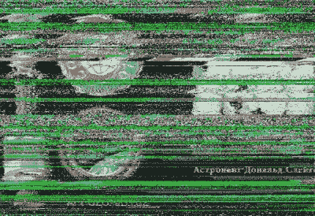

# 如何接收 Spaaace 的图片！

> 原文：<https://hackaday.com/2017/02/13/how-to-receive-pictures-from-spaaace/>

国际空间站，简称 ISS，已经以各种形式在轨道上运行了近 20 年。在那段时间里，我们中的许多人会在晴朗的夜晚站在外面，看着它从头顶掠过，作为太空中最大的人造物体，它不用望远镜也能清晰地看到。

大多数国际空间站的观察者都知道空间站携带了一些业余无线电的有效载荷。例如，当宇航员与学校交谈时，有语音联系，有数字模式，有时[在莫斯科范围内的通行证](https://ariss-sstv.blogspot.co.uk/2017/02/mai-75-experiment-to-be-active-in.html)(世界协调时 2 月 14 日 11:25-16:30)站传输慢扫描电视，或 SSTV。

你可能会认为接收 SSTV 会是一项艰苦的工作，需要昂贵的设备，但鉴于无处不在的移动和平板电脑以及极其便宜的 RTL 特别提款权的出现，它现在令人惊讶地变得触手可及。一部 Android 手机可以运行 [SDRTouch](http://sdrtouch.com/) 软件定义的无线电应用程序以及[机器人 36](https://play.google.com/store/apps/details?id=xdsopl.robot36&hl=en_GB) SSTV 解码器，如果有合适的天线，图片[可以相对容易地接收和解码](https://amsat-uk.org/beginners/iss-sstv/)。收音机必须接收 145.8MHz 宽带 FM，解码器必须设置为 ~~PD120~~ PD180 模式(感谢【M5AKA】的[更新](https://amsat-uk.org/2017/02/07/receive-pictures-from-space-iss-sstv-feb-13-14/))，这里至少应用程序运行在单独的 Android 设备上。使用极其简单的天线接收信号是可能的，但为了获得最佳效果，应该使用增益较小的天线。这里选择的天线是手持式[HB9CV] 2 元波束。

A failed grab from a 2015 transmission, proving that Hackaday scribes don’t always get perfect results.

你可以从任何一个 [ISS 追踪器](http://www.isstracker.com/)站点找到空间站何时会越过你，你也可以在 ARISS 新闻页面上了解 ISS SSTV 活动[的最新消息。然后你所要做的就是站在户外，让你的接收器和计算设备运行并准备好，当它经过时，把你的天线指向空间站的位置。如果你幸运的话，你会听到 SSTV 传输的音调，图像会被解码，如果没有，你可能会收到一个乱码。幸运的是，其他人收到的照片被发布在网上，所以如果你不太成功，你可以](http://www.ariss.org/news.html)[看看你错过了什么](https://ariss-sstv.blogspot.co.uk/)。

即使你不住在通行证的范围内，看看某个地方的网络 SDR 是否在范围内也总是值得的。例如[这个俄罗斯的](http://websdr.r4uab.ru/)用于当前传输。

由于你使用现成的硬件和软件，你可能会抱怨精英黑客从国际空间站获取图片的方式很少。但是等一下——你刚刚收到一张来自轨道空间站的照片。在孩子面前这样做，看看他们对技术的兴趣变得活跃起来！