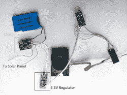
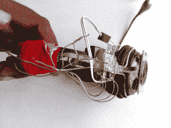

# 由回收零件制成的太阳能耳机

> 原文：<https://hackaday.com/2017/02/27/a-solar-powered-headset-from-recycled-parts/>

近年来，太阳能发电迅猛发展，个人用电也相应增加。Instructables 用户[tai fur]没有等待商业替代品，而是自己动手制作了一款[太阳能蓝牙耳机](http://www.instructables.com/id/Solar-Powered-Bluetooth-Headphone-From-Old-Wired-H/?ALLSTEPS)。

几乎完全由回收部件制成，减少电子垃圾有助于我们所有人，该项目仅购买了 1 W 柔性太阳能电池板、稳压器和 RN-52 蓝牙模块。耳机的底座由[taifur]的旧有线底座转换而来，同时一个回收的升压转换器和充电控制器——用于锂离子电池——形成电源电路。苹果公司的一个按钮出现在便携式 DVD 播放器的控制面板和 MP4 播放器的电池旁边。完成了一些仔细的恢复和重新配置工作，在勤杂工的秘密武器——管道胶带——和大量热胶的帮助下，重新组装了一个无线水果，准备接受太阳的恩惠。

主动使用太阳能变得绿色——从字面上理解——也可能导致进入水培园艺。