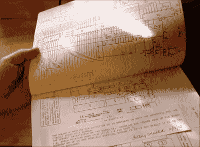

# MicroVox 将 80 年代的声音放回你的电脑中

> 原文：<https://hackaday.com/2017/02/22/microvox-puts-the-80s-back-into-your-computers-voice/>

[蒙他·埃尔金斯]想到他想用 SC-01(或 SC-01A)芯片尝试一种老式的语音合成器，一种利用音素产生语音的合成器。在网上搜索后，他找到了一个基于该芯片的 20 世纪 80 年代的 MicroVox 文本到语音合成器，在组装了一根临时串行电缆后，他将其连接到 Arduino Uno 并进行测试。它有 8 位人工语音，我们许多人都深情地记得，也相当容易理解。

[SC-01，然后是 SC-01A](http://www.redcedar.com/sc01.htm) ，是由 Votrax 国际公司制造的[。除了 MicroVox，SC-01 和 SC-01A 还用于 Heath Hero 机器人、TRS-80s 的 VS-100 合成器附件、Qbert 和 Krull 等各种街机游戏以及各种其他产品。它的输入决定了播放哪些音素，它的优势在于在它们之间产生良好的过渡，以产生像样的语音，这比你一个接一个地播放音素要好得多。](https://en.wikipedia.org/wiki/Votrax)

micro vox 有一个 25 针 RS-232 串行端口以及一个并行端口和一个扬声器插孔。除了 SC-01A，它的引擎盖下还有一个 6502。[蒙他]很幸运也收到了手册，这是一份多么好的手册啊！除了支持的音素和单词列表之外，它还包含了原理图、部件列表和串口的详细信息，这些内容阅读起来很有趣。我们真的很喜欢这张截图中的录音笔记。上面有一张手写的便条，上面写着“工厂于 1982 年 10 月 18 日更正”。

跟随下面视频中的[蒙他],他在线找到了串行端口的输入缓冲芯片数据表，并验证了电压电平。接下来，他打开机箱，使用 dips 开关设置波特率、数据位、奇偶校验位、停止位等等。在连接好扬声器，组装好 RX、TX 和接地的临时电缆，并编写一点 Arduino 代码后，他发送文本并输出语音。

 [https://www.youtube.com/embed/z8smbCHRt0c?version=3&rel=1&showsearch=0&showinfo=1&iv_load_policy=1&fs=1&hl=en-US&autohide=2&wmode=transparent](https://www.youtube.com/embed/z8smbCHRt0c?version=3&rel=1&showsearch=0&showinfo=1&iv_load_policy=1&fs=1&hl=en-US&autohide=2&wmode=transparent)

SP-01 并不是我们遇到的上世纪 80 年代唯一的语音芯片。[极客侯爵]用 SP0256 [制作了他所谓的自制斯蒂芬霍金](http://hackaday.com/2015/02/23/making-a-homemade-stephen-hawking/)。Votrax 自己也有自己的演讲箱，Type 'N Talk，通常用于为 VIC-20 配音。但是[简]没有手机，所以他[用一部安卓手机代替，为他的 VIC-20](http://hackaday.com/2015/02/13/an-adventure-into-android-makes-the-vic-20-speak/)上运行的旧文本冒险游戏配音。