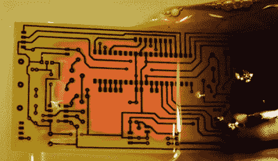
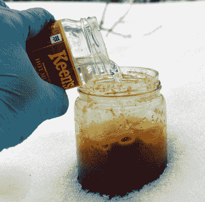

# 问 Hackaday:你的腐蚀剂是什么？

> 原文：<https://hackaday.com/2017/02/28/homebrew-pcb-etchant/>

虽然疯狂科学家的典型陈词滥调通常包括本生灯、烧杯和蒸馏罐，但我们大多数人(当然也有例外)并不是真正的化学家。然而，有一些电子工作需要一些化学或相关领域的知识，如冶金。没有什么地方比生产自己的 PCB 更明显了。除非你使用研磨机，否则你可能会使用某种化学浴来剥离电路板上的铜。

标准的解决方案是氯化铁。使用起来并不复杂，但是在高温和通气的情况下效果更好，尽管这两者都不是绝对必要的。然而，它确实会污染它接触到的所有东西。在液体形式，它是更昂贵的船舶，虽然你可以得到它的干燥形式。另一种常见的腐蚀剂是铵或钠过硫酸盐。

 还有一种自制腐蚀剂，使用盐酸和醋之类的东西。其中大多数使用过氧化物作为氧化剂。互联网上有很多类似的信息。然而，像互联网上的一切一样，你可以找到好的信息和坏的信息。

当[w_k_fay]用完 PCB 蚀刻剂时，他决定自己制作来替换它，并且[写了一个关于如何做的很棒的指南](https://hackaday.io/project/19898-make-your-own-pcb-etchant)。他在网上找到了很多含糊不清、相互矛盾的信息。他读到醋溶液太慢，铜酸需要一个加热罐，一种氧化溶液的方法，以及严格的 pH 值控制。然而，他确实用[盐酸和过氧化氢](https://hackaday.io/post/53430)做了成功的实验。他还用同样的材料(和其他一些材料一起)成功地制造了氯化铁。

 即便如此，这也是互联网上相互矛盾的信息的一个很好的例子。虽然[w_k_fay]说他的醋溶液没起多大作用，但我们已经看到了看起来相当有效的例子。在这种事情上，不良信息尤其危险。在[w _ k _ fay]的案例中，他小心翼翼地在户外工作，并使用防护装备，但你并不总是在网站上看到这方面的讨论。酸和过氧化物会冒烟，并且会腐蚀金属。[w_k_fay]在某处读到该解决方案会在几天后失效，但我们的一位编辑在过去五年中一直使用同一批产品。去想想。

蚀刻剂的一个共同主题是使用过氧化氢作为氧化剂。问题是，你在药店买到的东西并没有那么强。一般来说，过氧化物的浓度越高，溶液越浓。你可以冷冻 3%的过氧化氢来增加浓度，或者去美容用品店购买更高浓度的过氧化氢，但是这样会花费更多。当然，如果你用水稀释酸，过氧化物的浓度可能是没有意义的。

就成本而言，有些溶液很便宜，但也不像预制蚀刻溶液那么贵。然而，有时商业化学品很难在当地获得，所以这可能更有利于自制。

因此，所有 Hackaday 读者的问题很简单:你用什么来蚀刻你的电路板？商业解决方案？自制的东西？数控机床？(好吧，那真的不算这个问题的目的，但无论如何我们还是要接受答案。)我们认为等离子蚀刻也不算，但知道是否有人在做这件事会很有趣。留下你正在使用的内容和原因的评论。

提醒你一下，[铜蚀刻不仅仅是针对电子产品的](https://hackaday.com/2014/01/13/copper-etching-not-just-for-pcbs/)。当你决定开始[发送你的电路板](https://hackaday.com/2015/09/21/why-are-you-still-making-pcbs/)时，这会给你一些蚀刻剂的事情做。