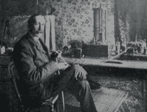
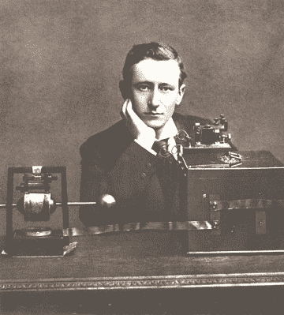

# 无线安全的起源:1903 年的马可尼无线电黑客攻击

> 原文：<https://hackaday.com/2017/03/02/great-hacks-of-history-the-marconi-radio-hack-1903/>

这个地方是伦敦皇家学院历史悠久的演讲厅。日期是 1903 年 6 月 4 日，发明家古列尔莫·马可尼(Guglielmo Marconi)即将展示他的新无线系统，他声称该系统可以安全地远距离发送信息，而不会受到调谐信号的干扰。

发明者本人远在 300 英里之外的康沃尔郡，准备将这些信息发送给他在剧院的同事弗莱明教授。弗莱明斯教授的讲座快结束时，接收器开始工作，莫尔斯电码打印机开始反复打印出一个词:“老鼠”。然后它拼出了一首侮辱性的打油诗:“有一个来自意大利的年轻人，他相当巧妙地欺骗了公众”。马可尼所谓的安全系统被黑客入侵了。

Nevil Maskelyne, circa 1903\. From the [Royal Institution](http://www.rigb.org/blog/2014/november/hacking-at-the-royal-institution).

这次黑客攻击的幕后黑手是内维尔·马斯基林，他是一位发明家、魔术师，也是一个麻烦制造者，是马可尼的长期对手。他是一家竞争对手无线公司的经理，曾与马可尼就无线电报系统的专利问题发生过多次纠纷。他认为证明马可尼的主张是空洞的最有效的方法是实际的演示。

在行业杂志《电工》(当时的黑客杂志)中，何 [详细描述了他是如何黑掉系统](https://books.google.com/books?id=Nrv8nIu2MbQC&pg=PA357#v=onepage&q&f=false) 。马可尼的基本主张之一是，因为他的系统使用调谐信号，所以其他信号不会干扰，除非它们被调谐到相同的频率。然而，这一点并没有得到令马斯基林满意的证明，他也不认为这个系统是真正安全的。所以，他开始演示这个。但你如何证明这一点？他在《电气人》的记述中写道:

> 然而，当有人向我指出，伴随讲座的实际演示使独立测试成为可能时，我立刻意识到这个机会太好了，不能错过……那么，唯一的希望就是插入旨在激怒和“吸引”接收端某人的信息。如果能做到这一点，就会有确凿的证据。”

他的计划包括在离讲座不远的地方(据说是在他父亲，一个著名的舞台魔术师拥有的剧院里)安装一个发射机，它可以淹没来自康沃尔的信号。他声称，他的发射机没有满功率运行:虽然它能够输出 8 或 9 安培，但他将其调低至 2.5 安培。他没有简单地屏蔽信号，而是短时间发送了自己的莫尔斯信号，声称他“刻意避免了所有不必要的干扰”。

Scientific Identity, Portrait of Guglielmo Marconi. [Smithsonian Institution](http://www.sil.si.edu/DigitalCollections/hst/scientific-identity/CF/by_name_display_results.cfm?scientist=Marconi,%20Guglielmo&_ga=1.84844753.938012530.1487700977).

他的计划成功了。讲座快结束时，马斯基林的信号被接收器接收到，弗莱明解码并记录下来，他给《泰晤士报》写信抱怨“科学流氓行为”。在随后的《泰晤士报》上，马斯基林和弗莱明就干扰是由马斯基林还是其他现象引起的(如接地回路或剧院的电气照明)进行了激烈的争论。

最后，人们发现弗莱明一直使用的接收器，用当时的说法，并不和谐。它没有调整到一个特定的频率，排除了所有其他频率，因为一个谐振接收器将会太大，无法在演示中使用。实际上，马可尼至少有一点欺骗性。马斯基林用拉丁语短语“Qui vult decipi，decipatur”结束了他的叙述，这是一个法律短语，翻译过来就是“让希望被欺骗的人被欺骗”

最终，这次黑客攻击并没有损害马可尼的声誉。就在一年前，他发出了第一个跨越大西洋的无线信号，并在几年后的 1907 年开始了跨大西洋的商业服务。同年，他和卡尔·费迪南德·布劳恩一起被授予诺贝尔奖，“以表彰他们对无线电报发展的贡献”。当他在 1937 年去世时，英国广播公司默哀两分钟，并要求所有的无线电发射机也这样做。

然而，黑客所做的是重新构建了关于无线安全的讨论。研究人员没有接受马可尼的断言，即这些信号是安全的，不能被干扰，而是开始寻找可以监控、干扰和操纵这些信号的方法。马斯基林可以轻而易举地监控信号，这也让政府大开眼界，并导致了无线加密系统的发展，该系统在第一次世界大战、第二次世界大战及以后的战争中得到了应用。

内维尔·马斯基林于 1924 年去世，他最出名的职业是魔术师。他写了“ [我们的魔术:魔术中的艺术，魔术中的理论，魔术中的实践](https://archive.org/details/ourmagicartinmag00mask) ”，一本至今仍在使用的魔术教材。他的儿子贾斯珀·马斯基林在第二次世界大战中运用了这些神奇的技能，他参与了假军火、坦克和其他欺骗手段的开发，这些欺骗手段在诺曼底登陆前夕误导了纳粹，他还教士兵如何在日常用品中隐藏逃生工具。

如果你想更多地了解科技史上这个迷人的时期，埃里克·拉尔森的《惊雷 T2》和《T3》是一个很好的起点。它通过讨论马可尼的生活以及他的发明如何帮助抓住臭名昭著的杀人犯克里本博士，详细介绍了无线电的历史。