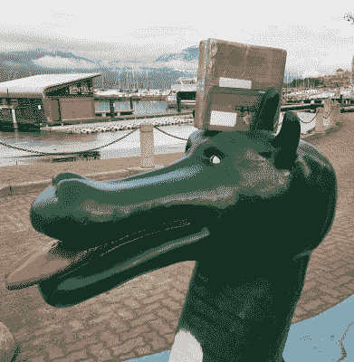

# 黑客日链接:2017 年 2 月 26 日

> 原文：<https://hackaday.com/2017/02/26/hackaday-links-february-26-2017/>

MeArm Pi 是一个神奇的小机器人套件，它是 Hackaday 的启蒙 Pi 竞赛的第一名。它粉碎了[低劣的机器人 subreddit](https://www.reddit.com/r/shittyrobots/comments/5u16ou/shitty_robot_75_professional_soldering_robot_100/) ，与旧的 MeArm 套件相比，*组装起来要简单得多。问我怎么知道的。现在，MeArm Pi 是一个 Kickstarter 。这个微小的机器人手臂从 Scratch 到 Perl 都可以编程。对于那些想重现《Pee Wee 的大冒险》开场场景的人，强烈推荐给 8 岁的孩子。*

大约一年前，Lulzbot [在中西部 RepRap 节上展示了他们最新的 3D 打印机](http://hackaday.com/2016/03/19/mrrf-3d-printing-spectacular/)。Taz 6 是一款很棒的打印机，但与他们之前的设计有些不同。最大的变化是“大脑盒”，这是一个装有电源、步进驱动器和其他相关电子设备的控制器盒。去年，Lulzbot 说他们将单独出售这个大脑盒子。[它现在出来了](https://www.lulzbot.com/store/parts/taz-6-controller-box)，准备集成到你自己的自建 Taz，或你自己设计的 3D 打印机中。

说到中西部说唱节，只有一个月了。它定于 3 月 25 日至 26 日在印第安纳州歌珊的 Elkhart 县 4-H 游乐场举行。为什么在这鸟不拉屎的地方？这确保了只有酷孩子才能成功。每年有一个周末，印第安纳州的戈申成为 3D 打印的中心。别问问题，只管来。这是免费的，尽管如果你给组织者一些钱会很酷。

[Clickspring] —那个在自己的商店里制作了一个神奇时钟的家伙正在进行他的第二个项目。这是一个 Antikythera 机制，最新一集[是关于建造一个巨大的齿轮](https://www.youtube.com/watch?v=eb9J5a5eaWs)。这是构建 Antikythera 机制的独特方法。[Clickspring]仍在使用现代工具，但他正在研究如何用 2000 年前可用的工具建造这台机器。

Ogopogo, defeated by the Travelling Hacker Box.

奥格波戈。Champ 是一张木头的照片，Nessie 是一个玩具潜水艇，它的头是塑料木头做的。Ogopogo 是蛇颈龙。你要告诉我一根木头——或者最多一只海狸——可以踢蛇颈龙的屁股吗？Ogo。Pogo。*蛇颈龙。* [旅行黑客盒子征服了 Ogopogo](https://hackaday.io/project/7373-travelling-hacker-box/log/53860-next-stop) 。

ESP32 正迅速成为最酷的微控制器平台。你知道这意味着什么——Kickstarters！[fluo WiFi 是 Arduino 衍生的开发板](https://www.kickstarter.com/projects/1163604493/fluowifitm-iot-board-with-wifi-and-ble-arduino-pro/#),具有用于 WiFi、蓝牙和所有酷炫无线功能的 ESP32。该板还具有 atmega 644 p——基本上是 ATMega1284p 的小姐妹——用于所有标准微控制器 Arduino 的东西。一块板要 25 英镑，对于你所得到的东西来说，这已经很便宜了。