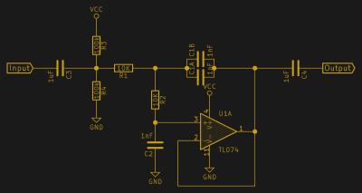

# 不要害怕过滤器:低通版

> 原文：<https://hackaday.com/2017/03/08/dont-fear-the-filter-lowpass-edition/>

无论是否知道，每个电子设计人员都会在设计中需要一个模拟滤波器。如果你来自数字世界，一切都是美好的数字，连续电压的严酷现实可能会有点令人震惊。但是，如果您要从模拟世界获取输入或向其发送输出，至少需要考虑信号的频域属性，甚至采取一些措施。

设计一个符合您需求的模拟滤波器*可能*是一项令人生畏的任务:您需要考虑许多因素，它们都是相互影响的。很容易迷路。我们将尽可能地简化这一点，转而关注一些常见的应用程序，并建立最简单的、最适合它们的过滤器。

今天，我们将考虑低通滤波器，特别是具有巴特沃兹特性和二阶滚降的 Sallen-Key 滤波器。听起来像单词沙拉？我们会马上解决这个问题，因为这可能是模拟工具箱中最重要的一个滤波器，适用于两种非常常见的情况:脉宽调制(PWM)输出和模数转换(ADC)输入。

## 问题

PWM 输出和 ADC 输入采样有两个共同点，一个是您感兴趣的低频信号，但它与一些您不想要的高频成分混在一起。在 PWM 情况下，高频成分来自其占空比正被调制的基础方波，您只需要几个周期的平均值。

很多时候，您可以忽略这种高频输出噪声。快速闪烁 LED 没有问题，你的眼睛反应如此之慢，以至于它们有效地为你做了低通滤波。当用 PWM 以足够高的频率驱动电机时，电机绕组形成电感，为您平滑信号。对于输出到扬声器的音频，或者使用较慢 PWM 频率的电机驱动，或者从 PWM 创建自己的 DAC，您需要滤除高频。

 在 ADC 采样中，频率问题更加微妙:你需要预先滤除所有高于采样频率一半的无用频率成分，否则它会折叠成较低的频率，扰乱数据。数学上的原因是[奈奎斯特-香农采样定理](https://en.wikipedia.org/wiki/Shannon_sampling_theorem)，但是直觉上，还有[车轮效应](https://en.wikipedia.org/wiki/Wagon-wheel_effect)。当你不经常采样时，“高于采样频率的一半”几乎是一切，所以有很多要过滤掉。

解决办法？嗯，有两个。第一种是以两倍于*干扰*频率的频率采样，并在固件中取平均值。但是，如果采样速度已经非常快，或者干扰频率非常高，那就不是一个选择。模拟解决方案是通过过滤掉干扰信号，并以两倍于所需*信号频率的速度进行采样，从而直接消除干扰信号。这就是所谓的低通采样，如果你周期性地读取一个 ADC，而前面没有滤波器，那么你就是在进行低通采样，而没有低通滤波器，如果有任何强高频信号混入，那么你得到的数据就会混乱。所以你需要一个低通滤波器。*

PWM 和 ADC 的另一大区别是，我们希望从 PWM 中获得音频波形，这意味着交流信号的频率更高，但在 ADC 中，我们感兴趣的是低频信号的 DC 成分。频率范围和交流/DC 电压失调对于滤波器的实际实现至关重要，因此两种情况都很好。

## 滤波器设计入门

在设计滤波器时，至少有五种选择，它们都是相互依赖的。当你加入模拟设计的其他常见陷阱时，如放大器不稳定性、范围、压摆率、带宽和失真、器件容差，以及现实世界中的问题，如[输入和输出阻抗](http://hackaday.com/2015/07/29/say-it-with-me-input-impedance/)，这足以让你抓狂。这是一次旋风式旅行。

*   键入:你想要什么频率？你想去掉哪个？例如，这决定了您想要低通滤波器、高通滤波器还是带通滤波器。今天，我们要做一个*低通*。
*   **拓扑**:这是实际的电路设计。这里，我们看一个简单的 *Sallen-Key* 滤波器拓扑，因为它稳定，对我们使用的运算放大器要求最低。即便如此，我们会发现运算放大器的选择很重要。
*   **阶次/滚降**:高频被[滚降](https://en.wikipedia.org/wiki/Roll-off)的速率取决于阶次:设计中电抗元件(此处为电容)的数量。如果需要，可以通过级联单级来制作更陡的滤波器，我们稍后会介绍。现在，我们将满足于二阶滤波器，它可以在频率每增加一倍时将信号幅度降低 4 倍(每倍频程下降-12 dB)。
*   **响应**:一些滤波器形状过分强调某些频率，在时域中表现出更多的过冲或振铃，以换取更陡的不需要频率截止。你可以[在业余时间阅读更多关于那个](http://www.etc.tuiasi.ro/cin/Downloads/Filters/Filters.htm#ChooseFilter)的内容。在这里，我们将采用*巴特沃兹*响应，因为它是对信号造成较小损害和快速达到最终滚降速率之间的一个很好的中间点。
*   **截止频率**:我们想要保留的频率(低通中的低频)和想要移除的频率(高频)之间的界限是由元件选择设置的另一个重要参数。

非常好，如果稍微先进一点，关于滤波器设计的资源是 ADI 公司《线性电路设计手册》 的第八章 *[。如果你对数学没有感觉，你可以跳过关于*的变换*的部分，不会损失太多。其余 140 多页是纯金的，应该有助于你通过任何模拟滤波器设计。我们在这里走高速公路，但是如果你想享受这条风景优美的路线，去看看吧。](http://www.analog.com/en/education/education-library/linear-circuit-design-handbook.html) [*三十秒内完成滤镜设计* (PDF)](http://www.ti.com/litv/pdf/sloa093) 是一个快速指南，非常符合本系列的精神。一旦你把每件事情都经历了一两次，这是一个很好的复习，但它自然会漏掉很多好的东西。*

## Sallen-Key 低通滤波器:一个老黄牛

一般的滤波器设计至少从上述五种选择开始。我为你们选择了其中的四个，这就留下了一个维度，它完全独立于其他维度。一个二阶巴特沃兹响应 Sallen-Key 滤波器就是 [Pareto 原则解决方案](https://en.wikipedia.org/wiki/Pareto_principle)，用 20%的努力获得 80%的收益。Sallen-Key 滤波器的某些配置适用于大多数规格，我们稍后将针对特殊情况处理复杂情况，如多级滤波器和其他电路拓扑。现在，这是基本电路图。

该电路的优点在于，两个电阻可以相同，而且通常如此，但它们不需要特别匹配，因此元件容差不成问题。两个电容*和*想要保持大致正确的比例，因为这决定了响应类型，但这并不重要，获得两倍电容的一个简单方法是并联使用两个相同的电容。最后，运算放大器被用作简单的缓冲器或放大器级，而不是频率确定工具。如上所述，这对运算放大器的高频增益提出了最低要求。

对 Sallen-Key 拓扑的赞美已经够多了，让我们来构建一些实用的东西。

## PWM 输出滤波

假设您想通过 PWM 产生一个音频速率波形。也许是为了样本回放，也许是简单的哔哔声或嘘声。你以前可能见过的解决方案是简单地在输出端上放置一个[电阻和电容。这种方法可行，但有两个缺点:滚降仅为每倍频程 3 dB，因此对较高 PWM 频率的衰减较小，而且它是一个无源滤波器，可以提高整个电路板的输出阻抗，即使对于我们想要保留的低频元件，它也更安静。你可以级联两个 R-C 低通滤波器来提高滚降的陡度，但它们会相互影响，电路会变得混乱。最好在组合中加入运算放大器，同时解决这两个问题。](https://en.wikipedia.org/wiki/RC_circuit)

`C`(这里是`C2`的值)和`R`的乘积决定了截止频率，像这样:  。你在选择价值观上有很大的自由。一个好的经验法则是将`R`保持在 500ω至 200kω的范围内。我通常粗略估计 10kω的`C`值，然后选择一个有效的电容，通过调整电阻来微调截止频率，直到它正确为止。对于实验，两个 50kω电位计或一个立体声电位计是理想的选择。

这里，我们的目标是音频 PWM，因此理想情况下，我们将滤波器的截止频率设置在 20 kHz 左右，即人类听觉的上限。在理想情况下，我们的 PWM 频率将远远高于 20 kHz，因此我们不必妥协。在现实世界中，我们可能运行低至 30-40 kHz 的 PWM 频率，10 kHz 左右的截止频率可能是更好的目标。插入 10kω电阻可产生 1.13 nF。简直太完美了！如果需要微调，我们将选择 1 nF C 并调整 10kω。

两个电容值的比值决定了滤波器的响应类型。同样，我们已经选定巴特沃斯作为一个很好的折衷方案，因为它使数学变得简单。如果你想知道其他答案，最好的办法是从网上找到一个[滤波器设计工具来帮你计算。比率高于 2 会更快达到截止速率，但会出现频率纹波。比值小于 1 时，开始时滚降较慢，但脉冲响应特性更好，或者相位线性度更好。巴特沃兹是我们的最佳地点。](http://www.daycounter.com/Filters/Sallen-Key-LP-Calculator.phtml)

因为这是一个音频应用，我们不关心绝对电压，只关心波动。一个输入电容对微控制器 PWM 的电压电平进行去耦，这对 100kω电容将信号偏置到运算放大器电压范围的中间。输出电容再次去耦，因此信号可以插入任何放大器。这些电容的值没多大关系，但必须比`C`大很多。这里用了 1 F。

PWM in yellow, filtered in green

PWM and filtered closeup: still some wiggling, but tolerable.

#### 运算放大器选择

选择 Sallen-Key 滤波器电路的原因之一是它易于运算放大器实现。如此图所示，运算放大器只是缓冲信号，它不需要操纵反馈中的任何电压来控制任何东西。这意味着，如果运算放大器的频率范围与截止频率一样高，那就没问题了。我在这个演示中使用了普通的 TL074s，几乎任何东西都可以正常工作。我说几乎是因为我最初尝试的是 LM324(流行的 LM358 的四通道版本)，它在方波输入上出现阻塞。

特别是，LM324 和 LM358 具有很差的交越失真，因此当 PWM 输入从开快速切换到关时，运算放大器无法跟踪它。这表现为输出中令人讨厌的小尖峰。任何运算放大器都会有一些明显的交叉失真，但 LM324 尤其糟糕。我通常喜欢 LM324，因为它价格便宜，输入电压低至地电位。下面我们将把它用于慢速 ADC 采样滤波，但它的交越性能很差，不适合 PWM 滤波。

LM324 Bad!

TL074 Better!

### 抗混叠、预采样滤波器

让我们继续以室内灯光闪烁时的光传感器为例。想象一下，我们想要跟踪光线每秒的变化，并消除噪声。只要它进入微控制器 ADC 的输入端，我们就可以调整输出以适应它。与 PWM 情况不同，这里我们关心的是 DC 失调，事实上，这正是我们想要测量的，所以我们将滤波器直接耦合到光传感器的输出。

由于频率较低，将它视为抗混叠滤波器可能有点奇怪，但原理是一样的，这是一个低通采样应用。如果我们对检测一秒钟的变化感兴趣，可以以 1 Hz 的截止频率进行滤波，并以两倍的速度采样，每秒两次。同样的想法也适用于较高频率的采样，但对运算放大器和 ADC 的要求变得更加明显。最好从简单开始。这是我脑海中的电路。

 光敏电阻和 2.2kω电阻组成了一个分压器，它取决于照射到它上面的光量。(专业提示:如果你想为任何类似分压器的设置选择一个最佳电阻，将你感兴趣的最大和最小电阻相乘，然后求平方根。结果，谐波平均值，就是你想要的较低的电阻值。)

我希望该滤波器的截止频率约为 1 秒，因此我最初用一个 10kω电阻进行计算，得到 10 F，对我来说太大了。将电容缩小 10 倍，电阻放大 10 倍，这样就差不多了。因为我们对 DC 值感兴趣，所以只需去掉输入电容和偏置电阻以及输出阻塞电容。

Raw and Filtered Light Sensor

Typical hand-waving.

从这些范围拍摄，你可以看到低通滤波器的预期行动。在左窗格中，荧光灯的噪声(峰峰值约为 330 mV)被很好地过滤掉，降至 20 毫伏水平。在右边的窗格中，你可以看到当我在传感器上慢慢挥动我的手时的反应，模拟一系列的照明水平。(我有四个手指！)该值相当快地跟踪实际的光照水平，尽管您可以看到未过滤值和过滤值之间有一些延迟。这只是你过滤时发生的事情！

#### 运算放大器选择

与 PWM 应用相反，TL074 让我们失望了，而 LM324 却大放异彩。与许多其它运算放大器一样，TL074 设计用于负电压轨，这意味着它无法处理与最低电压相差几伏的输入信号。这里，我们使用地作为负基准电压源，当我盖住传感器并上下摆动手时，这会导致放大器错过约 1.5 V 以下的输入信号。LM358 可以捕捉到这些变化。

TL074 Bad!

LM324 Good

为任何应用选择运算放大器都充满了细微差别。我为这个演示挑选了两个最标准和最有代表性的类型。对于老器件来说，TL074 的速度相当快，这使它适合音频，但它是为双电源使用而设计的，因此它无法可靠地应对低电压。在音频(AC)应用中，通常只使用电压范围的中间部分，所以没关系。LM324/LM358 速度较慢，但功耗较低，输入可达负供电轨，非常适合低频、电池供电的 DC 信号调理。当你既需要轨到轨操作又需要高速时，你会发现自己在阅读数据手册、做出权衡或花钱。

#### 与 ADC 匹配

 为数字化准备杂乱模拟信号的最后一个细节是放大或缩小输出电压，以匹配 ADC 的电压范围。目前，运算放大器输出与反相输入之间的线路将增益保持在 1。只需在反馈中增加两个电阻来放大结果信号，或者在滤波器后增加一个分压器来缩小信号。很自然，你只想做这两个中的一个。

## 下一步是什么？

如果您已经了解到这一点，那么您已经有了一个通用低通滤波器，它可以处理几乎所有的低通滤波需求:它具有良好的滚降，能够处理 DC 或交流耦合信号，并且具有可调增益，因此您可以充分利用 ADC 的最大精度。如果你愿意，你甚至可以通过改变电容的比例来调整响应类型，但这越来越花哨了。

接下来是 Sallen-Key 滤波器的另外三个例子:高通设计只需交换电阻和电容，通过级联高通和低通滤波器，就可以制成非常有用的带通滤波器。高阶(更陡的滚降)滤波器也可以通过级联这些级来实现。

(横幅中美丽的背景图片来自【Windytan】的[荧光效果脚本](http://www.windytan.com/2013/03/rendering-pcm-with-simulated-phosphor.html)。)