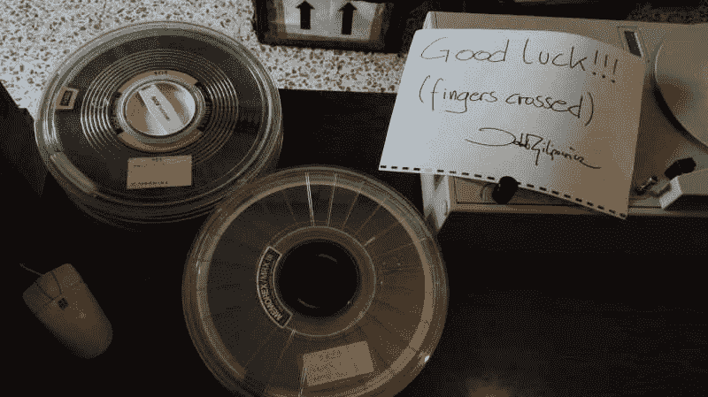
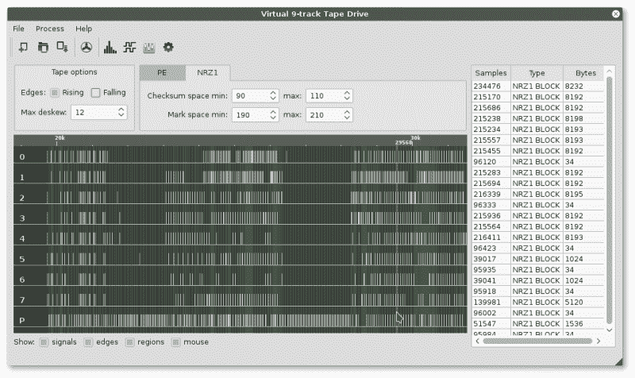

# 失落的操作系统攻略:重塑波兰 IT 历史

> 原文：<https://hackaday.com/2017/03/03/raiders-of-the-lost-os-reclaiming-a-piece-of-polish-it-history/>

在当今的数字时代，我们几乎理所当然地认为我们所有的信息都会被保存和备份，无论是在本地驱动器上还是在云中——无论是自动、手动还是通过其他服务。对于过去几十年的信息，情况并不总是如此，恢复可能是一个冒险的过程。尽管面临棘手的挑战，来自[[Museo Dell ' informatica Funzionante](http://museo.freaknet.org/en/)]和[ [mera400.pl](http://mera400.pl/) ]的团队，以及来自各种博物馆、机构等的研究人员和科学家都聚集在一起，试图恢复据信存储在五盘磁带上的波兰骗子操作系统[。](http://museo.freaknet.org/en/recupero-dati-nastri-magnetici-del-computer-polacco-mera-400/)

这些磁带最初存放在华沙技术博物馆，保存得非常理想，但是——尽管做了一些初步的测试准备——博物馆的磁带阅读器一直挂在 800 BPI NRZI 编码的头上，即使磁带的其余部分是 1600 BPI 相位编码。经过一番挠头之后，该团队决定破解他们的 Qualstar 1052 磁带阅读器，并尝试直接从电路上读取数据！！

 使用 Arduino Mega 作为采样设备，并在测试模式下使用磁带，团队能够读取磁带，但标题仍然不可理解，并伴随着其余数据中的错误。尽管如此有希望！

转换齿轮，决定使用逻辑分析仪读取磁带，并使用软件解码数据。在他们等待新分析仪发货的同时，团队成员之一[Jacob Filipowicz]利用 Python 的力量编写了一个名为 Nine Track Labs(如下图)的程序，该程序允许他们以任何速度、BPI 和写入标准读取任何类型的磁带。有了软件和分析器，该团队能够成功地从磁带中完整地恢复数据，而不会出错！

在恢复的数据中，有许多版本的 CROOK 操作系统，使他们能够重现该操作系统的开发过程，以及数百个其他文件，其中包含迄今为止被认为丢失的程序和工具。还有一个“活的”MERA-400 系统的备份，带有二进制 CROOK-3 操作系统，准备在仿真中运行。总的来说，这项技术考古的杰作取得了巨大的成功。

 如果——在你更现代的旅行中——你需要恢复出错的音频记录，知道你可以[用十六进制编辑器](http://hackaday.com/2015/04/02/manual-data-recovery-with-a-hex-editor/)恢复这些数据。