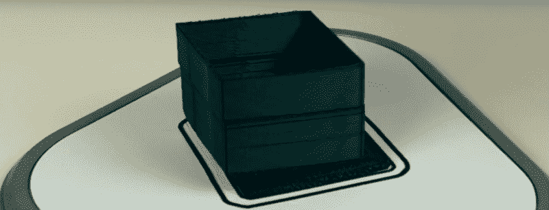

# Tiko 打印机:当你过度创新时会发生什么

> 原文：<https://hackaday.com/2017/02/27/the-tiko-printer-what-happens-when-you-innovate-too-much/>

在非常遥远的未来，宇宙将成为黑洞的领地。能量和熵将被压缩成微小的量子波动。即使在这个虚无的领域，仍然会有一个不容置疑的事实:你不应该在 Kickstarter 上购买 3D 打印机。

我们对失败的 3D 打印机众筹活动并不陌生。大约在去年的这个时候，Peachy Printer 的支持者发现他们在加拿大得到的是分时度假，而不是打印机。这是不寻常的，不是因为众筹活动*失败了*，而是因为我们知道实际发生了什么。难得得到内幕，桃色打印机没有让人失望。

在过去的几个月里，我们一直在关注另一场众筹运动走向绞刑架的漫长过程。[Tiko 3D 打印机](https://www.tiko3d.com/)是另一款看起来很创新的 3D 打印机，在众筹活动的时候，价格是打不过的。只需 179 美元，Tiko 打印机的支持者将获得一台 3D 打印机。请记住近两年前推出的 Tiko，当时一台廉价打印机的价格仍在 400 美元左右。傻瓜和钱，或者类似的东西，Tiko 3D 打印机运动获得了近 300 万美元的承诺。

现在，经过近两年的发展，Tiko 正在关闭店铺。在本周发布到 Tiko Kickstarter 的更新中， [Tiko 宣布他们正在解雇他们的团队，并逐步减少运营](https://www.kickstarter.com/projects/tiko3d/tiko-the-unibody-3d-printer/posts/1809879)。对于一个本该很酷的项目来说，这是一个悲伤但几乎可以预见的结局。与许多其他失败的众筹活动不同，Tiko 向我们展示了他们的活动。这就是 Tiko 是如何在 Kickstarter 上获得巨大成功的，也是它是如何失败的，这是一个很好的例子，说明了建造一个*和建造一万个*之间的区别。

### 为什么 Tiko 大受欢迎

Tiko 打印机很容易销售。你所要做的就是浏览你最喜欢的科技博客，看到有人以低于 100 美元的价格出售 3D 打印机。是的，这是超早期价格，但对于 3D 打印机来说，这太便宜了。在 2015 年，难以想象。正常价格，以及非早期 Kickstarter 支持者支付的价格，仅为 179 美元。即使在今天，随着中国数十家工厂的阴谋诡计，这是一个非常便宜的价格点。事实上，只有在即将发布的 Monoprice 150 美元的 delta 打印机上，我们才能看到一款功能如此强大，价格如此低廉的打印机。

Tiko 惊人的经济性引出了一个明显的问题。Tiko 团队是如何计划建造一台 3D 打印机并以不到 200 美元的价格将其送出大门的？即使在今天，寻找和构建最简单的 i3 克隆版本的成本也要比这高。2015 年，成本甚至更高。

Tiko’s unibody construction. By building a linear motion system into the enclosure, Tiko significantly reduced the cost of their bill of materials.

答案来自听起来像是苹果广告文案的东西:unibody construction。Tiko 的主体是一个整体部件，带有一个集成的 c 形槽，用作这个 delta bot 的线性轨道。这种单体结构非常简单、巧妙。如果你曾经组装过 RepRap Mendel，或者任何其他螺纹杆打印机怪物，你应该知道 3D 打印机的框架是决定制造或破坏制造的关键。通过使用集成导轨的挤压件，Tiko 团队降低了框架的成本，同时简化了组装。从制造的角度来看，Tiko 的单体结构非常出色，当我们看到另一个 delta bot 具有相同类型的外壳时，我们不会感到惊讶。

Tiko 的核心是创新。这是一台围绕标准化制造流程打造的 3D 打印机。是的，建造一台“一体式”3D 打印机需要大量的资本投资，才能让第一台打印机下线。然而，一旦这项工作完成，Tiko 打印机的创造者将拥有一种可行的产品，其制造成本将远低于竞争对手。

### 为什么 Tiko 失败了

Tiko 在他们的一体式车架上做了很多创新。不幸的是，他们决定将这一创新扩展到打印机的其他部分。甚至在 Tiko Kickstarter 诞生一周之前，3D 打印机论坛就对 Tiko 打印机产生了疑问。

3D 打印机中线性运动的常用方法是步进电机。NEMA 17 步进电机是意料之中的事。NEMA 17 汽车公司的历史定价本身就很有趣:早在 2008 年，在 RepRap 项目取得成果之前，花 40 美元买一台带司机的 NEMA 17 汽车并非不现实。现在，你可以用不到一半的价格买到同样的零件。

Tiko 没有依赖已经实现非常便宜的打印机的生态系统，而是选择走自己的路。他们在打印机上使用了更便宜但扭矩更低的步进电机。这将导致打印机出现严重问题。在 Tiko 发运的 4000 多台设备中，有太多的关于层移动和遗漏步骤的报告，超出了您的预期。在最严重的情况下，Tiko 打印机[无法打印一个简单的立方体](https://www.youtube.com/watch?v=TixJhVpze7Y)。

This should be a cube. Because of poor component selection, the Tiko printer was not reliable. [Image source](https://www.youtube.com/watch?v=TixJhVpze7Y).

即使在电子领域，Tiko 也在努力创新。

目前，3D 打印机的电子产品主要来自最初的 RepRap 项目。Arduino Mega 的衍生产品使用 ATmega2560 和 ATmega32u2 微控制器，是标准配置。新的 [LulzBot 大脑盒](https://www.lulzbot.com/store/parts/taz-6-controller-box)使用了一个 [RAMBo 板](http://reprap.org/wiki/Rambo)和这个微控制器。绝大多数 3D 打印机的电子设备都来自最初的 3D 打印机实验，这意味着十年的技术债务。

Tiko 在他们的 Kickstarter 活动中宣传 WiFi 打印。目前，使用 WiFi 打印机的简单方法是使用标准的基于 ATmega 的控制板和 ESP8266 WiFi 模块。这很容易，但也不便宜。Tiko 没有采用简单的解决方案，而是求助于德州仪器(Texas Instruments)发布的一款支持 WiFi 的微型控制器。[cc 3200](http://www.ti.com/product/CC3200)为 Tiko 配备了强大的 ARM Cortex-M4 微控制器和 WiFi。考虑到平稳的加速，甚至在[最便宜的 ARM 控制器板](http://hackaday.com/2016/06/13/review-monoprice-mp-select-mini-3d-printer/)上也能发现，这是一个胜利。

但是每个人都继续使用旧的基于 Arduino 的控制器板是有原因的。几乎所有 3D 打印机的固件都是围绕 Arduino Mega 构建的。围绕相对较新的部件构建打印机控制器板意味着从头构建一切。这是 Tiko 没有的开发时间，也是 Tiko 负担不起的工程时间。

尽管如此，Tiko 实际上成功制造并发运了超过 4000 台打印机。鉴于 Tiko 从 16，000 名 Kickstarter 支持者那里获得了近 300 万美元，这听起来不算多。想想 Tiko 所做的决定，这是非常了不起的。在原型最终确定之前，他们已经订购了完整的 BOM。使用廉价步进电机的决定直接导致最终设计的性能非常差。用软件解决硬件问题的努力没有效果。最终，Tiko 有太多的技术债务需要偿还。当然，这也无助于 3D 打印机的低价销售。一台 200 美元的打印机只有这么多利润，而且从一开始就没有剩下多少工程技术来制造一台好的、便宜的 3D 打印机。

### Tiko 的未来

到 2016 年底，Tiko 实际上已经死了。上周，他们放弃了，停止生产，并拒绝向支持者退款。Tiko 甚至拒绝退还运费，这一举动导致了网上请愿和——听着——T2——Kickstarter 运动，开始对 Tiko 提起集体诉讼。Tiko 已经死了，尽管他们正在积极寻找更多的投资者。

我们经常从工程的角度看待 Kickstarters。这些讨论中缺少的是从商业角度对 Kickstarters 的审视。Tiko 所做的是超越他们自己的创新。他们为 3D 打印机的框架设计了一个相当出色的系统，但这个系统不太适合硬件初创公司。他们为 3D 打印机社区开发了全新的硬件，但当他们的工程团队跟不上时，他们陷入了困境。在他们的设计最终确定之前，他们把所有的钱都花在了购买零部件上。这些不是糟糕的工程决策，而是糟糕的商业决策。

12000 人花了 200 美元(加上大约 60 美元的运费)买了一台他们不会收到的打印机。4000 人拥有一台不符合他们期望的打印机。Tiko 团队面临着 300 万美元的失败。没有人对这种情况感到满意。然而，这一切都可以追溯到一个问题。这就是你创新太多的结果。