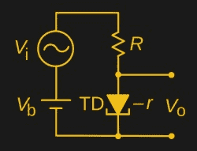
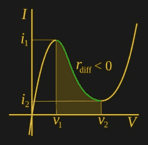

# 消极抵抗:应该说不通！

> 原文：<https://hackaday.com/2017/03/21/negative-resistance-it-shouldnt-make-sense/>

当你翻阅一本基础电子学教科书时，你会发现一些章节详细描述了各种元件的操作。电阻、电容、电感和半导体。后一章将讨论 P 型和 N 型区域，向我们介绍二极管，然后讨论晶体管:它的基本工作原理，如何偏置等等。

 

一种隧道二极管放大电路。特别是如果你的课本稍微旧一点，你可能会发现有一小段是关于隧道二极管的。将会有一个看起来很奇怪的电路，似乎完全没有意义，一个放大器只由一个正向偏置的二极管和几个电阻组成。你被告知，这种违反逻辑的电路之所以有效，是因为隧道二极管是一种具有负电阻的器件，尽管在没有现成的实验器件的情况下，你很难理解这一点。

我们都习惯于传统的电阻，即遵循欧姆定律的器件。当你给电阻施加电压时，电流流过电阻，当电压增加时，电流也增加。因此，如果您在分压器的上半部分和下半部分都使用正电阻器件，比如一个普通电阻，改变分压器顶部的电压会导致电阻的行为符合您的预期，并且其上的电压会增加。

在负阻器件中，情况正好相反:增加它两端的电压会导致流过它的电流减少。当在电阻分压器的下半部分使用足够大的负阻器件时，当输入电压增加时，它会降低流过分压器的总电流。流过顶部电阻的电流越小，输出端的电压就越大。这使得负电阻分压器成为一个放大器。

我们上面提到的隧道二极管可能是表现出负电阻的最著名的器件，在 20 世纪 60 年代初晶体管获得额外性能之前，它们似乎代表了电子产品的未来。但它们并不是唯一具有负电阻曲线的器件，事实上，除了耿氏二极管等其他半导体，你还可以在一些令人惊讶的地方发现负电阻。例如，电弧或荧光灯管。

 

典型的负阻 I-V 曲线。电弧的负电阻特性尤其在二十世纪早期产生了一种迷人的装置。第一批无线电发射机使用电弧来产生射频，但效率极低，带宽极窄，容易造成干扰。经过改进，火花不再被视为射频源，而是被视为振荡器中调谐电路旁边的负阻元件，这些设备可以产生极高功率的单一频率，因此在第一次世界大战前后更高功率的电子管发射机出现之前，它们作为高功率发射机与使用高频交流发电机的发射机一起受到欢迎。

在非常专业的剩余零件供应商领域之外，您不太可能会遇到隧道二极管或其他类似的电子元件。我们很少提到它们，它们通常是 20 世纪 60 年代的剩余设备。但是，了解它们在电路中如何工作应该是任何对电子学感兴趣的人的常识的一部分，因此值得花点时间来看看。

1N3716 隧道二极管表头图片: [Caliston](https://commons.wikimedia.org/wiki/File:GE_1N3716_tunnel_diode.jpg) 【公有领域】。