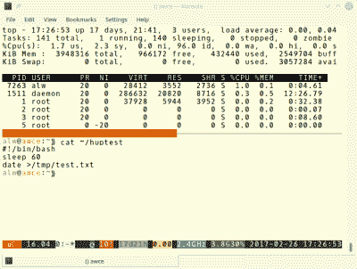

# Linux-Fu:保持事物运行

> 原文：<https://hackaday.com/2017/03/10/linux-fu-keeping-things-running/>

如果你很早就使用 Linux(或者像我一样，从 Unix 开始)，你不必马上学习太多，随着事情变得越来越复杂，你可以边学边学。如果你只是因为使用 Raspberry Pi 才开始使用 Linux，对 XP 成为孤儿感到不满，或者你正在为你最新的类似天网的物联网项目运行云服务器，那么在一个地方收集所有信息可能会令人生畏。

最近，我儿子问我，如何让一些东西在 Linux 系统上运行，即使你已经注销了。我认为这是一个很好的问题，不一定是一个简单的答案，这取决于你想完成什么。

我能想到四种不同的情况:

1.  你想推出你知道需要很长时间的东西。
2.  你正在运行某个程序，意识到它需要很长时间，想不停止它就退出。
3.  你想写一个脚本或其他类型的程序，它可以分离自己并保持运行(称为守护进程)。
4.  您希望某个程序一直运行，即使您在重启后没有登录。

使 Linux 变得困难的一个原因是有很多选择，所以在一个系统上工作的可能在另一个系统上不工作。如果你能假设一个单一的分布，你可能有更好的机会发现事情是一样的。为了使事情易于管理，我将把重点放在前两项上，也许以后会补上最后两项。我还假设我们在谈论命令行程序。如果你注销后需要运行图形程序，这就引出了许多奇怪的问题——这当然是可能的，但奇怪的是，当你注销后，你的图形用户环境会消失(提示:使用 [VNC](https://en.wikipedia.org/wiki/Virtual_Network_Computing) 或 [Nx](https://www.nomachine.com/) 创建一个持久桌面)。

然而，我会给你最后两个用例的线索。首先，一个自我分离的程序是一个[守护进程](http://www.netzmafia.de/skripten/unix/linux-daemon-howto.html)。这样做的步骤可能会很复杂，或者你可以[外包出去](http://libslack.org/daemon/)。让一个程序一直运行可能简单也可能复杂。大多数 Linux 发行版都有一个/etc/rc.local 文件，它在启动时(至少是正常启动时)作为 root 运行。如果你只是做一次性的，你可以在那里添加东西。否则，您需要知道您使用的是 SystemV init、Upstart、OpenRC 还是 Systemd。可能还有其他一些问题需要解决。但那是另一天的话题。如果你等不及了，在这篇 [IBM 论文](https://www.ibm.com/developerworks/community/blogs/752a690f-8e93-4948-b7a3-c060117e8665/entry/comparativo_upstart_sysvinit_systemd_openrc?lang=en)上试试你的葡萄牙语(或者谷歌的)。

## 两个案例的故事

[](https://hackaday.com/wp-content/uploads/2017/02/offline.png) 回到前两种情况，虽然。假设你要运行一个程序`remote_backup`,你知道你将启动它(可能使用 ssh 会话),然后你会想要断开连接，或者确保如果你由于某种原因意外断开连接，它不会停止运行。无论哪种方式，只要从命令行启动它就意味着当你的会话退出时，程序就会停止。还是会？

这可以像运行程序一样简单，使它们免受挂起的影响。如果您使用 bash 并且您的选项设置正确，答案可能非常简单。如果您使用&在后台启动一个程序，或者您可以暂停一个正在运行的程序(Control+Z)并用 bg 命令将它移到后台，它甚至可能在您退出会话后运行。这是 Linux 灵活性的另一个例子——实现类似结果的许多方法——碍事。

如果您运行 bash，您可以看到您的“shell 选项”,其中包括“退出时挂断”设置。尝试在 shell 提示符下运行:

```
shopt | grep huponexit
```

如果您看到 huponexit 被设置为 off，那么只需将一个程序推到后台就可以让它在您的会话断开后继续存在。当然，如果你在另一个系统上尝试同样的事情，它可能不工作，你会想为什么。

如果您知道您是在 huponexit 关闭的情况下运行 bash，那么您可以非常简单地在后台运行您的程序，只需用一个&符号结束:

```
remote_backup &
```

但是，更安全的做法是，在您注销时明确防止程序死亡。不为别的原因，因为如果你使用上面的方法，在你注销后，你将看不到程序的任何输出。如果你提前考虑，你可以“不挂起”地运行程序:

```
nohup remote_backup
```

如果你需要论据，就像往常一样把它们放在最后。Nohup 将做一些事情:

1.  将标准错误重定向到标准输出
2.  将 stdout 重定向到 nohup.out(取决于您的 nohup 版本，可能在~/nohup.out 中)
3.  将标准输入重定向到不可读的文件
4.  运行程序并返回到 shell 提示符

最终结果是程序会运行，得不到任何输入，会把任何输出放到 nohup.out 里，如果 nohup.out 里已经有任何数据，新的数据会到最后。

发生所有这些重定向的原因是因为 nohup 检测到每个流都连接到一个终端。如果你已经把东西重定向到一个文件，nohup 不会打扰它们。所以你可以说:

```
nohup remote_backup >/tmp/backupstatus.log &
```

或者

```
nohup bash -c 'echo y | remote_backup >tmp/backupstatus.log' &
```

最后一行将从管道接收输入，因此它不会重定向。所有输出(stdout 和 stderr)都将转到/tmp/backupstatus.log。

## 证明一下！

[](https://hackaday.com/wp-content/uploads/2017/02/tuxwiz.png) 如果您想了解 nohup 的不同之处，请使用 ssh 登录 Linux 服务器，并在 shell 提示符下键入以下命令:

```
echo '#!/bin/bash' >~/huptest
```

```
echo sleep 60 >>~/huptest
echo 'date >/tmp/test.txt' >>~/huptest
chmod +x ~/huptest
~/huptest
```

在 60 秒到期之前，按下波浪符号键(~)。然后按一个句号。波浪号是 SSH 转义字符(如果它在行首)。按~？如果你想知道更多你用它做的事情。现在，去喝一杯你想喝的东西，一分钟后回来。登录。您不会在/tmp/test.txt 中找到一个文件(除非那里已经有一个文件，但是内容应该清楚地表明这一点)。您的会话结束杀死了等待程序。

现在试试这个:

```
~/huptest &
```

这告诉 shell 不要等待程序完成。如果您使用的是 bash，只要 huponexit 设置为 off，这就可以工作。您可以使用以下工具进行实验:

```
shopt -s huponexit
```

和

```
shopt -u huponexit
```

第一个命令将打开标志。第二个将标志重置为关闭。

最后，您可以使用 nohup 运行相同的命令:

```
nohup ~/huptest &
```

即使 nohup 也不是完美的。如果你正在运行的程序拦截了 nohup 标志本身，nohup 就帮不了你。然而，您要担心的大多数程序都没有捕捉到这个标志，使用 nohup 不管 shell 和它的配置如何都可以工作。

有许多其他方法可以做到这一点。例如，研究将在指定时间(可能是当前时间之后的一秒钟)运行的 at 命令。运行的程序将使用 sh，而不是 bash(不需要做一些工作),但是将独立运行。

## 缺乏规划

不过，nohup 在两种情况下不起作用。首先，你可能没有提前做好计划。如果你开始做某件事，并意识到这需要一段时间，或者你突然不得不离开，你会怎么做？你也可能有这样的情况，你需要启动一个程序，给它一些手动输入，然后想让它在你不看的情况下运行。

您可能知道可以使用 Control+Z 键暂停正在运行的程序。Bash 将告诉您它已经创建了一个作业，并将为该作业提供一个编号。可以用 bg 强制放到后台。例如，如果作业编号为 3:

```
bg %3
```

如果你关闭了 huponexit，这就是你需要做的。但是在一般情况下，您需要告诉 shell 要么停止向它发送 HUP 信号，要么将它从作业表中完全删除。您可以使用 disown(内置于 bash 中)来实现这两个功能。

使用不带选项的 disown 将从作业表中移除指定的作业。如果不希望出现这种极端情况，可以使用-h 选项来禁止来自 shell 的 HUP 信号。您还可以指定-a 来命中所有作业，或者指定-r 来影响所有正在运行的作业。这是 bash 的一个内置命令(因此 man bash 需要阅读更多内容),因此它是 shell 相关的。一旦你放弃了一个后台任务，你就可以放心地注销了

## 持续会话

[](https://hackaday.com/wp-content/uploads/2017/02/by.png) 和往常一样，对于 Linux 来说，任何给定的任务都有不止一条路可走。您可以使用 screen 或 tmux 来提供会话。这类似于 VNC，在那里你可以登录并找到你正在做的任何东西。如果你在命令行上做了很多工作，你可能想试试 byobu，它为 screen 或 tmux 提供了一个更好的界面(见右图)。

如果您想尝试，像往常一样登录，运行 screen、tmux 或 byobu。再次执行测试脚本(结尾有或没有&号)。并使用~。终止 ssh 会话的技巧。然后重新登录并重新启动相同的程序(screen、tmux 或 byobu)。你会看到屏幕就像你离开时一样。总的来说很方便。另外，你可以很容易地构建多个类似图形的窗口，但这与本文无关。

## 选择

Linux 的部分优势在于你有很多选择。Linux 的部分问题是你有很多选择。真正的问题不在于你是否配置了一个可以控制一切的 Raspberry Pi。你让它工作，就是这样。真正的问题是当你试图将一些东西部署到不同用户甚至不同发行版的多个机器上时。

当然，如果你追求便携性，这并不是唯一给你带来麻烦的事情。如果你正试图编写可以进入许多不同 Posix 系统的脚本，你可能会阅读 autoconf 的 [GNU 文档，其中有许多关于问题和解决方案的有用信息。](https://www.gnu.org/savannah-checkouts/gnu/autoconf/manual/autoconf-2.69/html_node/Portable-Shell.html#Portable-Shell)