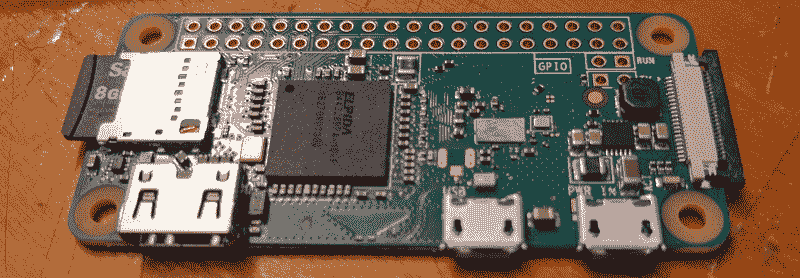
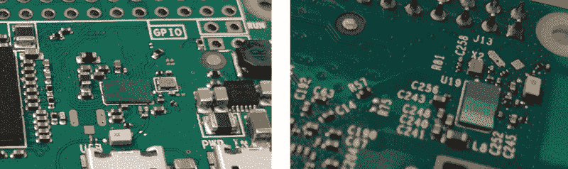
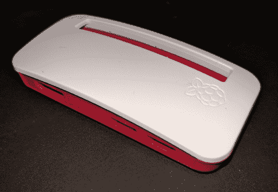
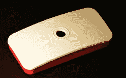
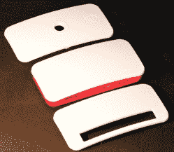

# 10 美元的树莓派 Zero W 增加了 WiFi 和蓝牙功能

> 原文：<https://hackaday.com/2017/02/28/10-raspberry-pi-zero-w-the-w-means-wifi-bluetooth/>

Raspberry Pi 诞生于 2 月 29 日，这意味着我们离它的第二个生日只有三年了，Pi 基金会发布的新硬件已经成为一种传统。今年也不例外:一款新的树莓派已经发布。Raspberry Pi Zero W 是 Pi 基金会的微型且极其便宜的单板计算机的最新版本。这是一个树莓皮零*与无线网络和蓝牙*。

新的 Pi Zero W 的规格与以前的非 W Zero 几乎相同。它配备了 1GHz 单核处理器，512 MB 内存，具有迷你 HDMI 和 USB OTG 端口，使用微型 USB 端口供电，具有现在标准的 40 引脚接头，带有 4 个用于复合视频的附加引脚和一个复位按钮。与 Pi Zero 的第二个硬件版本一样，该板也具有 CSI 摄像头连接器。

当然，很大的特点是增加了 WiFi 和蓝牙。Pi Zero W 增加了树莓 Pi 3B 的无线功能。那就是 802.11n 和蓝牙 4.0。

圆周率零点之所以出名，当然是因为它的价格。最初的 Pi Zero 是粘在 MagPi 杂志封面上的一点硬件，后来只卖 5 美元。树莓派 Zero W 售价仅为 10 美元。

See that triangle shape below the CPU? That’s the antenna.

圆周率零点有什么变化？除非你是从射频设计的角度来看 PCB，不然不多。这里的大变化是增加了 WiFi 和蓝牙。这个硬件直接来自 3B 的树莓派。这两款 Pis 封装在一个别致的玻璃芯片中，通过怪异的弯曲射频迹线连接到电路板上，都具有 802.11n 和蓝牙 4.0。与 Pi 3 一样，当暴露于激光时，Pi Zero W 不会遭受无线子系统的[光子重置](http://hackaday.com/2015/02/08/photonic-reset-of-the-raspberry-pi-2/)。

Zero W 和 Pi 3 的无线系统之间的一个细微差别是天线。Pi 3 使用 SMD 芯片天线，而 Pi Zero W 使用 PCB 天线。这对 Zero W 的无线功能有什么影响？我想不会太多，但话说回来，我的射频测试台[是由胶带](http://hackaday.com/2017/01/30/increase-the-range-of-an-esp8266-with-duct-tape/)制成的。

The Raspberry Pi Zero W (left) purportedly shares its wireless hardware with the Raspberry Pi 3B (right).

### 最终，一个更便宜的π0

从我们过去几年所见，Pi Zero 的最佳用例是支持 Linux 的*东西*。它只是坐在那里，从 GPIOs 接收比特，做一些处理，然后再发送出去。没有互联网的物联网，如果你愿意的话。

当然，这是一个完美的物联网原型设备。例如，现在我正在开发一个“自从不是黑客以来的天数”计数器，这个设备将查询黑客日的评论，并确定自从有人说一个黑客日的帖子不是黑客以来的天数。配有 WiFi 适配器的 Pi Zero 是这项工作的最佳硬件。我只需要一个八美元的 WiFi USB 适配器。

现在 Pi Zero W 已经内置了无线功能，这个项目就更便宜了。我只需要十美元的 Pi Zero W，而不是五美元的 Pi、八美元的 WiFi 适配器和几美元的必备 USB OTG 适配器。是的，通过硬连接七段显示器来显示“0”也可以获得相同的结果，但这不是重点。

### 一个新案子

不缺树莓派的案例。如果您想要激光切割外壳、3D 打印外壳、压铸外壳或注塑外壳，总有一款适合您。几年前，[Pi 基金会参与了这场游戏](https://www.raspberrypi.org/blog/raspberry-pi-official-case/),为正常规模的 Pi 提出了一个官方案例。现在，圆周率为零有了一个正式的理由。

      

官方 Raspberry Pi Zero 案例分为四个部分。底部覆盆子色部分具有方便的夹子固定器，以保持 Pi 零点在适当的位置。顶部的三个部分印有 Pi 标志，并提供了一个坚固的盖子，可以接触到 GPIO 引脚，或者允许安装摄像头模块。

### 想要一个免费的树莓派 Zero W？

每周都会有一些硬件奇才在 [Hackaday.io 的 Hack Chat](https://hackaday.io/project/5373) 分享他们的知识，这周真的很棒。我们将与 Raspberry Pi 的首席硬件工程师罗杰·桑顿对话。如果你曾经想知道如何制造一台微型 Linux 单板计算机，这就是你要问的人。[Roger]监督所有 Raspberry Pi 硬件的设计、测试、合规性和生产。[他会在 Hack Chat](https://hackaday.io/event/20043-raspberry-pi-hackchat) 中告诉你烤覆盆子馅饼的内幕。

与大多数黑客聊天一样，将会有一个硬件赠品。我们正在向那些对如何使用这种新型无线硬件有最佳想法的人发送 Raspberry Pi Zero W 板。注册黑客聊天，并在 3 月 3 日中午加入我们。