# 不要害怕过滤器:级联 Sallen-Keys

> 原文：<https://hackaday.com/2017/03/29/dont-fear-the-filter-cascading-sallen-keys/>

在上一期的[不要害怕滤波器](http://hackaday.com/2017/03/08/dont-fear-the-filter-lowpass-edition/)中，我们构建了两个有史以来最简单、最常用的有源滤波器示例:双极 Sallen-Key 低通滤波器。这一次，我们将把两个基本滤波器模块放在一排，最终得到一个更尖锐的低通滤波器和一个带通滤波器。对于带通，我们还需要建立一个快速高通滤波器。奖金！

我上次说过，Sallen-Key 低通滤波器可以满足 80%的滤波需求。(而且 72.4%的所有统计数据完全是编造的！)这两条大概能让你再熬过 10%左右。老实说，我从来没有建立一个独立的有源高通，原因我们将在下面看到，但我们正在建立的有源带通滤波器是一个很好的工具，尤其是对任何音频。

## 级联 Sallen-Key 低通滤波器以获得更多滚降

正如我们上次所说，如果一个双极点滤波器有两个电抗元件(两个电容)和每倍频程-12 dB 的滚降，我们当然可以在下游增加一个相同电路的副本，实现更多滤波，对吗？是的，但是它不是最佳的。

我上次忽略了一个细节。给定阶数的所有滤波器都具有相同的渐近(最终)滚降率，即每极点每倍频程-6 db。不同响应(巴特沃兹、贝塞尔或切比雪夫)的主要性能差异在于滤波器从通带平坦到最终滚降速率的速度。一个 1969 年的大众 Bug 会以和兰博基尼一样的速度驱动限速，但是你达到限速的速度会有所不同。

[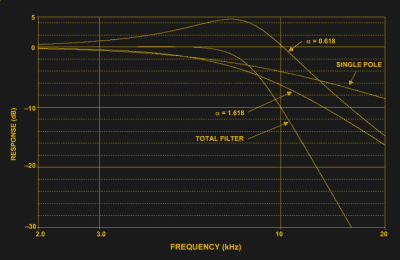](https://hackaday.com/wp-content/uploads/2017/02/fifth-order-butterworth-cascade1.png)

Same idea, but with a 5th order filter, from Analog Devices’ “Basic Linear Design”

事实证明，只要堆叠滤波器，就可以选择一个略呈尖峰状(在截止频率处产生谐振)，另一个略显平坦，这样的组合会有一个很好的平坦过渡，但比简单堆叠相同的滤波器更快地达到滚降速率。也就是说，整体滤波器具有巴特沃兹响应，但单个级不会。这使得设计变得更加重要，但是没有什么是你不能处理的。

选择最佳共振值是一个数学问题，并没有真正的信息。在过去，你可以在书中的表格中查找，然后使用铅笔和纸按比例放大原型 1 Hz 滤波器，以满足你的需求。今天，我们开始使用在线计算器。单击 Butterworth，4 极，为各种级增益输入 1，然后输入截止频率，就大功告成了。这个工具甚至可以很好地绘制电路图，并从标准值 E6 或 E12 系列中选择最接近的电容值。嘭！

[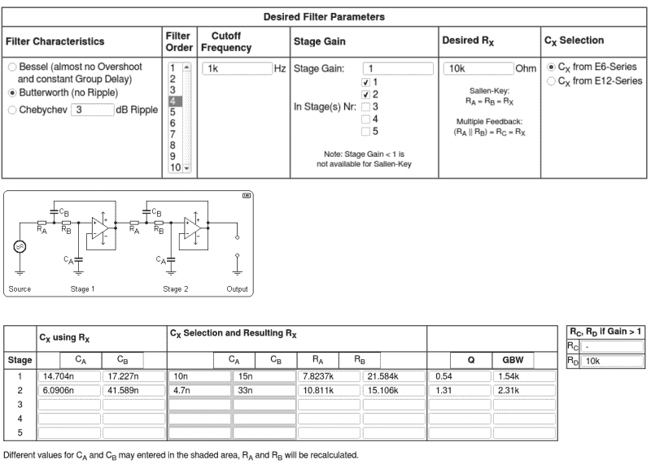](https://hackaday.com/wp-content/uploads/2017/02/filter_designer.png) 你会注意到不再有整数电阻了:电阻值很奇怪，不再是整数比。接近这些值是一个很好的目标，但是再次使用 Butterworth 响应，没有什么是太关键的。如果需要 21，584ω电阻，我只需从盒子里拿出一个 22kω电阻。使用上面的特定工具，您甚至可以测量实际使用的电容，将真实值输入电子表格，它会为您重新计算电阻。一个不错的接触，但对一个宽容的电路来说不是必要的。

构建四阶滤波器的工作量是二阶滤波器的两倍多一点，但当您需要时，结果是值得的。这里有一些可以炫耀的 FFT 频谱图。在这两种情况下，输入都是 800 Hz 的方波。方波在所有奇数值处都有音量递减的谐波，因此在 2400 Hz 处有一个相当大的峰值，在 4000 Hz 处有另一个峰值。

First and Second Stage, 800 Hz, filtered square wave

[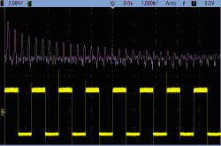](https://hackaday.com/scope_154/)

Square Wave at 800 Hz

[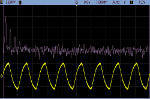](https://hackaday.com/scope_155/)

Two-pole filter at 1000 Hz

[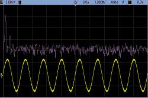](https://hackaday.com/scope_156/)

Four-pole filter at 1000 Hz

在所有这些示波器镜头中，输入是 800 Hz 的方波，通过截止频率为 1000 Hz 的滤波器。第一个窗格显示二极和四极滤波器的对比。剩下的三张示波器照片也显示了震源和两个滤波波的傅立叶变换。您可以看到，在四极点滤波器中，峰值下降的速度几乎是两倍。成功！

### 天空才是极限？

[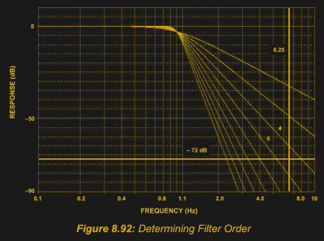](https://hackaday.com/wp-content/uploads/2017/02/filter_order1.png) 但为何止步于四极？每个额外的极对只需要两个电阻、两个电容和一个运算放大器级，对吗？为了保持滤波器的整体非谐振，不同级将需要仔细控制谐振值，这将意味着精确的电容比。对于实际的零件公差，这变得越来越困难。此外，随着更多级的加入，最终级为补偿早期级所需的谐振对运算放大器的频率能力提出了越来越高的要求，特别是需要更高的[增益带宽积](https://en.wikipedia.org/wiki/Gain-bandwidth_product)。

最后，在某种程度上，相对较慢的巴特沃兹响应的简单性优势被额外的级所压倒，设计低阶切比雪夫滤波器比高阶巴特沃兹滤波器更好。另一方面，四极巴特沃兹是一个漂亮而稳定的滤波器。除非真的需要，否则不要把事情复杂化。

## 两级带通滤波器

[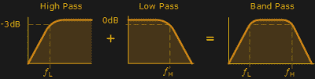](https://hackaday.com/wp-content/uploads/2017/02/fil97_bg.png) 现在来做一个完全类似的事情:级联高通和低通滤波器，做成一个带通滤波器。如果低通滤波器滤除高频，让低频通过，那么高通滤除低频，带通滤波器滤除高频和低频，保留丰富的中频，这并不奇怪。策略是首先让信号通过高通，然后通过低通。

像这样的带通滤波器是任何 ADC 方案的绝佳前端，您可以大致了解目标频率的范围，但不希望缩小到频谱中的某一部分。如果使用 ADC 进行低通采样，至少需要低通滤波器。如果你对最低的低频不感兴趣，为什么不在模拟中把它们去掉呢？

例如，在电容感测应用中，一个人触摸金属板是一个频率范围从 10 Hz 到 1 Hz 的事件，即使是短暂的点击也会持续 100 ms，您可能不会在意这个人的手指在按钮上停留的时间是否超过 1 秒。在这种情况下，带通信号可以消除低频环境变化(湿度、温度)的影响，这些变化会导致一天中的电容漂移，同时还可以消除高频噪声，如来自附近电子设备的干扰。在模拟环境中提前完成这一工作使得固件中的编程和分析工作变得非常容易。

### 高帕斯

关于 Sallen-Key 高通滤波器就不多说了，因为它与低通滤波器是同一个电路，只是交换了电容和电阻。在低通滤波器中，我们将电阻设为相等，电容设为 1:2，但现在，对于巴特沃兹响应，电容相等，电阻为 1:2。如果你在单边电源下给运算放大器供电，而不是匹配正负电压，你将需要产生一个[恒定的中轨电压](http://www.robertkeeley.cimg/Keeley%20Designs%20Express%20PCB/Delay%20Project/Virtual%20Ground%20Circuits.htm)(图中的 *GNDREF* )。这样做就像用两个相对低值的电阻制作一个分压器一样简单。如果任何地方有未使用的运算放大器级，也可以缓冲这个“虚地”。

[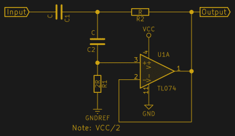](https://hackaday.com/wp-content/uploads/2017/03/sallen-key-highpass.png) 主动高通就是不如低通有用。高通滤波器确实在射频应用中大放异彩，但大多数运算放大器速度太慢，跟不上。不过，在分频和均衡电路等音频应用中，你会发现它们的身影。与低通滤波器一样，Sallen-Key 滤波器的高通版本可以级联，以获得更陡的滚降。

我唯一一次构建独立的高通是在蝙蝠探测器前置放大器中，过滤掉音频范围中的可听部分，以专注于蝙蝠的高频啁啾。如果你用过有源高通滤波器，我很乐意在评论中听到。我错过了什么明显的申请吗？

### 带通

带通滤波器简单地级联一个高通和一个低通滤波器。该电路并不针对特定频率的极端选择性，经验法则是使高通和低通截止频率相差至少 5 倍左右。这非常适合人声范围(75 Hz 至 1000 Hz 基本音，重要内容高达 3000 Hz ),或者在用 ADC 采样之前对缓慢移动的 DC 模拟值进行预滤波。

[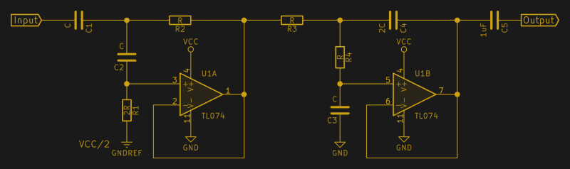](https://hackaday.com/wp-content/uploads/2017/03/sallen-key-bandpass.png)

当你的目标是一个特别窄的频带时，这个电路可能没有那么多帮助。窄带通滤波器是一个独立的主题，我将单独讨论它们以及窄带抑制(陷波)滤波器，因为它们很难正确设计，但在需要时非常有用。

正如讨论高通滤波器时提到的，该电路的输入端不需要额外的隔 DC 电容，因为高通已经解决了这一问题。两级之间也不需要 DC 阻塞，因为即使第二级是低通滤波器，信号到达时已经位于运算放大器响应范围的中间。因此，这种设计的 DC 耦合带通和交流耦合带通的唯一区别是增加了一个输出电容。

为了演示这个电路，我构建了一个截止频率为 20 kHz 的高通和一个截止频率为 50 kHz 的低通。馈入这个带通滤波器白噪声给你一个很好的频率响应感觉，至少以及我的范围将捕捉它。您会注意到高通和低通部分的斜率看起来不一样。这部分是因为频率滚降本质上是倍增的，它们在频率的对数标度上看起来是一样的。事实上，这将是经验版本的波德图。

[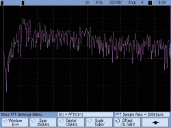](https://hackaday.com/scope_149/)

Highpass at 20 kHz

[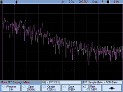](https://hackaday.com/scope_146/)

Lowpass at 50 kHz

[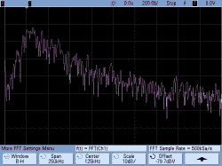](https://hackaday.com/scope_150/)

Bandpass: Centered on 20 – 50 kHz

[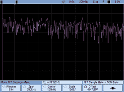](https://hackaday.com/scope_151/)

Noise Spectrum: Pretty Flat.

## 包裹

我们上次构建的双极点 Sallen-Key 滤波器是一款老爷车，但有时你需要一匹赛马，有时你需要一匹表演用的小马。将两个已知的单元堆叠在一起，同时注意调整谐振值，使四极设计易于构建，并且在需要额外滚降时相当稳定。类似地，将高通和低通叠加在一起是一件轻而易举的事情，并且为您的工具箱添加了一种新的滤波器类型。

由于所有这些电路都是由(多个)相同的电路拓扑结构构成的，或许电阻和电容互换了位置，因此您可以轻松想象基于两个或四个运算放大器芯片制作一个电路板，只需插入正确的无源值，或许还带有可选的交流去耦级，就万事俱备了。由于大多数运算放大器共用一个引脚，因此也很容易互换。嗯……也许我会那样做。如果你捷足先登，请在评论中发表。

接下来是专用滤波器:窄带通滤波器和陷波滤波器。当您想要强调或拒绝频谱中的一小部分，而让其余部分保持不变时，这些选项非常有用。想要检测特定的音调或消除讨厌的交流嗡嗡声？敬请关注。