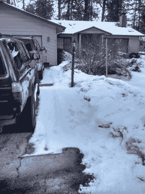

# 自主分娩和最后 100 英尺

> 原文：<https://hackaday.com/2017/03/13/autonomous-delivery-and-the-last-100-feet/>

毫无疑问，你现在已经看过波士顿动力公司最新的“我们生活在未来”机器人创作，被称为手柄。[Mike Szczys] [最近报道了](http://hackaday.com/2017/02/27/i-am-science-fiction-incarnate-i-am-handle/)或多或少官方公司推出的混合双足轮式机器人 Handle，它可以处理光滑或崎岖的地形，甚至可以在必要时跳跃，同时保持平衡，显然可以用手臂搬运高达 100 磅的货物。绝对科幻。

[Mike]用一句俏皮话结束了他的帖子，说看到“Handle 在街上推着轮椅，在每个门廊上放着装饰着微笑的盒子。”我最近写了一篇关于自动送货的文章，既谈到了作为自动驾驶汽车“杀手级应用”的自动货运，也谈到了自动送货带来的安全问题。现在，我想看看类人机器人在供应链中的位置，以及像 Handle 这样的东西接管从送货卡车到你家门口的最后一百英尺的可能性有多大。

### 商业团体

首先，我不得不说，除了下面的视频，我没有看到任何其他关于手柄的信息。我不知道这个机器人的预期市场是什么，或者是否有市场——它可能只是一个概念验证项目。但根据名称，以及手柄在大小和形状上都大致拟人化的事实，以及他们费心展示机器人携带 100 磅的负载，我可以说这是一个非常安全的打赌，机器人不是为了焊接或探索外星世界或做任何其他我们期望机器人做的事情。对我来说，Handle 看起来是送货机器人的完美外形；读起来很像赛格威上的人。

 [https://www.youtube.com/embed/-7xvqQeoA8c?version=3&rel=1&showsearch=0&showinfo=1&iv_load_policy=1&fs=1&hl=en-US&autohide=2&wmode=transparent](https://www.youtube.com/embed/-7xvqQeoA8c?version=3&rel=1&showsearch=0&showinfo=1&iv_load_policy=1&fs=1&hl=en-US&autohide=2&wmode=transparent)

Handle 的外形细节对其在自动送货中的假定角色很重要，我的想象如下:一辆无人驾驶的 UPS 卡车行驶在郊区的街道上，琥珀色的警示灯在它无窗的车身顶部闪烁。它的全球定位系统已经指引它到达指定路线的下一站:你的家。一个破旧的把手(无疑漆成 UPS 棕色)从卡车后部的充电站出来，从车辆行驶时呈现的紧凑的“运输姿势”展开，并开始扫描您的包裹。它在上层架子上找到它，轻轻地但坚定地抓住它，并向车辆发出信号打开车门。把手滚下短坡道，出了门，到了街上。它的摄像头可以快速扫描，让它绘制出一条通往你家前门的路线，由于它的轮子，它可以快速通过这条路线。它避开人行道上的三轮车，把包裹放在门廊上，飞快地回到卡车旁，跳上车，准备开往下一站。

鉴于我们目前所看到的 Handle，这一切都是完全合理的。我们知道[自动驾驶长途卡车在这里](https://www.youtube.com/watch?v=Qb0Kzb3haK8)，所以自主本地交付只是时间问题。手柄的大小和形状都很适合一辆合理的汽车，我们已经看到它在停放时有多紧凑。它可以轻松应对坡道，至少可以毫无问题地下楼。我们只能假设上楼梯将是未来的功能，但就目前而言，如果有必要，它肯定会跳楼梯。Handle 在几乎整个视频中不受束缚地运行，看起来完全是自动的，并且在需要在卡车后面加油之前，至少有足够的电池寿命来服务几个站点。它还具有避障功能，因此 Fido 或 Junior 在院子里玩耍时不会被撞到。

### 障碍和敌对行动

因此，如果所有的部分都在那里，有什么可以阻止处理现场？毕竟，Handle 现在可以作为机器人“司机助手”使用人类驾驶的卡车进行测试。没有理由整个系统需要端到端自动化，因为最后 100 英尺需要自动化。那么，如果今天对 trip 进行试点测试，它会处理什么呢？

Handle this, Handle.

作为一个思维实验，让我把送货到我家作为一个可能的问题。首先，天气。我们假设 Handle 可以在一定程度上经受气候变化，因此在雨中或雪中外出不成问题。但是 Handle 能在积雪的车道和人行道上行走吗？自 12 月初以来，爱达荷州北部的积雪已经堆积，一些人行道和车道刚刚开始解冻。更重要的是，整个冬天堆积的雪堆导致了“车道狭窄”，随着车道变窄，事情变得有点轻松了。我的车紧紧地挤在一起，所以我们经常不得不侧着身子走下车道去取邮件。Handle 很难处理这样的事情，而人类司机可以很容易地解决这个问题。

像这样的障碍显然不是不可逾越的。从技术上讲，把手没有理由必须局限于从道路到门的面向人的路径——它可以很容易地在路边和草坪上绘制出一条安全的路径。在视频中，我们看到 Handle 相当优雅地在积雪的路堤上高速行驶，甚至泰然自若地处理结冰的路面，因此越野旅行不是问题。不过，我想快递公司和顾客之间应该有某种“通行权”协议，以免杜鹃花被踩坏，脾气暴躁的老人会大喊，“滚开我的草坪，你这个机器人嬉皮士！”

可能会有一天，家庭甚至社区开始设计机器人送货，将障碍降至最低。机器人送货——或机器人消防员，或机器人急救人员；我可以很容易地看到有一天一对把手移动担架——甚至可能最终被建筑法规强制要求。在那之前，机器人送货助理将不得不处理大量的可变性，以将您的包裹送到门廊。孩子、玩具、宠物、水管、雪、泥和脾气暴躁的老傻瓜都会密谋搞糟手柄和随后出现的任何东西。这只是将美国郊区的用例考虑在内——想想交付给市中心高层公寓的复杂性。

但是我保证快递公司会尽快解决这个问题。在最后的 100 英尺里，把人类从循环中解放出来会有太多的收获。看到他们如何利用类似 Handle 的东西来实现这一点将会非常有趣。