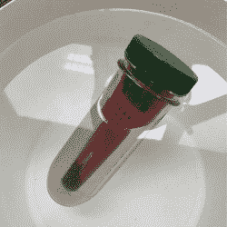

# 物联网设备在家庭酿酒中发挥作用

> 原文：<https://hackaday.com/2017/03/01/iot-device-pulls-its-weight-in-home-brewing/>

The iSpindel floating in a test solution.

在家酿造啤酒或葡萄酒并不复杂，但它需要注意细节，并愿意多次测量和消毒，尤其是在跟踪发酵过程时。多亏了 iSpindel 项目，这项工作变得更加容易。基于 ESP8266 的物联网设备，旨在作为昂贵的商业解决方案的 DIY 替代方案。

![Hydrometer [Source: grapestompers.com]](img/ae8a7580b7d8a51be9f93de211d473c0.png)

跟踪发酵通常涉及一个简单而关键的设备，称为[比重计](https://en.wikipedia.org/wiki/Hydrometer)(左图)，用于测量液体的比重或相对密度。酿酒师和酿酒师使用比重计来确定溶液中剩余的糖量，从而指示发酵过程的进度。使用比重计首先要对所有设备进行消毒。然后从发酵液中取样，放入一个高容器中，插入比重计并记录结果。然后样品被送回，所有东西都被清洗干净。【编辑(及酿酒师)注:样品是*不是*退回。上面/里面有各种各样的细菌。把那 20 毫升扔掉！]这个过程重复多次，有时每天都是如此。每次打开批次时，也会增加污染的风险。

为了取代这一过程，iSpindel 定期自动测量比重和温度。该设备由一根塑料管、一个 3D 打印筏、一个用于测量管子漂浮角度的 IMU、一个温度传感器、一个可充电电池和一个 [Wemos D1 迷你](https://www.wemos.cc/product/d1-mini.html)(基于 ESP8266EX)微控制器组成。漂浮设备的倾斜角度随着设备的浮力而变化，因此也随着发酵液的含糖量而变化。

这是一个聪明的 DIY 解决方案，击中所有正确的音符，并利用所有正确的元素。塑料管易于密封，易于保持清洁。该设备本身对发酵过程没有影响，电池足以从头到尾监控一批发酵，传感器给出的读数与正确使用的手动比重计一样准确，无线功能用于从密封环境中传输数据。

将这款设备与 2010 年推出的用于葡萄酒监测的 DIY 传感器套件进行比较，该套件最初被设想为一个独立的浮动探头，但最终成为一个由两部分组成的设备。与短短几年前相比，今天可供业余爱好者使用的东西令人惊讶。

感谢[janniz]的提示！

*【比重计图像来源:[grapestompers.com](http://www.grapestompers.com/articles/hydrometer_use.htm)*