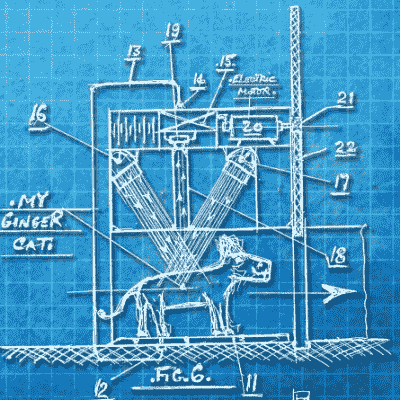

# 阿瑟·保罗·佩德里克的发明

> 原文：<https://hackaday.com/2017/03/14/the-inventions-of-arthur-paul-pedrick/>

当我们浏览早晨的科技新闻时，我们会听到很多关于专利组合的事情。几乎没有一天没有关于可疑律师或硅谷巨头之间又一场法律冲突的新闻，要么解决跨国公司之间的争端，要么解决专利钓鱼者的可疑活动。

这些庞大而富有的组织拥有许多专利，这些专利要么是通过他们的员工努力工作来创造发明，要么是通过从其他发明者那里收购专利而获得的。大量的专利通过其他方式，例如由个人获得，这种情况并不常见。

有一个多产的个人发明家，拥有多项专利。他并不是因为他的发明成功而声名狼藉，而是因为这些发明看似不切实际，却符合专利制度的规则。他的名字是[亚瑟·保罗·佩德里克]，他是一名退休的英国专利审查员，从 20 世纪 60 年代早期到 20 世纪 70 年代中期去世，他申请了大量古怪的专利，所有这些专利都拓展了实用性的边界。

他的主题是多种多样的，但包括大量的运输发明以及能源和核物理领域的创新。我们希望在这些页面上有足够的空间来展示它们，但遗憾的是，它们太多了，以至于很难选出我们可以展示给你的选择。所以请坐下来，享受[Pedrick]创新的怪异而美妙的世界。

## 把酒吧放在马的前面

![[Pedrick]'s bold vision for a gasoline-free future.](img/13f7ebd5f3414bc9f5bf720baa269bf3.png)

【佩德里克】对无汽油未来的大胆设想。

乍看之下，GB1405575A，“[不用汽油或汽油驱动汽车](https://patents.google.com/patent/GB1405575A/en?q=pedrick&before=filing:19770101&sort=new&num=100)”([Pedrick]的拼写，不是错别字)似乎掩盖了汽车领域的一项真正创新。但是伴随专利申请的图纸揭示了一个早期时代的债务。一匹马被套在一辆汽车后面，它的前进运动是通过将马槽从它身边移开来加速的，希望它会开始向前走去够到它的食物。刹车踏板连接到动物的头环上，点火开关对不幸的动物施以温和的电击，使其开始运动。一种改进是将马放在仓鼠轮式跑步机上，让它在汽车空转期间休息。

我们可以看到这种车可以工作，如果有合适的马，甚至可以达到在像伦敦这样的现代城市的繁忙街道上使用所需的每小时 5 英里。然而，我们也可以看到额外的马和马槽长度的一些问题，停放这么多车辆可能是一个挑战。

## 猫翼和大灾变

Let the correct cat in, and possibly save the world.

在 GB1426698A 中，“[光子推挽辐射探测器用于色彩选择性猫襟翼控制和 1000 兆吨地球轨道维持和平炸弹](https://patents.google.com/patent/GB1426698A/en)”，【Pedrick】展示了他同时解决世俗和全球规模问题的天赋。在确保他那只会说话的老姜猫的领地不被邻居家的黑猫侵犯的同时，他还将自己的注意力放在了维护当时处于冷战高峰的世界和平的问题上。他的探测器可以在驾驶猫翼时区分路过的猫的皮毛，或者在连接到轨道卫星时注意到导弹发射的闪光。该卫星将向肇事者发射 1000 兆吨级核弹，从而通过确保相互摧毁达到全新水平来确保和平。

我们自然对这种多功能技术印象深刻，但鉴于这只超级智能的会说话的猫有着相当漂亮的虎斑猫皮毛，我们不禁想知道它的用途是否不会超出姜黄色和黑色动物。

## 有什么比一杯茶更重要的吗？

![The [Pedrick] Tea Strainer](img/4c3f6df7465e06fc9cec172af30f26c4.png)

【佩德里克】滤茶器

【佩德里克】的一些发明并不是特别高科技，但它们仍然适用于特别重要的主题。例如，GB1351926A 中的“茶过滤器的改进”解决了寻找最有效的滤网设计以阻止茶叶进入发明者最喜欢的热饮中的问题。在最终发现形成六边形镶嵌的互锁线的设计是最好的之前，模拟了各种配置。

对[Pedrick]来说，可悲的是，袋泡茶的引入使他的发明大部分过时了。然而，我们完全相信，完全新颖和独特的设计会使它从众多表面相似但质量低劣的过滤器中脱颖而出，事实上，如果他当时将其商业化，那么热饮的历史可能会完全不同。

## 比他们的时代早了好几年的宽体客机

![[Pedrick]'s ultra-large air liner, side view.](img/97da8b94bba179f9e78fc1747bbf1a6f.png)

【佩德里克】的超大型航空客轮，侧视。

【佩德里克】在喷气式飞机时代的黄金时代工作，在这个时代，国际飞行的奇迹第一次为大众所知，远洋客轮不断倒闭。他勇敢地预见到超高容量飞机的市场在几十年内都不会实现，他在 GB1439086 (A)“使用现有大型飞机(如波音 747)的机身或机身束的大型平基低空飞行飞机”中提出，多个机身可以并排连接，形成一个巨大的飞机，可以在非常低的高度飞越海洋，安全舒适地运载大量乘客。遗憾的是，这架飞机从未制造出来，所以我们永远也不会知道它是否会兑现承诺。所谓的超大型飞机的出现至少部分实现这一愿景还需要几十年的时间。

你可能会认为这是一个愚人节玩笑，在这个玩笑中，我们将一系列荒谬或极其明显的想法呈现为开创性和有远见的，并伴有不太可能是用华丽圆珠笔绘制的自制图表。但事实上，除了(Pedrick)拿他所服务的组织开玩笑之外，没有别的笑话了。他是一个真正的退休公务员，他所有的申请都是真实的。

谁知道呢，他们中的一些人甚至可能已经工作了！

谢谢[克莱尔]的建议。