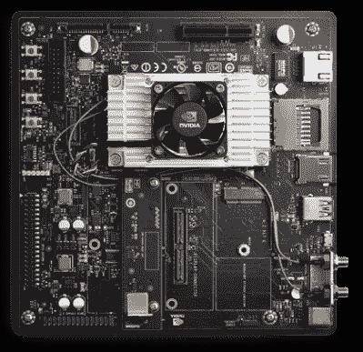
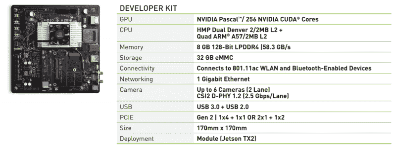

# Nvidia 宣布推出 Jetson TX2 高性能嵌入式模块

> 原文：<https://hackaday.com/2017/03/07/nvidia-announces-jetson-tx2-high-performance-embedded-module/>

过去的一年对 Nvidia 硬件来说非常棒。Nvidia 发布了一款使用 Pascal 架构的显卡，1080 正在全球范围内升温，现在 Nvidia 又在高性能、低功耗计算方面迈出了一步。今天， [Nvidia 发布了 Jetson TX2](http://www.nvidia.com/object/embedded-systems.html) ，这是一款信用卡大小的模块，为嵌入式世界带来了深度学习。

Jetson TX2 是 Jetson TX1 的后续产品。我们在 2015 年底发布的时候看了一下[，感觉是正面的，有一些警告。TX1 仍然是运行 Linux 的速度非常快、功能非常强大、功耗非常低的 ARM 设备。也是低功耗。不过，英伟达试图为 TX1 制造的案例没有得到很好的沟通。这最终是一个可以连接几个摄像头并运行 OpenCV 的设备。这是一个机器学习模块。现在看来，英伟达已经降低了他们嵌入式平台的销售宣传。](http://hackaday.com/2015/11/24/the-nvidia-jetson-tx1-its-not-for-everybody-but-it-is-very-cool/)

### 嵌入式深度学习

Jetson TX2 的营销口号是，“边缘的深度学习”。虽然这听起来绝对像一个字母汤的废话，但它确实解析得相当好。

每个新的计算机科学毕业生都想进入的热门领域是深度学习。很容易看出为什么——从无人机到自动驾驶汽车，深度学习无处不在。这些深度学习的“酷”应用有一个问题:它们都需要大量的处理能力，但这些应用都在电力预算之内。如果你能把它插到墙上，建造一架跟随你的自拍无人机将不会是一个问题，但这不是自拍无人机的目的。

TX2 被设计为一个本地深度学习和人工智能平台。这种人工智能的训练仍将在装有 GPU 的服务器机架上进行。然而，这个人工智能的推理过程必须发生在摄像机附近。这是杰特森的切入点。通过使用新的 Nvidia Jetpack SDK，Jetson TX2 将能够运行 TensorRT、cuDNN、VisionWorks、OpenCV、Vulkan、OpenGL 和其他机器视觉、机器学习和 GPU 加速的应用程序。

### 规范

Jetson TX2 Module (and its heatsink) installed on the larger development board.

像之前的 Nvidia TX1 一样，Jetson TX2 是一个信用卡大小的模块，固定在一个大散热器上。这些规格是 TX1 的重大升级:

*   *显卡:* Nvidia Pascal GPU，256 个 CUDA 核心
*   *CPU:* 双核丹佛+四核 ARM A57
*   RAM: 8GB 128 位 LPDDR4
*   *存储:* 32GB EMMC，SDIO，SATA
*   *视频* : 4k x 2x 60Hz 编解码
*   *显示屏:HDMI 2.0，eDP 1.4，2 个 DSI，2 个 DP 1.2*
*   *端口和 IO: USB 3.0、USB 2.0(主机模式)、HDMI、M.2 Key E、PCI-E x4、千兆以太网、SATA 数据和电源、GPIOs、I2C、I2S、SPI、CAN*

Jetson 开发套件是 TX2 模块和分线板，实际上是 MiniITX 主板。这对于一个*开发*平台来说很棒，但是对于生产来说就不行了。自从 Jetson TX1 发布以来的一年半时间里，[至少有一家公司](http://www.connecttech.com/sub/Products/ASG001.asp?l1=GPU&l2=ASG001)发布了载板，其中包含了最常用的外围设备和端口。TX2 的硬件接口向后兼容 TX1，因此这些分线板可以用于较新的 TX2。

TX2 模块将于 2017 年第 2 季度上市，千片订量报价为 399 美元。开发套件的价格会高一点。如果你想为 TX2 开发自己的突破，物理连接器是可获得的，制造商对样品要求非常宽松。