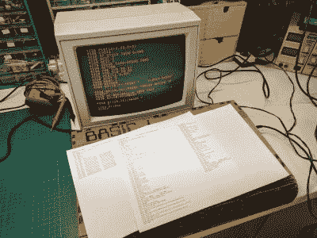

# Flappy Bird 是新的“它运行厄运吗？”

> 原文：<https://hackaday.com/2017/03/10/flappy-bird-is-the-new-does-it-run-doom/>

早在 2014 年，[Johan]决定通过编写自己的 BASIC 解释器来庆祝 BASIC 50 周年。现在，几年后，他说他觉得他已经[达到了某个里程碑](https://vandenbran.de/2017/03/08/flappy-bird-running-home-build-basic-computer/):他可以玩 Flappy Bird，这是用他自己版本的 BASIC 编写的，在他自己建造的计算机 BASIC-1 上运行。

在 BASIC-1 的内部是一个 Atmel XMega128A4，一个来自一个坏掉的 Commodore 64 的键盘，一个操纵杆端口，一个串行到电视输出适配器，以及一个用于程序存储的 SD 卡适配器。一个漂亮的激光切割外壳带有[切口弯曲](http://hackaday.com/2012/06/12/bending-laser-cut-wood-without-steam-or-forms/)容纳键盘和硬件。BASIC-1 就像 80 年代的许多家用电脑一样启动成 BASIC。

The BASIC-1 remains true to 80s home
computers, with a few nods to modern convenience.

Keyboard is from a C-64 and
enclosure is kerf-bent, laser cut wood.

之前已经有人做了工作来创建最简单的基本计算机，但是并不是每天都有人决定编写他们自己的基本的 T2 解释器。也不是每天都有人把自己的自制电脑连接到一个漂亮的木板外壳上。两者同时出现很好，但是让它在琥珀色的屏幕上运行一个用 BASIC 语言编写的 Flappy Bird 克隆体是非常特别的。

很久以来，我们有两个黑客熟练程度的证明——《Hello World》证明你可以用一个系统做最基本的事情，而《running Doom》证明你已经掌握了系统上的硬件抽象。在过去的几年里，Flappy Bird 已经成长起来，填补了这两个系统之间的空白，因为[没有马力](https://hackaday.com/2016/04/15/flappy-bird-on-an-e-cigarette/)(或分辨率)来运行 Doom，但仍然需要一个技能指标。