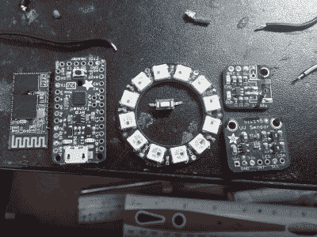

# 最聪明的智能手表是你自己做的

> 原文：<https://hackaday.com/2017/03/13/the-smartest-smart-watch-is-the-one-you-make-yourself/>

如果你这几天在打造智能手表(哈欠！)，你必须有一些特殊的酱来打动厌倦 Hackaday 社区。[Dominic]的 [NeoPixel 智能手表](https://hackaday.io/project/5090-neopixel-smartwatch#j-discussions-title)提供了他自己对戴在手腕上重要的东西以及不重要的东西的看法。

 没有花哨的屏幕。相反，手表通过一个新像素环来满足所有通知需求。但通知是它做得对的。当然，当他有来电时，它会告诉[Dominic],但短信、Snapchat 和电子邮件也有不同的闪烁颜色模式。哦，对了，它还能显示时间，甚至还有手电筒模式。极简显示器的强大功能。

但这还不是全部！它还有一个光传感器，可以从紫外线一直工作到红外线。目前，它被用来自动调节 LED 亮度和显示当前的紫外线水平。(我们设想把这个变成晒伤报警模式。)还计划推出一款 TV-B-Gone 风格的红外发射器。

硬件是这一构建的艰难部分，而[Dominic]最终使用定制的 PCB 来帮助将如此多的现成模块塞进一个狭小的空间。做的好看就是锦上添花。

谢谢[马塞罗]的提示！

 [https://www.youtube.com/embed/6suk-m8i5Do?version=3&rel=1&showsearch=0&showinfo=1&iv_load_policy=1&fs=1&hl=en-US&autohide=2&wmode=transparent](https://www.youtube.com/embed/6suk-m8i5Do?version=3&rel=1&showsearch=0&showinfo=1&iv_load_policy=1&fs=1&hl=en-US&autohide=2&wmode=transparent)

