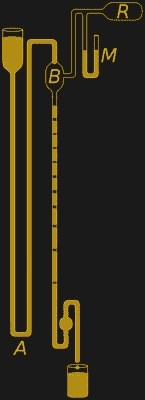

# 发明一个灯泡需要多少库存

> 原文：<https://hackaday.com/2017/03/20/how-many-inventors-does-it-take-to-invent-a-light-bulb/>

许多人将白炽灯泡的发明归功于爱迪生或斯旺，但它的发展实际上发生了两个多世纪，到爱迪生和斯旺参与进来时，技术已经深入到细节了。然而，这些细节意味着实验室里的好奇心持续几分钟就燃尽，而一些东西可以卖给消费者并持续几个月。这就是白炽灯泡是如何被发明的故事。

## 实验室的好奇心

Ebenezer Kinnersley’s electrical air-thermometer experiment

我们的故事始于 1761 年的埃比尼泽·金纳斯利。在给本杰明·富兰克林的一封信中，他描述了他为测试电是否产生热量而做的实验。他的电源是用一箱瓶子或莱顿瓶制成的静电电容器，那时电池还没有发明出来。为了获得足够的电流来检测温度的变化，他需要通过火花隙一次性释放所有储存的电荷。在一个实验中。(信中第 11 段)电流足以使一根黄铜丝变红。

今天我们说电线变成了白炽的，它因受热而发出可见光形式的电磁辐射。他还安排了一个实验，让金属丝在底部悬挂一个重物，并发现当它变得炽热时，它伸长了一英寸，这是这种加热对金属丝具有破坏性的第一个迹象。他用相同材料的不同直径的导线做实验，发现较大的导线没有显示出明显的热效应，并得出结论，这是因为较大导线的电阻较低。

下一步是 1799 年亚历山德罗·伏打发明了电池。这使得用恒定电流进行测试成为可能。许多实验者很快对电池进行了扩展和改进，以至于到 1802 年，汉弗莱·戴维在英国皇家研究所的地下室里获得了一个由 2000 个电池组成的特别大的电池。他通过使电流通过铂薄带产生光，铂具有足够高的电阻，但也具有高熔点。但还是没坚持多久，也不是很亮。

在接下来的 75 年里，许多人要么实验白炽灯，要么复制其他人的工作。苏格兰的詹姆斯·鲍曼·林赛(James Bowman Lindsay)写道，1835 年他在密封的玻璃罐中做了实验，不需要空气，尽管不清楚这是否仅仅意味着玻璃罐是密封的，或者他在某种程度上抽空了玻璃罐。

1838 年，比利时人马塞林·乔巴德用碳丝做了真空实验。1840 年，沃伦·德拉鲁在真空管中使用了铂线圈，但铂的成本使其在商业上不可行。第一个白炽灯专利于 1841 年授予英国的弗雷德里克·德·莫利恩斯，因为他在真空管中使用了铂丝，尽管他也用碳做了实验。

  Platinum and carbon lamps from Starr’s British patent 10,919  Alexander Lodygin’s light bulbs

1845 年，美国人约翰·w·斯塔尔以他的商业伙伴金的名义获得了 T2 的英国专利第 10919 号。另一个使用托里塞利真空中的碳丝，产生 10^-3 托(1.3×10-6 atm)的压力。此后不久，斯塔尔就去世了，因此没有继续从事商业活动。

1872 年，[俄国人亚历山大·罗迪金(或称罗迪金)](https://en.wikipedia.org/wiki/Alexander_Lodygin)为他发明的白炽灯申请了俄罗斯专利，后来获得批准。这种灯使用两根碳丝，每次只有一根在使用。当第一根灯丝烧断时，可以转动一个外部换向器来使用另一根。他首先用氮气填充，然后换成真空。在 1873 年和 1874 年，他试验了船上和城市街道的照明，并成立了电气照明公司 A.N. Lodygin 公司，但他卷入了社会主义思想，最终不得不离开俄罗斯。

在 19 世纪 70 年代之前，包括 19 世纪 70 年代在内，还有许多其他发明家，但没有一个人生产出灯丝寿命足以满足商业需求的灯泡，他们中的许多人引进了罗迪金(Lodygin)等技术，随着灯丝的消耗，让更多的灯丝发挥作用。

## 到消费者手中

Sprengel vacuum pump [by Vladsinger](https://en.wikipedia.org/wiki/File:Sprengel_vacuum_pump.svg) CC-BY-SA 4.0

很难说是否有任何啊哈时刻最终导致商业上可行的灯泡，尽管如果有大的贡献者，他们可能是 1865 年发明的 Sprengel 水银真空泵，允许更高的真空和更持久的电源。

英国化学家和物理学家约瑟夫·斯旺在 19 世纪 50 年代和 60 年代做了实验，但因为真空不足和电力短缺这两个原因而放弃了。但是随着 Sprengel 真空泵的发明，Swan 在 19 世纪 70 年代重新开始工作，到 1878 年能够开发出一种内部不会变黑的灯泡。它在 1880 年被授予英国专利。这种灯泡使用弧光灯的粗碳丝，持续了 40 个小时。然而，低电阻意味着它需要高电流和粗导线来馈电，这使得它在商业上不可行。

然后，他用硫酸处理过的“羊皮纸化”棉线做实验。它具有金属的外观，坚固耐用，直径为 0.01 英寸，可以形成 1/10 英寸的螺旋。在 100 伏电压下，它能输出 60 烛光。1880 年 11 月 27 日，他获得了另一项专利。

在这一点上，他开始照明，从他的房子开始，用水电供电，这是世界上第一个用电灯照明的房子。在他的公司天鹅电灯有限公司成立后，其他住宅和地标也随之出现，包括拥有 1200 盏灯的萨沃伊剧院和伦敦的法院。

然而，棉线仍然存在问题，包括任何厚度的变化都会导致加热不均匀，使其无法使用。他找到了解决这个问题的方法，从硝基纤维素中去除氮([棉花几乎是纯纤维素](https://en.wikipedia.org/wiki/Cotton))，溶解纤维素并将其挤压成非常细的线。这个他也申请了专利。

Edison carbon filament light bulbs from the early 1880s

独立于斯旺，托马斯·爱迪生也于 1878 年开始尝试白炽灯照明，申请了他的第一个照明专利，并于同年成立了爱迪生电灯公司。他也使用了 Sprengel 真空泵。他研究过碳丝和铂，但最终选择了碳。他在 1879 年 10 月 22 日的第一次成功持续了 13.5 小时。在进一步研究之后，他于 1879 年 11 月 4 日申请了他最著名的照明专利，该专利于 1880 年获得批准。正是在这之后，爱迪生和他的团队意识到碳化的竹丝灯可以持续 1200 小时。也是在 1880 年，爱迪生的灯第一次安装在爱迪生实验室外面的一艘客货两用轮船“哥伦比亚”号上。

与斯旺不同，爱迪生为整个社区安装发电站，斯旺用专用发电机为照明供电。因此，他既有持久的白炽灯，也有持续供电的手段。

正如你所料，爱迪生有专利纠纷，也许最著名的是关于威廉索耶的纠纷，他在 1877 年和 1878 年拥有类似的专利，早于爱迪生。但是索耶从未能制造出持久的光，这场争论最终以爱迪生胜诉的方式解决了。1883 年，爱迪生通过将英国爱迪生公司与斯旺公司合并，成立了[爱迪生和斯旺电灯公司](https://en.wikipedia.org/wiki/Edison_and_Swan_Electric_Light_Company)，俗称 Ediswan，从而避免了与斯旺在英国的专利纠纷。爱迪生买断的另一个著名专利是加拿大发明家亨利·伍德沃和马修·埃文斯的专利，他们在 1874 年获得了他们的灯泡专利，这种灯泡在稀薄气体填充的玻璃管中使用碳，气体是氮气。

## 我们知道(或曾经知道)的灯泡

亚历山大·罗迪金，我们上面提到的 1872 年离开俄罗斯的人，当时并没有停止实验。从 1886 年开始，他获得了几项美国白炽灯专利，还在法国、德国、英国和比利时拥有专利。19 世纪 90 年代，他用金属丝做实验，据说是第一个使用钨丝的人。钨丝灯比碳丝灯更亮，持续时间更长。

 

第一个国产系列的钨丝灯泡(右)和碳纤维灯泡(右)，由扎东尼·桑多(ifj。)，Fizped [CC BY-SA 3.0]，via[Wikimedia Commons](https://en.wikipedia.org/wiki/File:Izz%C3%B3l%C3%A1mp%C3%A1k.jpg)

然而，在 1904 年 12 月 13 日，正是匈牙利人 Sándor Just 和克罗地亚人 Franjo Hanaman 获得了钨丝灯泡的匈牙利专利。他们将专利授权给生产和销售灯泡的匈牙利公司。1906 年，威廉·d·柯立芝在为通用电气公司工作时，发现了一种从烧结钨中制造韧性钨的方法，然后将钨制成细丝。1911 年，通用电气开始销售灯泡中的灯丝。

关于在灯泡中使用惰性气体而不是真空，我们上面提到过亚历山大·罗迪金、伍德沃德和埃文斯曾试验过用氮气填充灯泡。然而，是欧文·朗缪尔在 1913 年发现，通过在钨丝灯泡中充入氩气等惰性气体，钨丝的寿命可以大大延长。1930 年，匈牙利人伊姆雷·布罗迪设计了一种从空气中提取氪的方法，从而首次用氪代替了氩。

1917 年，伯尼·李·本博发现了一种制造螺旋钨丝线圈的方法，1921 年，在东芝的前身 Hakunetsusha 工作的米乌拉纯一利用螺旋灯丝制造了第一个灯泡。

最后，1924 年，美国化学家马文·皮普金获得了在不削弱灯泡的情况下给灯泡内部蒙上霜的专利，1947 年，他获得了在灯泡内部涂上二氧化硅的专利，这让我们的灯泡发出了更多的漫射光，许多人都是伴随着这种光长大的。

## 情况就是这样

为了回答这个问题，是谁发明了灯泡，以上所有的都是和其他几个一起发明的，尽管这些是亮点。

然而，这并不意味着我们黑客没有空间了。看看这个用唐培里侬香槟酒瓶或[制成的 DIY 白炽灯](http://hackaday.com/2014/07/11/home-made-lightbulb-is-a-fun-proof-of-concept/)。很高兴看到在这个 CFL 和 LED 灯泡的时代，最初如此照亮我们生活的灯泡的故事仍有一丝曙光。