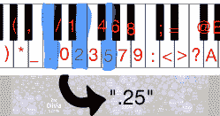

# 神经网络作曲；说“我会是巴赫”

> 原文：<https://hackaday.com/2017/03/17/neural-network-composes-music-says-ill-be-bach/>

[carykh]潜入神经网络，训练一台计算机[复制巴洛克音乐](https://www.youtube.com/watch?v=SacogDL_4JU)。结果和他使用的过程一样有趣。这个过程不是将莎士比亚(例如)输入神经网络，然后惊叹文本输出看起来像莎士比亚，而是将巴赫的音乐转换成一种文本格式，并将那个输入神经网络的*。钢琴上的每一个键都有一个字符，在训练中使用了 88 个字符的字母表。然后，神经网络疯狂运行，结果返回到音频，以查看(或听起来)输出听起来有多像巴赫。*

下面嵌入的视频以一个小品开始，但坚持住，因为一旦你达到 90 秒，事情就变得有趣了。缺乏耐心的可以直接跳到演示；[听巴赫的原曲，然后是早期的结果](https://youtu.be/SacogDL_4JU?t=254) (4:14)，并与[在巴赫上进行一整天的训练](https://youtu.be/SacogDL_4JU?t=697) (11:36)的结果进行比较，其中混合了一些莫扎特的音乐。对于一个完全不知道任何大画面概念(如旋律)的系统来说，其结果不仅可以被识别为音乐，甚至听起来也很好听。

MIDI describes music in terms of discrete events, and individual note starts and stops are separate events. Part of the reformatting process involved representing each note as a single ASCII character, thereby structuring the music more like text and less like keyboard events.

事情的核心是这个[基于角色的循环神经网络](https://github.com/karpathy/char-rnn)，它本身就是[安德烈·卡帕西](http://karpathy.github.io/2015/05/21/rnn-effectiveness/)的作品。用他的话说，“它将一个文本文件作为输入，训练一个递归神经网络，该网络学习预测序列中的下一个字符。然后，可以使用 RNN 逐个字符地生成看起来像原始训练数据的文本。”【carykh】实际上是怎么用这个做音乐的？通过以下过程:

1.  收集原始资料(很多很多巴赫钢琴或大键琴作品的 MIDI 文件。)
2.  使用工具将这些 MIDI 文件转换为 CSV 格式。
3.  用定制[处理](https://processing.org/)脚本标记和重新格式化 CSV 数据:一个 ASCII 字符现在等于一个钢琴键。
4.  向 RNN 提供结果文本。
5.  将 RNN 的输出转换回 MIDI，过程正好相反。

[carykh]分享了在整个过程中提出的一个重要问题:他到底在追求什么？他是如何定义自己真正想要的东西的？这有点模糊:一方面，他希望 RNN 的输出尽可能地复制输入，但他也不希望完全复制；他只是想让输出呈现足够多的相同模式，而不是实际复制源材料。神经网络的处理实际上从未“结束”；[carykh]简单地在某个时候拔掉插头，看看结果是什么样的。

 [https://www.youtube.com/embed/SacogDL_4JU?version=3&rel=1&showsearch=0&showinfo=1&iv_load_policy=1&fs=1&hl=en-US&autohide=2&wmode=transparent](https://www.youtube.com/embed/SacogDL_4JU?version=3&rel=1&showsearch=0&showinfo=1&iv_load_policy=1&fs=1&hl=en-US&autohide=2&wmode=transparent)

神经网络是一个过程而不是最终结果，它有各种各样的应用，从[处理手写方程](http://hackaday.com/2017/02/17/neural-network-does-your-homework/)到帮助腿式机器人[蠕动到行走步态](http://hackaday.com/2016/12/11/train-your-robot-to-walk-with-a-neural-network/)。

感谢[基思奥尔森]的提示！