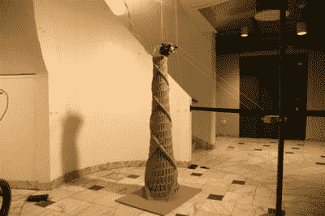

# 悬挂式 3D 打印机将整个房间作为打印床

> 原文：<https://hackaday.com/2017/03/20/hanging-3d-printer-uses-entire-room-as-print-bed/>

人们可以利用空余的房间做很多事情。有的做客房，有的做婴儿房，有的甚至做工艺房。黑客用空房做什么？当然是把它们变成巨大的 3D 打印机。【托尔比约恩·拉德维森】是瑞典于默奥大学的一名物理学专业学生，他只花了 250 美元就制造出了这款悬挂式打印机。它遵循了 RepRap 的传统，即[完全开源](https://github.com/tobbelobb/hangprinter)，并且主要由它可以打印的部件制成。

打印机功能齐全，通过打印五英尺高的巴别塔模型得到了证明。[Torbjorn]希望改进打印机，使其能够打印家具和其他大型家居用品。

[Torbjorn]希望 3D 打印不会重蹈 2D 打印的覆辙，在那里打印机被设计成在打印太多之后就坏掉。开源是阻止这种机器出现的关键。

感谢[Jeremy Southard]的提示！

 [https://www.youtube.com/embed/ULJqLSTriRY?version=3&rel=1&showsearch=0&showinfo=1&iv_load_policy=1&fs=1&hl=en-US&autohide=2&wmode=transparent](https://www.youtube.com/embed/ULJqLSTriRY?version=3&rel=1&showsearch=0&showinfo=1&iv_load_policy=1&fs=1&hl=en-US&autohide=2&wmode=transparent)

