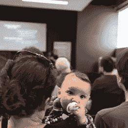
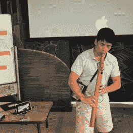
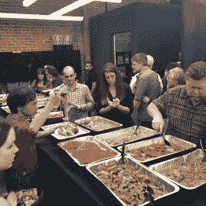
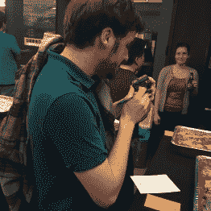
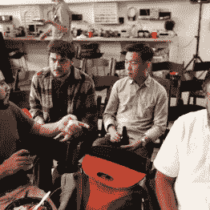

# 一朵壁花跳进了洛杉矶会议

> 原文：<https://hackaday.com/2017/03/29/a-wallflower-jumps-into-the-los-angeles-unconference/>

上周，当我被要求报道洛杉矶的大会时，我不得不承认，我对这个想法感到非常不舒服。我不太喜欢旅行，见到很多人的想法有点吓人。当然，亲自与 Hackaday 的读者见面就像走进一个特别有争议的帖子的评论区的现实版。对吗？

我大错特错了。

在帕萨迪纳 Supplyframe 设计实验室举行的 LA Unconference 是我职业生涯中参加过的最具学术性和参与性的会议。我不可能要求一个更好的团体来分享下午和晚上，并且谈话的质量是极好的。设计实验室成了这次活动的绝佳场所——一个用于会谈的大型主房间，有许多小区域可供即兴讨论和交流。

我没有做官方统计，但是这个地方已经满了，几乎所有的人都在整个活动过程中没有离开。就像芝加哥和旧金山的比赛一样，我们基本上是边走边编。通常“即兴表演”和“会议”会是一场灾难，但几乎每个人都准备好了发言，甚至一些壁花(包括你真正的壁花)也受到启发，站起来即兴发言。我们用一叠便利贴和一块白板开始了这次活动，很快就建立了一个 8 分钟演示和闪电谈话的可靠计划，然后就开始了比赛。

### 非会议可以有主题吗？

让我印象深刻的一件事是，这次会谈有几个主要主题，这很奇怪，因为整个事情是有机的。不过，英雄所见略同，有几次演讲涵盖了黑客和社会工程的哲学。[Rob]讨论了他的“城市圈”项目，该项目旨在通过将复杂系统的形状映射为互连节点的三维网络来对其进行建模。优化后的系统将接近球形，他一直在向帕萨迪纳这样的城市推销他的模型。

 [![CitySpheres with [Rob], one of our many philosophical talks.](img/01271f6bdf9e8da26ec83447c287b1e4.png "IMG_9344")](https://hackaday.com/2017/03/29/a-wallflower-jumps-into-the-los-angeles-unconference/img_9344/) CitySpheres with [Rob], one of our many philosophical talks. [![[Matt] holding forth on rapid development.](img/8d593fd4b14cca9318977f72486404b6.png "IMG_9360")](https://hackaday.com/2017/03/29/a-wallflower-jumps-into-the-los-angeles-unconference/img_9360/) [Matt] holding forth on rapid development.  This conference doesn’t suck. [![[Liam] likes the ISS. A lot.](img/1575a4bd9a6d709ba6ddb92e89bf7aa6.png "IMG_0453")](https://hackaday.com/2017/03/29/a-wallflower-jumps-into-the-los-angeles-unconference/img_0453/) [Liam] likes the ISS. A lot.

沿着社会工程学的路线还有[琼·霍瓦特]关于[利用 3D 打印帮助视障儿童的老师的演讲](https://hackaday.io/project/11312-3d-prints-for-teachers-of-the-visually-impaired)和[马特·梅尔]关于快速发展哲学的观点。[Matt]正在从事一个名为[Howstr](http://howstr.com/)的项目，以简化开放硬件项目的文档。

[Amy Wenslow]就许多黑客渴望解决的一个问题做了一次精彩的演讲——如何实现从产品到利润的飞跃。她就如何管理众筹活动以及将你的预购款定位为“带礼物的捐赠”的重要性提出了一些可靠的建议。她还深入谈到了不要踩到库存过剩的地雷，以及应对利润率吃紧的重要性。收到具有这些商业才能的人的来信很有趣。

谈到成功的产品，我们听到了一个温暖人心的故事，来自[利亚姆·肯尼迪]关于 Hackaday 如何帮助他实现梦想。我们报道了他的 ISSAbove 项目，该项目让你知道国际空间站何时会从头顶掠过。从那时起，他已经将产品扩展到包括直播视频流，并已售出超过 1700 台，包括一些给美国宇航局的会议室。

### 健康与超人类学家

健康是另一个表现强劲的主题。自称为“开源超人类主义者”的 pawechojnacki 讨论了如何开始努力[揭穿一个名为 NeuroOn](https://alxd.org/neuroon-analysis-results.html) 的“智能睡眠面具”的 Kickstarter，这是一个据称可以分析你的脑电图并确定你睡眠周期最佳醒来点的设备。事实证明，该产品实际上运行得相当好，而且[pawez]现在正与该公司合作，对该设备进行开源。

 [![[Paweł] and open-sourcing a commercial product.](img/06e84be64e6c1e1a4f63432634f1458d.png "IMG_9350")](https://hackaday.com/2017/03/29/a-wallflower-jumps-into-the-los-angeles-unconference/img_9350/) [Paweł] and open-sourcing a commercial product.  Our dinner music. [![Horrible shop accident or fashion statement, [Alex]?](img/da30995ac4e461bfd57b670bc0910d0b.png "IMG_0423")](https://hackaday.com/2017/03/29/a-wallflower-jumps-into-the-los-angeles-unconference/img_0423-3/) Horrible shop accident or fashion statement, [Alex]?  The feast!  Eat a little, hack a little.  Working dinner.

坚持健康，[Jacob Christ]讨论了他关于通过使用 Google 的 TensorFlow 开发诊断专家系统，为全球人口带来可负担的医疗保健的想法。[Raul Ocampo]讨论了他关于用自主机器人拦截跌倒的老年人并减少冲击能量来防止老年人髋部骨折的想法。

然后是更折中的谈话:[乔纳森]关于建立社区 LoRA 网络，以及[莱昂纳多·祖尼加]正在研究一种连续热解过程来生产生物炭作为堆肥的替代品。两个真正取悦大众的是【博伊恩·米托夫】的 [Visuino](https://www.visuino.com/) ，一个面向 Arduino 的可视化编程环境，带有一个拖放界面来自动生成草图，以及【亚历克斯】的 [BananaPhone](https://www.arctangent.io/build-your-own/) 系统来自动阻止 robocalls。

这一天发生了很多事情，我毫不怀疑我错过了什么，所以我向所有被我漏掉的人道歉。节奏轻松但一致，休息时间主要是工作时间——网络、演示和围绕设计实验室的非正式聚会。晚餐棒极了，是一场意大利食物的盛宴，远远超过了我们可以合理吃的东西；如果有人饿着肚子离开，那不是因为缺少食物。向[Shulie]和[Katie]致敬，感谢他们的领导，感谢他们的组织，如果这有意义的话，感谢他们的热情款待和建议，让我们在南加州度过了一个美好的周末。当然，感谢每一个参加并使这成为一个伟大事件的人。

Hackaday Unconference 拉开了 [2017 Hackaday 大奖](https://hackaday.io/prize)的序幕。受到启发，去做一些有意义的事情，让世界变得不同。有很多问题需要解决，也有很多人加入到挑战中来。这只是选择在一个聪明的想法上花费一些时间和技能的问题，上周在洛杉矶就有很多这样的想法。

The [HackadayPrize2017](https://hackaday.io/prize) is Sponsored by:   