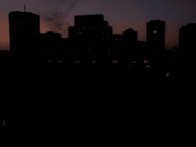

# 当电网变暗时

> 原文：<https://hackaday.com/2017/04/03/when-the-grid-goes-dark/>

如果你经历过 2000 年的惨败，你可能会记得很多最终几乎没有任何现实影响的宣传。随着日历年从 1999 年跳到 2000 年，许多人预测控制我们银行和基础设施的机器会出现灾难性的软件错误。虽然这场潜在的灾难没有达到预期，但在新千年开始后不久，又出现了另一个重大的基础设施问题，导致北美多次停电。虽然从造成的混乱程度来看，2000 年问题似乎终于有了结果，但这些停电的实际原因只是电网本身的体制问题。

### 内置保护硬件

虽然 2000 年代初发生的几次大规模停电并不常见，但局部小规模停电几乎肯定会在某个时候发生。尽管电力公司受到激励，尽可能多地防止它们(如果停电，电表不会转动)，但没有保证的方法来防止闪电击中电力线或昂贵的设备，或防止不道德的电工使面板过载和损坏变压器，或防止鸟类在每个变电站筑巢。

理论上，一旦出现问题(称为电气系统“故障”)，有各种保护装置来确保电力中断尽可能短。大多数电气故障都是短暂的瞬时故障，过一会儿就会自行消失。这些都是像雷击或者树枝刷电线之类的事情。这些故障需要人工重置，而不是打开断路器，称为“自动开关”的小型设备可以重新给电网中受到这种临时故障影响的部分供电。对于更永久性的故障，一个更大的断路器将打开，但在故障被技术人员物理清除后，必须手动关闭。电网还广泛使用保险丝，这是一次性使用的设备，不同于断路器和自动继电器。

### 彻底的失败

然而，所有这些保护设备并非没有缺点，在适当的情况下，它们可能会表现失常，产生非同寻常的效果。2003 年东北大停电就属于这种情况，当时一根输电线路接触到了俄亥俄州的一棵树。通常像这样的事故会被保护设备和电网运营商迅速处理。然而，这是一个夏天，电力线接触到树的原因是因为它比正常情况下下垂得更远，因为它携带的电流接近其最大额定电流。更大的电流意味着电线的热膨胀更大，这意味着有更多的机会接触到它不应该接触的东西。

Toronto during blackout
by [Camerafiend](https://commons.wikimedia.org/wiki/File:Toronto_ON_2003_Blackout.jpg) CC-BY-SA-3.0

由于这是一个夏天的下午，当第一条输电线路离线时，电路上的所有正常负载加上所有峰值功率都必须通过其他电路发送，以避免停电。通常情况下，这很容易解决，但其他电路*也*处于峰值承载能力，一旦紧急负荷转移到这些电路，这些电路就会离线跳闸，这导致更多的输电线路过载，更多的电路离线跳闸。当一切都结束时，估计美国和加拿大有 5000 万人断电。这是当时历史上第二大范围的停电，只不过是由一个炎热的天气和一个小小的计算机错误导致级联故障迅速失控造成的。

值得注意的是，电力公司是企业，建设一个比实际需要更强大的电网在财务上没有意义。一定程度的紧急评级是一个好主意，虽然俄亥俄州公司最终可能有点疏忽，但至少他们没有公开邪恶。事后指责也相对容易。

### 停电作为一种商业模式

然而，另一方面，大规模停电是由积极试图从中获利的公司造成的。2000 年和 2001 年的加州电力危机是一个典型的利益冲突案例，安然等能源交易商控制着加州的能源供应，同时也是能源期货交易商。这种做法不再被允许，但它确实需要一家现在因腐败、不正当商业行为和破产而闻名的公司来催化法律的变化，这种变化允许在能源市场上解除管制。在危机期间，加州遭受了大规模的轮流停电，尽管输电系统足够强大来处理需求，并且有足够的发电能力在没有停电的情况下为整个州供电。

### 启动发电厂

虽然有一个监管机构(在北美是 T1)有一些牙齿(感谢安然)来处理这样的问题，电力公司仍然必须能够在停电时恢复供电。尽管电网的任何损坏都必须修复，但恢复供电并不像按动核电站或燃气轮机的开关那么简单。如果这些基本负荷电厂失去电力，它们要么需要来自所谓黑启动电厂的场外电力，要么需要大型柴油发电机，以便重新开始发电。锅炉必须点火，控制棒必须移动，燃料必须输送到核电站，所有这些都需要能源。一般来说，电力公司利用水力发电厂的黑启动能力，但在没有地质条件支持拦河筑坝的地区，目前必须使用其他方法。

虽然小规模停电几乎肯定会发生在每个人身上，但尽管基础设施老化，公司无良，大规模停电还是相对罕见。当然，在像电网这样大的规模上，电力流动可能非常复杂，但在本系列的下一篇文章中，我们将了解智能电网:当前电网的现代化，以及我们如何利用现代技术来改善它的一切。