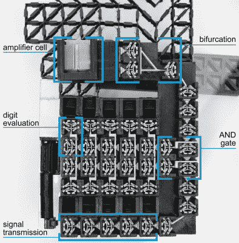

# 3D 打印键码是塑料数字逻辑

> 原文：<https://hackaday.com/2017/04/06/3d-printed-key-code-is-plastic-digital-logic/>

3D 打印机非常适合创建静态对象，但如果你够聪明，也有可能打印出功能性设备。如果你非常聪明，你可以做得更好，这里就是一个例子。这种带钥匙密码锁的门把手是用 3D 打印完成的，使用的机械设计看起来像是外星技术。这只是他们正在开发的更有趣的机械数字逻辑的一个应用。

在[Hasso-Plattner-Institut]的工作中，研究小组正在关注超材料本身的机制。这种锁的关键是一系列双稳态弹簧，如果输入正确的密码，这些弹簧将串联触发以打开门。该项目建立在我们去年展示的[门把手](http://hackaday.com/2016/09/14/3d-printed-door-latch-has-one-moving-part-itself/)中的剪切单元网格上。它在视频中发生得很快，但手柄解锁的复杂级联是一种享受。

这是一场迷人的机械设计秀。数字电子的常见元素都存在:设置或未设置的位、逻辑门、传播问题、整个工程。但是在这个系统中有额外的挑战，比如需要特殊的细胞，可以将逻辑链旋转 90 度，并将信号分成多个部分。

这种信号分离出现在右上方(分叉)，并导致实际上是一个放大器。锁紧螺栓必须移动两倍于正常电池的距离，因此需要双电池输入来抵消来自更小电池的力的损失。从认知上来说，我们理解这一点，但我们仍然试图获得对放大器机制的直观感受。

有一点是肯定的，整体概念比这个公认的可怕的门锁机制要酷得多。这篇论文值得你花时间深入研究。它提到了他们的设计编辑器软件。你可以在线玩它，但我们认为它还没有更新到包括新的逻辑单元。

 [https://www.youtube.com/embed/FFLKgPtrJis?version=3&rel=1&showsearch=0&showinfo=1&iv_load_policy=1&fs=1&hl=en-US&autohide=2&wmode=transparent](https://www.youtube.com/embed/FFLKgPtrJis?version=3&rel=1&showsearch=0&showinfo=1&iv_load_policy=1&fs=1&hl=en-US&autohide=2&wmode=transparent)

【谢谢提示，意泰！]