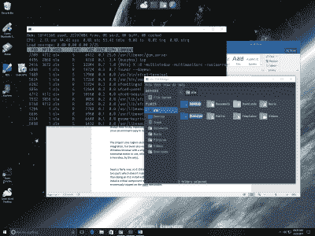

# swan:Windows 上更好的 Linux

> 原文：<https://hackaday.com/2017/03/29/swan-better-linux-on-windows/>

如果你是一个必须使用 Windows 的 Linux 用户——或者甚至是一个需要一些 Linux 支持的 Windows 用户——Cygwin 一直以来都是一个很好的工具。它提供了一个几乎完整的 Linux 工具集。它还提供了几乎整个 Linux API，因此它没有提供的任何东西都可以从源代码中构建。你甚至可以在 Windows 上编写代码，编译并测试它，然后(通常)轻松地将其移植到 Linux 上。

然而，Cygwin 的包管理有点笨拙，设置 GUI 环境总是很棘手，尤其是对于新用户。一个名为 Swan 的项目旨在使一个全功能的 X11 Linux 环境易于在 Windows 上安装。

这个项目使用 Cygwin T1 和 T2 Xfce T3 作为它的桌面。Cygwin 提供了非常好的 Windows 集成，但是 Swan 也包含了额外的特性。例如，只需单击一下，您就可以将默认浏览器设置为 Windows 浏览器。它还包括 SPM——Cygwin 的一个更容易使用的包管理器，尽管它仍然启动默认的包管理器来完成这项工作(顺便说一下，这不是[的新想法](https://github.com/transcode-open/apt-cyg))。

下面是 Windows 10 的截图(可以看到 Word 在后台原生运行)，top 在 Bash shell 中运行，Thunar(Swan 的默认文件管理器)。请注意顶部带有天鹅图标的面板。你可以在那里添加东西，从天鹅图标你可以访问许多设置。

Swan 相当新，所以它仍然有一些粗糙的边缘，但我们喜欢它的发展方向。安装过程分为两个部分，这对于试图变得更简单的东西来说没有意义。不可否认，这已经比用普通 Cygwin 安装 X11 容易多了。但是，在至少一次测试安装中，病毒扫描程序错误地触发了 wget 可执行文件，导致安装失败。

如果您想查看源代码或投稿，该项目托管在 [GitHub](https://github.com/starlight) 上。当然，Windows 现在(在某种程度上)有了自己的对 Linux 的支持[。Swan 并不是一个完整的产品，像 Cygwin 一样，它也不是 Linux 的完全替代品。但是在任何启动 Windows 的机器上都值得一看。](https://hackaday.com/2016/03/30/windows-and-ubuntu-cygwin-can-suck-it/)