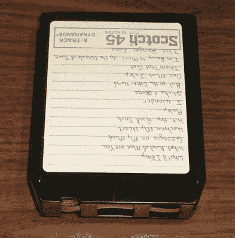
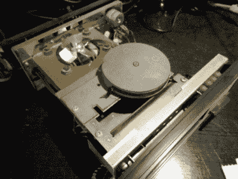
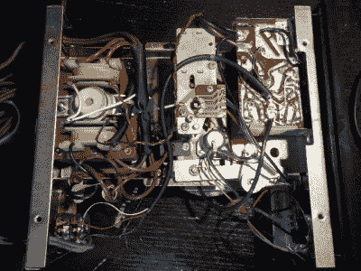
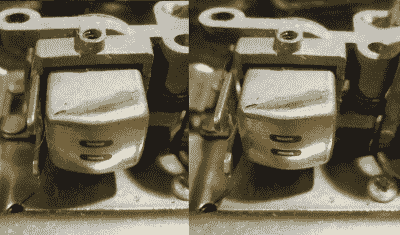
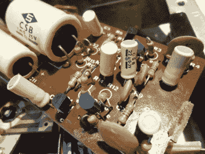
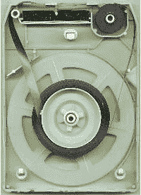

# 复古拆卸:8 声道立体声播放器内部

> 原文：<https://hackaday.com/2017/04/12/retro-teardown-inside-an-8-track-stereo-player/>

如果你是模拟音频的鉴赏家，你很可能在家里的某个地方有一个唱盘和一叠唱片。如果你到了一定的年龄，你甚至可能有一个卡式录音机，尽管你更有可能在 20 世纪 90 年代的某个时候放弃了这种格式。如果你的年龄足够大，生活在 20 世纪 60 年代或 70 年代，你可能已经拥有了另一种模拟音频格式。你可能会在那个时期设备齐全的家庭中找到的几个之一是 8 声道立体声盒式磁带，这是一种独立的盒式磁带格式，将四个立体声轨道安装到一个四分之一英寸的磁带环上，作为八个平行轨道，左右各四个。营销的胜利，真的，它应该更准确地被称为 4 声道立体声。

An 8-track stereo cartridge. [Government & Heritage Library, State Library of NC](https://www.flickr.com/photos/statelibrarync/8743811847) (CC BY 2.0).

8 声道盒式磁带是从早期的盒式磁带格式发展而来的，主要是为了满足汽车工业对可互换的车内娱乐的需求。因此，如果你拥有一台 8 声道播放器，它最有可能出现在你的汽车里，但也经常会发现它们被集成到家庭高保真系统中。这样我们就进入了今天的主题。我们的 retrotechtacular 系列通常会重点展示一个展示过时技术的视频，但今天我们将获得更多的实践机会。

20 世纪 90 年代初的某个时候，我买了一台 8 声道播放器，这是一台 BSR·麦当劳的产品，在英国制造，可以追溯到 20 世纪 70 年代初。BSR 因其唱盘而更加出名，所以这有点奇怪。我发现它的地方已经消失在时间的迷雾中，但它可能是在一个无线电集会或旧货出售。我当然没有买它，因为我想让它播放 8 轨磁带，相反，我想为我的高保真音响找一个话题，一个与众不同的东西。因此，在过去的四分之一世纪里，每一个听觉享受的化身都有一个 8 声道播放器，即使它在我的所有权下从未播放过磁带。因此，我们有一个独特的机会进行这种复古拆卸。

该播放器本身的大小约为普通高保真音响的一半，而不是普通的大约 19 英寸机架大小，它大约 9 英寸(23 厘米)宽，4.5 英寸(11.5 厘米)高。外壳由纤维板制成，覆盖着当时流行的木质效果乙烯基，前面板有盒式磁带插槽和音轨选择按钮。在后面板上是音频电平控制和电缆，音频输出被带到 DIN 插头，而不是我们今天更常见的唱机。在 20 世纪 70 年代的一段时间里，d in 连接器还处于音频领域的领先地位。

Sticky belt debris still attached to everything.

将装置翻转过来，拧开支脚，盖子就可以滑开，露出机械装置。一个非常坚实的钢板底盘显露出来，有一个电源供电的罩极电机和一个皮带传动到夹送辊轴上的一个坚固的铸铝飞轮。电机也是电子设备的主变压器，这是 BSR 特有的节省成本的技巧，你也可以在那个时期的唱机中找到。

很快，一件古老设备的不幸副作用变得明显起来，在这款播放器最后一次使用后的几十年里，驱动带已经变软，变成了一种粘稠的黑色焦油状物质。这在 20 世纪 70 年代的皮带中很常见，有人告诉我这与橡胶的硫化程度有关。接下来是一段用薄纸挑选、摩擦和刮擦的插曲，我的手在去水槽和一些工业洗手液约会之前沾满了黑色的黏糊糊。

 经检查发现，底盘由两部分组成，用自攻螺钉固定在一起。前半部分是 8 轨机构，后半部分是电机和电路板。这可能是因为相同的基本机制被用于一系列 BSR 产品，虽然 8 轨格式并没有真正在英国起飞，它很可能是 BSR 将这种机制出售给其他制造商，以同样的方式为他们的转盘。

翻转底盘，连同电子设备和电机，我们看到 8 轨播放器的商业端，螺线管和允许它改变轨道的机制。有一个凸轮，由一个螺线管通过四个位置递增地旋转，这个凸轮在磁道之间上下移动磁头。有两种方法可以触发螺线管，要么通过按下单元前面的选择器按钮，要么通过一片导电箔片在胶带环连接处通过一对电触点来自动改变轨道。为了展示凸轮的操作，我录制了一段视频，视频中用一对镊子启动螺线管，可以看到凸轮在旋转。

 [https://www.youtube.com/embed/4nd20V0CwtY?version=3&rel=1&showsearch=0&showinfo=1&iv_load_policy=1&fs=1&hl=en-US&autohide=2&wmode=transparent](https://www.youtube.com/embed/4nd20V0CwtY?version=3&rel=1&showsearch=0&showinfo=1&iv_load_policy=1&fs=1&hl=en-US&autohide=2&wmode=transparent)

You can just about see by the shadow, the tape head on the left is lower than that on the right.

同时，在底盘的另一侧，头部向上或向下移动相应的量。因为磁带的宽度只有 1/4 英寸，所以没有太多的移动，但是你可以从两张图片中头部阴影的相对位置看出它是如何在不同的轨道之间移动的。磁头本身包含两个独立的磁头，每个通道一个，正如你所看到的，这两个磁头相隔大约半个磁带宽度。

The channel selector light switch

在凸轮轴的底部是一个 PCB 开关，带有一个滑动触头，它穿过四个衬垫，每个轨道一个。这会将电源传送到前面板上显示当前选定曲目的一组四个指示灯中的一个。指示灯不是我们今天期望的发光二极管，而是微小的白炽灯泡。对于 20 世纪 70 年代初来说，LED 可能有点过于新奇。

最后，前置放大器电路是 20 世纪 70 年代早期在一个典型的树脂粘合纸板上的分立元件的集合。很明显，这件艺术品采用了老式的方式，在醋酸纤维上使用皱纹纸，给人一种那个时代的感觉。由于该装置已经几十年没有通电了，它的电解电容器很可能已经有所退化。

Vintage components on the pre-amp board.

这台机器给我的印象是，它是多么复杂，同时却做得如此之少。它所包含的单个组件的数量肯定使它成为一种非常昂贵的制造设备，所有这些都可能导致它在英国没有商业上的成功，因为在英国，它没有汽车制造商的支持，无法像在美国那样将它投入新的车型中。它会回到我的高保真音响架上，最终人们会问“那是什么？”而不是因为我的高保真音响里有一个 8 声道播放器而高兴地大叫。

Inside an 8-track cartridge. [Isis](https://commons.wikimedia.org/wiki/File:8track_inside.JPG?uselang=en-gb) (GFDL).

在我们结束这个话题之前，还有最后一件事要检查，8 声道拾音器本身。它们包含一个缠绕在单个单面卷轴上的连续胶带环，由于胶带在从卷轴中心进给时必须通过自身，因此它们使用了特殊的润滑胶带和石墨背衬。因此，他们只能前进，不可能后退。压带轮被整合到磁带盒中，从那里它将与播放器中的主导轴配合。中央开口是磁头与磁带接触的地方，左侧开口是磁带末端箔片传感器的触点与磁带接触的地方。

从某种意义上说，8 声道立体声盒式磁带从推出的那一刻起就注定要失败，因为它的克星，紧凑型盒式磁带，已经进入了市场。盒式磁带提供了更大的容量和在更小的包装中倒带的能力，并且没有遭受 8-磁道的磁头对准问题，这是由于在磁道变化上的移动。在 20 世纪 70 年代，盒式磁带赢得了盒式磁带格式之战，这得益于集成到汽车收音机中的小得多的播放器，并最终集成到大获成功的索尼随身听和类似的便携式音乐播放器中。到 20 世纪 80 年代，仍然有这种形式的主要发行，但到了 20 世纪 80 年代末，它已经淡出历史，只是作为电影中的临时插科打诨而复兴。

我们将为您留下另一个视频，这一次是一个广告，当时 8 声道播放器是您汽车的一个很酷的配件。这是一个苦乐参半的问题，因为当然不仅这种形式已经成为历史，现在也有商店在出售它。

 [https://www.youtube.com/embed/3PMMGvmnCSE?version=3&rel=1&showsearch=0&showinfo=1&iv_load_policy=1&fs=1&hl=en-US&autohide=2&wmode=transparent](https://www.youtube.com/embed/3PMMGvmnCSE?version=3&rel=1&showsearch=0&showinfo=1&iv_load_policy=1&fs=1&hl=en-US&autohide=2&wmode=transparent)

