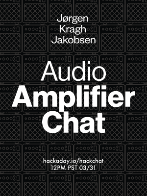

# 周五聊天:音频放大器设计

> 原文：<https://hackaday.com/2017/03/29/friday-hack-chat-audio-amplifier-design/>

加入 Merus-Audio 的模拟/数字设计工程师[jrgen Kragh Jakobsen]，[参加本周的黑客聊天](https://hackaday.io/event/20627-audio-amplifier-hack-chat)。

每周，我们都会发现一些有趣的人在制造东西，这些东西制造所有的东西，让他们坐在电脑前，让他们透露现代制造和技术实际上是如何发生的。这是黑客聊天，时间是 3 月 31 日星期五中午(太平洋标准时间 20:00)。

Jr gen 的公司开发了一系列多电平 D 类放大器，专注于降低功耗，在移动应用中节省电池寿命，同时又不损失音频质量。

有许多降低功耗的技巧，一些是基于晶体管开关的核心技术，另一些是基于输入电平的，调制类型和频率可以动态变化，以适应从背景音频电平到派对模式的一切。

### 以下是参与方式:

 我们的 Hack Chat 是 Hackaday.io 上的实时社区活动 [Hack Chat](https://hackaday.io/project/5373-hacker-channel) 群发消息。

登录 Hackaday.io，访问该页面，并寻找“加入这个项目”按钮。一旦你成为这个项目的一部分，这个按钮就会变成“团队信息”，直接带你进入黑客聊天。

你不必等到星期五；随时加入，你可以看到社区在谈论什么。

### 即将开始的黑客聊天

当谈到我们的黑客聊天时，我们有很多要讨论的。4 月 7 日，我们的主持人将是[Samy Kamkar]，杰出的黑客，来谈谈逆向工程。