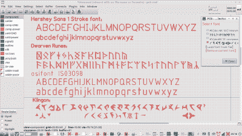

# GEDA PCB 工具的新字体

> 原文：<https://hackaday.com/2017/04/01/new-fonts-for-geda-pcb-tool/>

在开源世界里，PCB 设计主要有两种选择:KiCad 和 gEDA。但如果你厌倦了枯燥的好时字体告诉你哪个电阻是哪个，或者如果你需要遵守 ISO 3098，有一个明确的选择:PCB-RND，gEDA 的 PCB 工具的改进分支。为什么？

 因为 [PCB-RND 现在支持 osifont](http://vk5hse.blogspot.de/2017/03/iso-3098-cad-compatible-font-support.html) ，支持的语言数量多的离谱。除了常见的嫌疑人，如阿塞拜疆人和越南人，还增加了对遗留用户的支持，包括中土世界的用户，他们建造的 PCB 只能在都灵日最后一缕阳光的夕阳下，当画眉敲门时才能阅读。

他们并没有就此止步。期待 2267 年的 Organia 条约，您现在可以创建完全符合 plqaD-HaSta 的 PCB。

我们很高兴看到这些重要的步骤向服务不足的 PCB 建造社区延伸。然而，我们对持续缺乏对 Rihannsu 的支持感到震惊。任何想把他们的项目推进到 Beta 象限的人都必须纠正这一点。