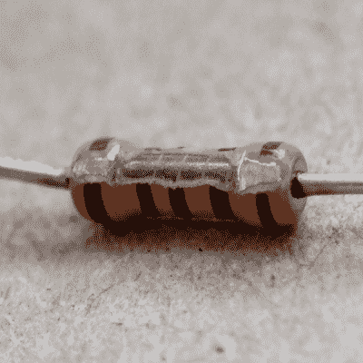
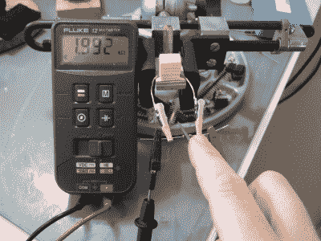
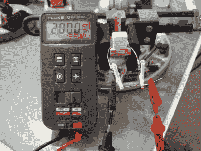
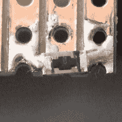

# Hackaday 调整自己的电阻

> 原文：<https://hackaday.com/2017/04/10/hackaday-trims-its-own-resistors/>

有时候你可能需要一个奇值电阻。与其跑到商店去买一个 3140ω的电阻，你可以用一个好的欧姆表，并愿意焊接串联和并联的东西。但是，当你想要一个*精确的*电阻值，并且你想要很多这样的电阻值时，一次又一次地将许多电阻组合在一起并不是一个好的解决方案。

例如，8 位 [R-2R 电阻阶梯 DAC](https://en.wikipedia.org/wiki/Resistor_ladder#R-2R_resistor_ladder_network_.28digital_to_analog_conversion.2C_or_DAC.29) 需要 17 个两值电阻，精度优于 0.4%。我手头没有这样的东西，串联/并联的方法很快就会让人厌倦。

很久以前，我读过关于手工调整电阻的文章，但我认为这是疯子的专利。另一方面，这是 Hackaday 我有时间和一份文件。我能在 0.5%的范围内调整和匹配电阻吗？请继续阅读，寻找答案。

## 金属膜通孔电阻器

All in the name of science

你的普通通孔电阻器是一个[金属薄膜电阻器](http://www.resistorguide.com/metal-film-resistor/)，通过在不导电的陶瓷圆柱体上沉积一层薄金属制成。金属薄膜被切割成螺旋状，所得到的金属线圈的长度、宽度和厚度决定了电阻。由于沉积的金属很薄，在 50 纳米到 250 纳米之间，你可能会认为用手来修整它会有点挑剔。

直截了当地说，当我试图少量改变电阻时，可能不到 5%左右，很容易就能找到精确的期望值。我有一袋 1kω和 2kω1%电阻，我认为我在学习时会犯一大堆错误。

事实是，在 17 次尝试中，我只有一次越过了目标，而且只差 1 欧姆。其余的电阻已尽我所能进行了调整，精确到 1 欧姆。(我的电表和探头有 0.3ω的失调，但我对此无能为力。)我投了“差”的，又做了一个，很快就有了完美的一套。

这是整个过程。我将电阻放入一些绝缘夹子中，并将欧姆表夹在两端。我用了一个小圆锉，然后就开始了。最初的几笔可以让你穿过相对较厚的涂层，但是一旦你看到金属，或者注意到欧姆表上的一个信号，通常是用锉刀轻轻一碰。当你接近的时候，也许可以在划水之间吹掉一些金属灰尘，但是我没有注意到这有什么不同。用小锉刀轻轻敲了七八下，电阻降到了 10 点。

0.4% Error?

How About 0% Error?

事实上，由于一开始很容易走得太远，我发现理想的候选电阻是 1990ω电阻。我的许多 1kω电阻都是 999ω，这使得它很难在不超出标记的情况下穿过外壳。我可能会离开他们。好消息是，大多数 1%电阻在任一方向上都会相差几欧姆以上，否则它们将作为 0.1%电阻出售。当然，你需要选择比目标电阻更低的源电阻——你不能用锉刀添加金属。

因此，您的套件中只需要一个电阻值，对吗？绝对不行。用 1kω的原件制作 1.2kω的电阻是自找麻烦。我让它工作了几次，再次下降到单欧姆，通过在不同的地方重新开始锉过程，而不是简单地在一个洞里更深，但我不推荐它，我想不出你什么时候需要它。只需增加一个 200ω串联电阻并进行调整。请记住，你正在细化一个只有 100 纳米厚的金属螺旋。慢慢来。

## 表面贴装？

记录通孔电阻的精确值比我预期的要容易得多，所以我决定做一些更难的事情。我把一个 1206 2.1kω电阻钉在了某个条形板上。你不会知道吧，它读出的正好是 2100ω，所以 2105ω就成了目标。那一点也不顺利；最终，我获得了一个比预期更快的 2722ω电阻。

Didn’t end well.

第二个 1206 从 2，103ω开始，我只是在没有目标的情况下进行。通过非常小心地操作，我将它的电阻*降低到*2009ω，然后它跳到 2600ω甚至更高。降低阻力一点意义都没有。也许我把一些焊料拖进了缝隙，有效地加厚了金属层？我去寻找信息，但没有得到任何深入的建设比 Vishay 的数据表:“高品质陶瓷上的金属釉”，这并没有启发太多。

经过两次以上的尝试，我不能得到 SMT 电阻在微调；沉积的金属层太薄了。无论如何，我不确定它会有多大用处——焊接和脱焊 17 个这样的元件的想法不是很有吸引力。

## 结论

调整通孔电阻非常棒。我做了一整套匹配好于-0.05%(！)电阻，只需要一个锉刀和一个欧姆表，半小时就可以完成。我第一次尝试的时候。通过这种方式，您可以轻松实现 10 位 DAC。结果比我希望的要好一个数量级，而且一点也不难。太神奇了。没有什么比手工制作的 DAC 更酷了。(对于 cool 的奇数值。)

另一方面，我调整表面贴装电阻的尝试彻底失败了。有人想猜猜为什么吗？仅仅是修整一个超薄膜的扭捏感吗？任何拥有精密激光切割机的人都想试一试，并[写信给我们](mailto:tips@Hackaday.com)？