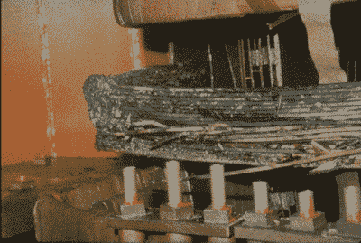

# 魁北克的熄灯:1989 年的地磁风暴

> 原文：<https://hackaday.com/2017/04/10/lights-out-in-quebec-the-1989-geomagnetic-storm/>

1989 年 3 月 13 日晚上，我发现自己和我的女朋友以及她的父母在他们家的后院凝视着天空。天空几乎真的着火了。红色和粉红色的等离子体片从正上方呈圆形流出，偶尔会有像氙气一样的蓝白色条纹在空中闪烁。我们实际上可以听到周围的咝咝声和噼啪声。我们四个人站在那里，对有幸目睹的北极光肃然起敬。

与此同时，在魁北克省以北几百英里的地方，灯光正在闪烁。让我着迷的同一个太阳风暴也让魁北克水力发电公司(省电力管理局)感到不适，触发了断路器，造成了严重破坏。这当然不是太阳第一次爆发并破坏地球上的系统，但这是非常戏剧性的，从它和其他太阳爆发中可以吸取一些教训。

### 通量绳

我目睹的事件实际上开始于三天前的日冕物质抛射(T1)，或 CME。日冕物质抛射是从日冕发射出来的等离子流和纠缠在一起的磁力线。尚不清楚是什么导致了日冕物质抛射，但它们肯定似乎与其他太阳现象有关，如太阳耀斑和太阳黑子，通常在太阳活动频繁时更经常发生。目前的想法是，当太阳内部的应力磁场相互作用时，CME 是太阳抛出的磁通量绳，释放出大量储存的磁能。这些绳索从太阳向外扩展，就像一个不断增长的甜甜圈，从太阳的日冕中获得数十亿吨的等离子体，并以每小时一百万英里的速度推动它前进。

 [https://www.youtube.com/embed/xsXqNNQsS7I?version=3&rel=1&showsearch=0&showinfo=1&iv_load_policy=1&fs=1&hl=en-US&autohide=2&wmode=transparent](https://www.youtube.com/embed/xsXqNNQsS7I?version=3&rel=1&showsearch=0&showinfo=1&iv_load_policy=1&fs=1&hl=en-US&autohide=2&wmode=transparent)

在某些情况下，这些膨胀的等离子云是指向地球的，就像 1989 年 3 月一样。经过几天的旅行，膨胀的甜甜圈到达了地球的磁层，这是地球磁场的影响极限。日冕物质抛射的前沿形成一种冲击波，使地球昼侧的磁场变平。这使得带电粒子溜进了地球的大气层，导致了我在北纬 42°左右看到的极光——对于北极光的定期显示来说，这有点偏南，但还没有远到闻所未闻的地步。1989 年的日冕物质抛射是如此强大，以至于它在佛罗里达引起了极光，甚至古巴也目睹了这次展示。

### 阻力最小的办法

尽管 1989 年日冕物质抛射中的极光令人惊叹，但它们并没有让魁北克水文部门如此头疼。那里的活动是在远离太阳的地球背面引起的。当日冕物质抛射冲击波压缩昼侧磁层时，它也将夜侧磁层拉伸成一条长长的磁通量尾。就像最初引发 CME 的太阳内部崩溃的磁场一样，最终尾部的磁力线重新连接，向地球释放太瓦的储存能量。

这是魁北克水电公司的麻烦开始的地方。所有的电能都需要去某个地方，而且总是走阻力最小的那条路。魁北克省的大部分地区坐落在一块巨大的火成岩绝缘片上，称为加拿大地盾，覆盖在上面的薄薄的一层土壤很快就传导了大量的电流。魁北克水电公司的高压线和变压器传输系统的地面连接最终开始传导一些大地电流，凌晨 2 点 43 分，魁北克中部 Chibougamau 变电站的保护性断路器跳闸。这造成了 750 千伏输电线路的不平衡，导致 150 公里外的断路器跳闸。

Damage to $10 million transformer in NJ as a result of 1989 storm. Source: [J.G. Kappenamn](https://www.ferc.gov/industries/electric/indus-act/reliability/cybersecurity/ferc_meta-r-319.pdf)

在一分钟内，级联故障触发了整个魁北克的自动系统，关闭了 21 千兆瓦的供应，使该省陷入黑暗超过 9 个小时。一连串的失败不仅限于加拿大；由于美国和加拿大电网之间的互联，美国在最初几分钟内就发生了 200 多起电网故障。不过，运营商能够绕开问题，避免任何重大停电。

值得称赞的是，魁北克水电公司并没有将此归咎于天灾，而是在尘埃落定后继续照常运营。他们吸取了那天太阳教给他们的教训，并建立了系统来防止类似事件再次发生。降低首先引起问题的保护继电器的灵敏度的简单权宜之计避免了类似风暴的重复；1989 年 8 月，还有一次芝加哥商品交易所扰乱了多伦多证券交易所的计算机，但未能导致任何重大停电。魁北克水电公司还建立了一个早期预警系统来监视太空天气，并在预测到风暴时改变了有关转换操作和功率水平的政策。

对于我们这些有幸目睹烟火表演的人来说，这一事件令人难忘，但对于 600 万加拿大人来说，更令人难忘的是，他们醒来时看到的是寒冷、黑暗的房屋、瘫痪的交通系统和关闭的机场。看着大自然平静的愤怒，第二天发现破坏的程度，只能强调我们是多么的弱小，我们的系统是多么的脆弱，无论我们如何努力假装不是这样。