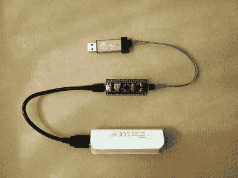
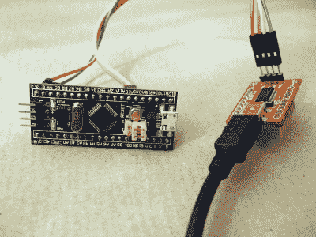
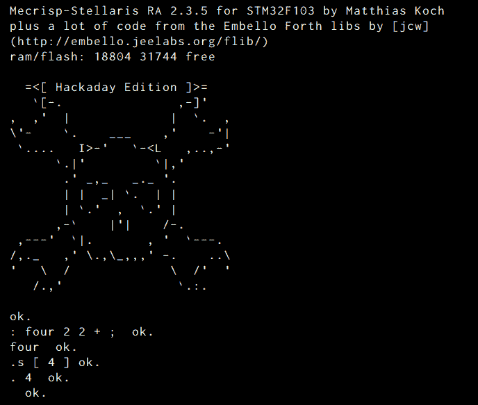
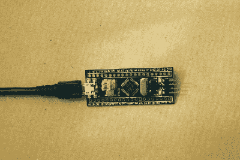

# 与梅克里斯普-斯特拉里斯和恩贝罗一起前进

> 原文：<https://hackaday.com/2017/04/19/moving-forth-with-mecrisp-stellaris-and-embello/>

在上一集里，我[主张微控制器](http://hackaday.com/2017/01/27/forth-the-hackers-language/)上的 Forth 是一个仍然可行的开发平台，不仅仅是对于目前常见的行业，对于黑客也是如此。我甚至骗你买了几件便宜的硬件。这一次，我们将在该硬件上设置第四系统，并运行强制的“hello world”和 LED blinky。但接下来我们还将探讨微控制器的一个非常出色的特性:轻松的多任务处理。

去工作！

## 五金器具

Mecrisp-Stellaris Forth 在许多 ARM 微控制器上运行，但我在这里将重点关注 STM32F103 芯片，这些芯片以通用拷贝 [Maple Mini](https://github.com/rogerclarkmelbourne/Arduino_STM32/wiki/Maple-and-Maple-mini) 的形式以令人难以置信的低价出售，由于外形因素，通常被称为“STM32F103 最小系统板”或“蓝色药丸”，而且事实上过去有红色芯片出售。板上的微控制器可以以 72 MHz 运行，具有 20 kB 的 RAM 和 64 或 128 kB 的闪存。它有大量的引脚，数字专用引脚可以承受 5 V 电压，并且拥有所有常用的微控制器外设。它不是最节能的，也没有浮点单元或 DAC，但它是一种坚固的旧设计，价格比它应有的价格低得多。

[](https://hackaday.com/wp-content/uploads/2017/04/dscf9342-wb.jpg)

Programmer Connected, Power over USB

对于程序员来说，类似的大规模生产奇迹也是一样的，你需要先闪存芯片。ST-Link v2 的任何克隆都可以正常工作。(够讽刺的是，编程器内部的硬件几乎和目标一模一样。)最后，因为 Forth 像在交互式 shell 中一样运行，所以您需要一个到 STM32 板的串行连接。这可能意味着一个 USB/串行适配器。

这整个设置的成本不会比一顿快餐高多少，而且如果你还没有的话，编程器和 USB/串行适配器是你无论如何都想拥有的东西。

您可以通过分散在板上的各种`3.3`和`GND`引脚，或者通过微型 USB 端口或目标板上的`5V`引脚直接为板供电。后两个选项在与`3.3`引脚连接之前通过一个 3.3 V 调节器。所有的引脚都是互连的，所以最好一次只使用一个电源。

## 固件:第四系统

去 GitHub 拿超级特别的[黑客版 Mecrisp Forth](https://github.com/hexagon5un/hackaday-forth) 包。“ROMs”目录中包含了第四个系统，它将为这里的演示工作。我还从[jcw]优秀的[Embello Forth 库](http://embello.jeelabs.org/flib/)加载了一个不错的基础，提供了诸如简单的 GPIO 配置、延迟功能等等。还有更多可用的库，下次需要时我们会研究它们。

使用 Forth 系统最酷的一点是根本不需要什么支持软件——Forth 解释器编译自己的代码，你通过串行终端与它交互。一切都发生在微控制器内部。那么，一个障碍就是如何进入芯片。在过去，这通常是通过手动切换字节来完成的，而 Forth 实际上足够小，以这种方式启动它是可能的。但是你已经买了那个芯片编程器，对吗？

[Texane]的 ST 实用程序是进入您的芯片的最简单的方法。[从 GitHub](https://github.com/texane/stlink) 下载，然后[自己编译](https://startingelectronics.org/tutorials/STM32-microcontrollers/programming-STM32-flash-in-Linux/)或者试试你发行版的软件包管理器。(Windows 乡亲们，[你也没有被遗漏](http://www.emb4fun.de/archive/stlink/index.html)。尽管这个二进制文件已经有一段时间没有更新了，但它还是可以的。)

以明显的方式连接编程线，并发出神奇命令`st-flash erase`和`st-flash write mecrisp-stellaris-hackaday-edition.bin 0x8000000`。五秒钟后，你就可以开始咆哮了。

*   gnd-全球导航卫星系统
*   SWCLK — CLK
*   SWSIO — DIO

如果你没有一个程序员，那么不得不购买一个程序员是一件麻烦的事情，但它会让你的余生变得更容易，而获得一个程序员就像点击“支付”并等待一样简单。我们自己的【Al Williams】(没有关系)最近有一篇文章是关于使用 [same 软件和 GDB](https://hackaday.com/2017/03/30/the-2-32-bit-arduino-with-debugging/) 一起调试 C 或 Arduino 代码的，所以这是值得你花时间来设置的。

## 软件

[](https://hackaday.com/wp-content/uploads/2017/04/dscf9344-wb.jpg)

Serial Hookup, Powered by Laptop

暂时放下编程器，通过串口连接到 STM32 默认波特率应为 115，200。如果你还没有拔掉电源，你可能需要点击 STM32 板上的复位按钮。如果一切顺利，迎接你的将是熟悉的骷髅头和十字扳手。Mecrisp 希望在行尾有一个换行符，所以如果你发送 LF+CR，你将有效地按两次回车键。

*   A9 TX —串行 RX
*   A10 接收—串行发送
*   gnd-全球导航卫星系统

[jcw]的 [folie](https://github.com/jeelabs/embello/releases) 是这个应用程序的一个不错的多平台串行终端仿真器。它所做的是你的普通终端程序所没有的，允许你用向上箭头重新输入一个命令行，这使得修复错误比重新输入一个长命令要容易得多。它还自动包含其他文件，我在为本文构建二进制文件时大量使用了这些文件。你不需要跑`folie`，但我打赌你会喜欢的。

## 你好世界

现在是“你好，世界”时间。如果你是第一次接触 Forth，这里有一个非常有选择性的介绍。键入`2 2 +`并按回车键。上面写着`ok.`。这很让人放心，对吧？现在输入`.`(读作“点”)，它将打印出并不令人惊讶的结果。Dot 是你想要吸收的几个全球第四名的第一名。大多数带点的命令会立即打印出结果。例如，`.s` (dot-ess)打印出堆栈内容。另外两个我们会经常看到的习惯用法是`@`用于获取变量或读取输入，以及`!`用于设置变量或输出。当扫描代码时，在你的头脑中把这些理解为“获取”和“设置”。

[](https://hackaday.com/wp-content/uploads/2017/03/had-forth-login21.png) 接下来，我们来看看如何写一个函数。`:`开始函数定义，`;`结束函数定义。所以`: four 2 2 + ;`定义了一个将二加二的函数。(并实时编译！)然后你就可以转身立即调用这个函数了。`four .s`将显示我们的函数在堆栈上留下了二加二的和。从这个意义上说，Forth 中的函数并不是真正的函数。它们不接受显式参数，也不返回显式值。它们只是对栈上的任何数据进行操作，并将结果留在那里。这就是为什么 Forth 函数被称为“单词”的原因。从现在开始，我将坚持这个惯例。

这里，最后是“Hello World”:`: hw ." Hello, World!" cr ;"`字符串在 Forth 中有点奇怪，主要是因为该语言的解析方式——编译器读取到一个空格，然后执行它找到的内容，因此在 print-a-string 命令(`."`)和您想要打印的第一个字符之间必须有一个空格。打印命令向前扫描，直到找到一个结束的`"`，所以你不需要额外的空间。`cr`发送回车。在提示符下键入`hw`。你好，世界！

## 闪烁的 led

尽管在 Forth 中串行文本输入和输出非常容易，但闪烁 LED 是微控制器的传统“hello world ”,所以是时候使用一些 GPIO 了。因为系统已经针对这个特定的微控制器板进行了配置，所以打开 LED 就像在提示符下键入`led.on`一样简单。想关掉吗？`led.off`。不过，手动眨眼很快就会过时，所以让我们写一个眨眼的单词。`: blink led.on 100 ms led.off 200 ms ;`就行了。试试`blink blink blink`。详见我的[眨眼演示代码](https://github.com/hexagon5un/hackaday-forth/blob/master/demos/blinky.fs)详解。(几千毫秒后，更多关于`ms`。)

[](https://hackaday.com/wp-content/uploads/2017/03/blinky_anim.gif)GPIO 初始化的细节分别隐藏在`[core/Hackaday/LED.fs](https://github.com/hexagon5un/hackaday-forth/blob/master/core/hackaday/LED.fs) `和 Embello 的`[stm32f1/io.fs](https://github.com/jeelabs/embello/blob/master/explore/1608-forth/flib/stm32f1/io.fs) `中。深入研究后，您会看到标准的初始化过程:通过翻转 STM32 外设控制寄存器中的一些位，将特定引脚设置为输出。[jcw]定义了一堆这样的东西，用推挽式驱动器设置一个引脚作为输出，就像`PC13 OMODE-PP io-mode!`一样简单。(还记得“！”表示在变量或寄存器中设置值。)

为 ADC 输入配置引脚`PA7`:`PA7 IMODE-ADC io-mode!`。使用内置的上拉或下拉电阻测试按钮:`PA3 IMODE-PULL io-mode!`，然后使用`true PA3 io!`或`PA3 ios!`将输出设置为上拉或下拉。随后，您将能够通过`PA3 io@`(“io get”)读取按钮状态。

STM32 芯片上的 GPIO 非常灵活，如果您想深入了解数据手册中的配置选项，您可以使用[jcw]的`io.fs`代码轻松设置所有这些选项。例如，`io.all`打印所有的 GPIO 寄存器及其值，这对交互式调试有很大的帮助。也就是说，如果你想贡献一个更用户友好的硬件抽象层，这里还有一些空间。

## 快速进行多任务处理

所以现在我们有一个闪烁的 LED 和串口打印“你好，世界”。这是一个不错的开始，这两个都很好地利用了 Forth 的交互性:只有当你键入`blink`时，LED 才会亮起。对我来说，Forth 的一个主要优点是在像这样的词的交互测试之间进行转换，然后在工作系统中部署该功能。一个原因是几乎所有的 Forths 都支持简单的[协作多任务](https://en.wikipedia.org/wiki/Cooperative_multitasking)。我的意思是。

首先，让我们循环我们的`blink`函数，这样我们就不必输入那么多。`: bb begin blink again ;`创建一个函数，`bb`为“坏眨眼”，这将永远运行。Forth 中“run forever”的问题是，如果不按下 reset 按钮，你永远也不会回到解释器的命令行，然后你在 RAM 中所做的一切都会丢失。

而是让我们在一个有出路的循环中眨眼。`: gb begin blink key? until ;`创建一个函数，它将运行我们的`blink`命令，直到有来自键盘的输入——回车键被按下。这种特殊的循环结构对于测试您想要连续运行的函数非常有用，而不会挂起系统。牢记在心。

一旦我们调整了我们的`blink`函数以我们想要的方式运行，让我们创建一个后台任务，这样它就可以在无人值守的情况下闪烁。

```
task: blinktask
: blink&  
    blinktask activate 
    begin blink again
;
multitask
blink&

```

简而言之，`task:`字为我们称之为`blinktask`的闪烁后台任务创造了一些内存空间。函数`blink&`在后台工作。`blink&`首先声明它将使用`blinktask`任务上下文，并且它应该开始运行。然后它进入一个永无止境的闪烁循环，永远不会离开。`multitask`开启多任务处理，`blink&`执行我们的任务。运行它，LED 会闪烁，而您仍然可以与控制台进行交互。太好了。键入`tasks`，你会看到有两个活动的:一个是我们的信号灯，另一个是交互式解释器。

但是眨眼任务是如何知道何时向其他同时发生的过程让步的呢？在 Forth 中，单词`pause`从当前上下文中退出，进入下一个循环多任务处理。除此之外，`ms`函数包含一个`pause`命令，所以在单任务设置中看似阻塞的延迟最终会与其他任务完美配合。

协作式多任务处理的好处在于，你可以精确地控制上下文切换的时间，这有助于消除抢占式系统中的小故障。不利的一面是，你要负责不时地记住你的功能，而且你必须自己核实时间。当然，这是一个微控制器，你也可以使用 ARM 非常丰富的内部中断控制器。

在 Forth 中，在 micros 上进行多任务处理的真正意义在于，它为编写、测试和部署小守护进程提供了一个很好的工作流:希望“永远在线”的功能。首先，编写执行一次操作的函数。第二，在一个有逃生出口的循环中测试它。第三，一旦它工作了，就删除 escape 并为它创建一个后台任务。然后，您可以使用`idle`和`wake`来打开和关闭它，甚至可以在其他任务中使用。详见 Mecrisp 的[多任务. txt](https://github.com/jeelabs/mecrisp-stellaris/blob/master/common/multitask.txt) ，源码。

## 下一步是什么？

到目前为止，我们已经用 Jeelabs 的 Embello Forth 框架的附加库建立了 Mecrisp-Stellaris，并运行了一些快速演示。如果这激起了您的兴趣，下次我将带您浏览构建一些真正的软件。关于 Mecrisp 处理 flash 与 RAM 的细微差别、输入和输出以及交互式开发实践的方式，还有很多要说的。在 Forth 工作的一些非常怪异的方面会让他们抬起奇怪的头，不管怎样，我们都会喜欢他们。

与此同时，让您的廉价 STM32F103 板与我们的二进制文件一起刷新，并习惯于在芯片上的第四环境中玩耍。闪烁一些发光二极管。查看一下 [Mecrisp-Stellaris 词汇表](http://mecrisp.sourceforge.net/glossary.htm)和 [embello API 文档](http://embello.jeelabs.org/flib/)。或者只需输入`list`就可以看到所有的命令，并开始破解。