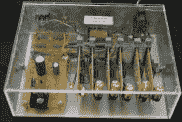
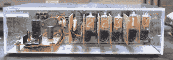
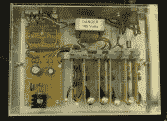
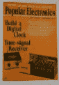
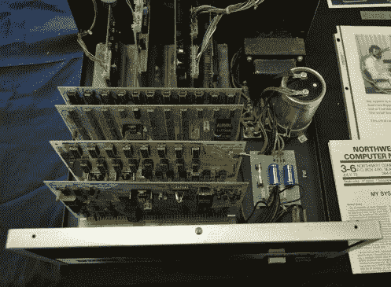
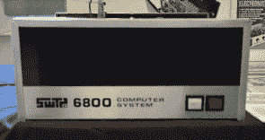
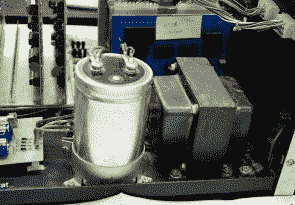

# VCF:大众电子和西南技术产品公司

> 原文：<https://hackaday.com/2017/04/05/vcf-popular-electronics-and-southwest-technical-products-corporation/>

Hackaday 在很大程度上要归功于昔日的电子杂志爱好者。过去，*大众电子*和*无线电电子*会发表关于 DIY 电子产品的项目和文章——或多或少与我们今天的编辑权限相同。这些项目中的一些将成为成熟的产品，你只需要看看 Altair 就知道在出版和工程的交汇处会发生什么。

这些业余爱好者的贸易杂志中最受欢迎的公司之一是 SWTPC，或西南技术产品公司。这家公司通过 SWTPC 6800 向大众推出了第一批微型计算机之一。这不仅仅是一家家酿微型计算机公司——还有谢妮时钟、测试设备和立体声前置放大器——所有这些都可以在今天的黑客时代轻松找到一席之地。

今年在东部老式计算机节上，[迈克尔·霍利]展示了他过去几十年来一直在收集的测试设备。这些机器在今天的任何 DIY 电子博客上都不会过时。从各方面来看，这都是创客运动的前期历史。

展品中有趣的物品包括*流行电子产品* Digi-Vista，一个装满 1970 年 12 月版谢妮电子管的数字钟。这种时钟的结构在今天看起来很奇怪 Nixies 以直角安装在与背板相连的各个电路板上。今天，你可以制作一个谢妮时钟[作为如何布置 PCB](https://www.youtube.com/watch?v=JrH_itjMDjo) 的例子。以前你可以在 Radio Shack 买到唱片，但没那么贵。

        

当然，SWTPC 最著名的产品是 6800，这是一种基于摩托罗拉 6800 的背板微型计算机。再加上 SWTPC 几年前对电视打字机的改进，在 Apple I 上市前一年，你就拥有了一个完整的计算机系统。这是当时消费技术的高度。

     