# VCF:跟上准将的人

> 原文：<https://hackaday.com/2017/04/02/vcf-the-guys-keeping-up-with-commodore/>

今年的复古电脑节上，战争开始了。今年，con 的组织者发动了一场政变，不是给单个参展商一个专门展示他们产品的空间，而是鼓励 8-bitters 战争中的各个派别集中资源，为他们特定品牌的家用电脑创造最好的展览。这场战斗在垃圾 80 阵营和苹果抵抗组织之间激烈展开。最后，只剩下一个家用电脑展品。你跟上准将了吗？因为准将一直在关注你。这个展品来自[安东尼·贝克尔]、[克里斯·法拉]、[托德·乔治]和[比尔·温特斯]等人，是有史以来在一个地方展出的最伟大的海军准将收藏品。

今年的 Commodore 展览免费展出 Commodore(或僵尸 Commodore)生产的所有硬件。还记得上网本吗？准将做了一个。还记得人们带着专用设备玩 MP3 吗？准将在那里。你知道你可以花 20，000 美元买一台 30 年前的电脑吗？那是准将。

 [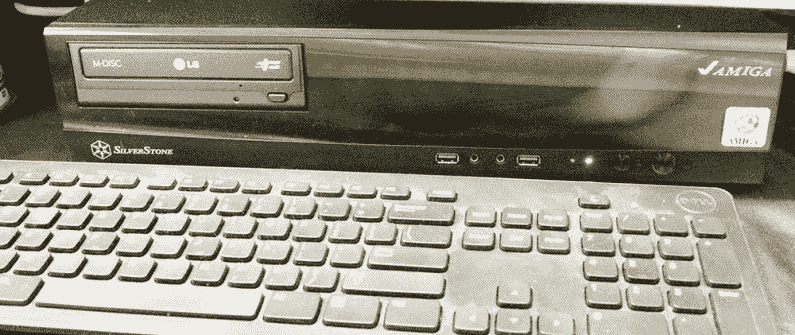](https://i0.wp.com/hackaday.com/wp-content/uploads/2017/04/amiga.jpg?ssl=1)  [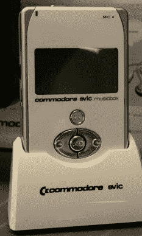](https://i0.wp.com/hackaday.com/wp-content/uploads/2017/04/avic.jpg?ssl=1)  [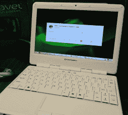](https://i0.wp.com/hackaday.com/wp-content/uploads/2017/04/netbook.jpg?ssl=1)  [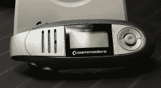](https://i0.wp.com/hackaday.com/wp-content/uploads/2017/04/pmp.jpg?ssl=1)  [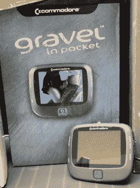](https://i0.wp.com/hackaday.com/wp-content/uploads/2017/04/video.jpg?ssl=1) 

僵尸准将是存在的，如果你想卖一些有鸡嘴唇的逆向计算设备，你会碰到他们。有人持有 commodore 的商标，这意味着这些年来出现了一些奇怪的官方授权的 Commodore 产品。有一个上网本，一个蹩脚的视频播放器，比 Zune 更糟糕的东西，最有趣的是，我们将得到的最接近现代 Amiga 运行在真正的硬件上。

坐在一个不起眼的标准台式电脑机箱里的是一个 Pegasos 主板。这是一个带有 AGP、PCI、以太网、USB 和 Firewire 的 PowerPC MicroATX 主板。这与半透明的蓝色 PowerMac 没有太大区别，但这是用开放固件启动的，这意味着它原生运行 Amiga 4.0。

 [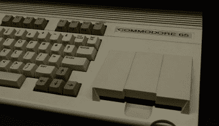](https://i0.wp.com/hackaday.com/wp-content/uploads/2017/04/651.jpg?ssl=1)  [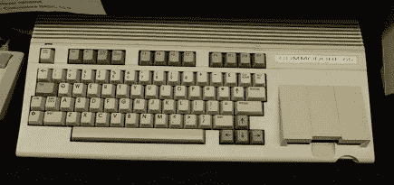](https://i0.wp.com/hackaday.com/wp-content/uploads/2017/04/652.jpg?ssl=1) 

到目前为止，在 Commodore 展台上展出的最稀有、最奇特、最昂贵的计算机是传说中的 Commodore 65。只有大约 200 台样机被生产出来，从西切斯特的 QVC 工作室送到收藏家手中。当这些稀有机器中的一台出现在易贝时，2 万美元的最终出价并不少见。

 [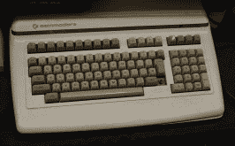](https://i0.wp.com/hackaday.com/wp-content/uploads/2017/04/b.jpg?ssl=1)  [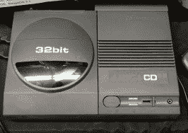](https://i0.wp.com/hackaday.com/wp-content/uploads/2017/04/cd.jpg?ssl=1)  [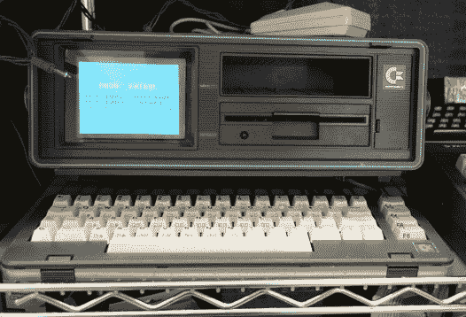](https://i0.wp.com/hackaday.com/wp-content/uploads/2017/04/executive.jpg?ssl=1)  [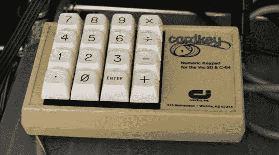](https://i0.wp.com/hackaday.com/wp-content/uploads/2017/04/key.jpg?ssl=1)  [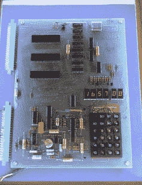](https://i0.wp.com/hackaday.com/wp-content/uploads/2017/04/kim1.jpg?ssl=1)  [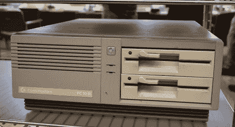](https://i0.wp.com/hackaday.com/wp-content/uploads/2017/04/pc.jpg?ssl=1)  [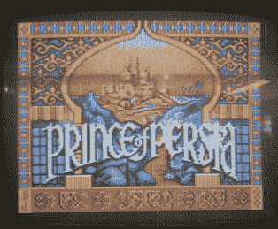](https://i0.wp.com/hackaday.com/wp-content/uploads/2017/04/pop.jpg?ssl=1)  [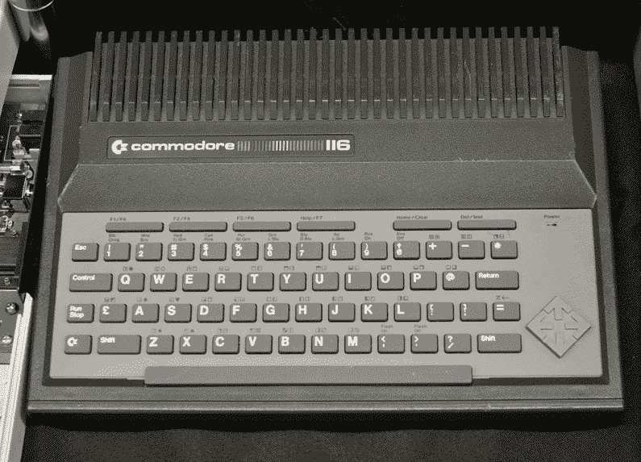](https://i0.wp.com/hackaday.com/wp-content/uploads/2017/04/ted.jpg?ssl=1) 

Commodore 阵营的其他罕见和奇怪的东西包括几乎所有的 TED 机器——C64[的“成本降低”版本，部分由我们自己的【Bil Herd】](http://hackaday.com/2014/09/02/30-years-later-ted-finds-his-voice-a-commodore-story-part-i/)设计，具有一些有趣的功能。成堆的 VIC 20s 到达了天花板，一些 IBM PC 兼容的 Commodores 出现了。没人关心 PC 兼容机。

在这场 80 后垃圾、苹果和准将之间的皇家战争中，谁会赢？精英专家评审团选择了准将(编辑:没关系，Tandy 赢了，我在结果公开前写了这篇文章)。他们跟上了准将，因为准将跟上了你。