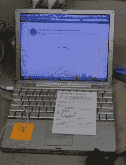

# VCF 东部的精华

> 原文：<https://hackaday.com/2017/04/06/the-best-of-vcf-east/>

上周末是新泽西州沃尔市的东老式电脑节。虽然对一些人来说，这种一年一度的对旧电脑着迷的书呆子聚会可能有点太模糊了，但总会有一些具有实际历史重要性的惊人展览。几台恩尼格玛机出现了，[最稀有的准将商品出现了](http://wp.me/pk3lN-13kN)。我们和[西南技术产品公司](http://wp.me/pk3lN-13ky)一起看到了黑客时代和“创客”文化的早期历史，并且发现[在 80 年代](http://wp.me/pk3lN-13gL)建造一个 RepRap 是很有可能的。除非你知道你从哪里来，否则你不知道你要去哪里，尽管老前辈们比我们更加白发苍苍，但老式电脑节表明事情实际上变化很小。

VCF 最酷最奇怪的东西是什么？银球弹球博物馆是什么样子的？看看下面。

### 怪异感应鼠标

寄售/供应商区域总是一个检查计算机历史失败者的好地方。在每个人都有鼠标之前，CAD 设计师和艺术家需要一种方法来精确地将纸上的绝对位置映射到设计程序中的绝对位置。解决方案是 Numonics Grid Master 和其他感应/电磁鼠标。这些鼠标使用线圈和活动鼠标垫来精确地将光标映射到现实世界的维度，而不是轮子、球和光学传感器。现在我们有了无线通讯和扫描仪等等，但这是我真的希望还存在的技术之一。我在寄售店里发现了两只感应老鼠，20 块钱就能把它们带回家。

      

### 其他寄售商品

很少评论。

  a 128k for $150\.    A 3Com Audrey      A stack of Internets        Lexmark manufactured in the mid-90s        12-inch PowerBook      This is a good price for an SE/30        A pile of crap. Want a rack of computer? you can assemble it here.      

### 价值两百万美元的苹果

如果你想看壮观的东西，这里有价值 200 万美元的苹果电脑。在 VCF 东区展出了三台苹果 I 型电脑，一台是油印复制品(你可以花不到 2000 美元自己做一台)，还有两台原件，一台是字节存储板，另一台是 NTI 模型。世界上只生产了大约 200 个苹果原件，拍卖价格非常高，非常罕见。基本上，这些电脑每台价值 100 万美元。为什么它们值那么多钱，而比尔·赫德的地下室里有更稀有、更有趣的技术？对高领毛衣的崇拜，或者类似的东西。

    The Mimeo. You can build your own Apple I replica for about $2000\. No, you can’t pass it off as an original.  A replica Datanetics keyboard, used with the Mimeo replica    

### 银球和铁饼

虽然这与老式计算机或老式计算机联盟没有直接关系，但在距离 VCF 东区几英里的地方，有一个非常不错的博物馆。从 VCF 开车 10 分钟就能到达 Silverball Museum Arcade ,而且*哦，天啊*这个东西太棒了。从 50 年代到 90 年代的辉煌时期，木板路上的拱廊里挤满了几十台弹球机。10 美元可以让你在所有的机器上免费玩一个小时，25 美元可以让你玩一整天，整个地方都是漏斗蛋糕的味道。

                                    

这个博物馆/拱廊的策展相当有趣，似乎银球博物馆的某个人知道他们在做什么。几乎每个时代都有从*到*的弹球机，所有的机器都是当时弹球状态的非常好的例子。当然，有一些信息标志将所有的机器放在上下文中。

电子游戏的收藏是这个地方真正引人注目的地方。MAME 游戏机多如牛毛，一个精心打造的机柜可以重现大部分经典街机游戏。然而，有一些游戏有着怪异的控制(蜈蚣的轨迹球，导弹指挥的旋转控制器，以及小行星试图成为的任何东西)。MAME 机器通常不会为这些早期的用户输入实验费心。Silverball 博物馆中的大多数街机游戏都使用这些奇怪的控制方案，这使得它成为复古街机技术的最佳实践博物馆之一。

这不是我去过的最好的新泽西木板路。在 MTV、桑迪和一场大火席卷这个地方之前，这个头衔属于海滨高地。我不确定这些街机是否还存在。)，但是银球博物馆是一个花费一小时十美元的好地方。

### 未来的风投基金

今年的第一届老式电脑节已经结束，还会有更多的。去年，VCF 韦斯特参加了 DEF CON 周末，但是因为已经提前了一周，我们可能会在八月的第一个周末去山景城。VCF 东南在这个月底在亚特兰大，中西部 con [在九月](http://vcfmw.org/)举行。