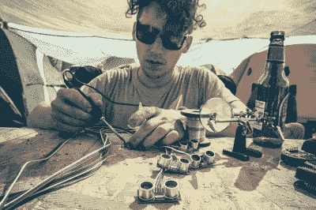
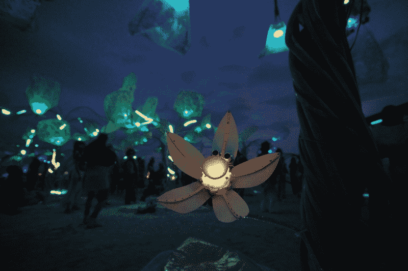

# 燃烧人互动绿洲

> 原文：<https://hackaday.com/2017/04/15/an-interactive-oasis-at-burning-man/>

沙漠中的绿洲是疲惫的旅行者得救的典型象征。在 2016 年的火人节上，Grove——十个生物反馈树雕塑——提供了一个类似的[互动喘息机会。每棵树都有两千多个发光二极管，几十英尺长的钢管，两块定制呼吸传感器用来创造节日魔法的小板子。](http://www.ofbrooklyn.com/2017/03/31/building-grove-burning-man-art-installation-2016/)

Grove 是这样工作的:当你靠近时——由双红外传感器检测到——一朵机械花绽放，这意味着促进调查。当你靠近时，水仙花状花朵上的呼吸传感器会检测你是在吸气还是呼气，将输入转化为耀眼的 LED 光脉冲，沿着树干蜿蜒而上，到达树枝顶端明亮的 3W LEDs。

在沙漠中调试和最后一分钟焊接修复了一些问题，在安装之前——没有一个项目没有打嗝。整个树林由太阳能充电的深循环电池供电，这意味着至少从日落到日出，或者足够接近，如果有人忘记连接电池充电。

 【塞缪尔·克莱】是这种艺术装置建造的编年史家。事实上，[山姆]和团队中的许多其他人在《燃烧的人 2014》上工作过[脉冲&绽放装置——一束会对你的心跳做出反应的莲花雕塑。他在 GitHub](http://hackaday.com/2014/09/10/biofeedback-flowers-at-burning-man/) 上提供了[代码和图表，以指导其他有类似灵感的艺术家。](https://github.com/samuelclay/grove/)

