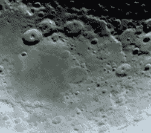

# 预算天文摄影与树莓皮

> 原文：<https://hackaday.com/2017/04/20/budget-astrophotography-with-a-raspberry-pi/>

刚接触天体摄影的杰森·鲍林(Jason Bowling)听说树莓 Pi 的相机模块可以作为这项爱好的低成本入门。手里拿着一个旧项目的 Raspberry Pi B+和相机模块，他一头扎了进去，[为任何其他新来者详细描述了过程](http://shortcircuitsandinfiniteloops.blogspot.ca/2017/04/astrophotography-with-raspberry-pi.html)。

小心翼翼地取下相机的镜头，这个模块被装进一个 3D 打印的盒子里——这是一个朋友的好意——然后把它连接到一个单独的盒子里。[Bowling]然后将相机直接安装在望远镜上——这种技术被称为主焦摄影，它将望远镜视为一个超大的相机镜头。USB 电池组非常适合为 Pi 供电几个小时。

当不在家时，[Bowling]设置了他的 Pi 作为无线接入点；这使得 Pi 可以在拍照前将预览发送到他的手机或平板电脑上进行调整。[Bowling]承认相机并不理想，所以有必要进行一点后期处理来充实高质量的图片，但你可以利用你所拥有的东西。

如果你想进一步深入天体摄影，我们已经为你展示了探测系外行星的后院设置，以及长曝光摄影的提示，甚至还有 T4 定制相机来完成这项工作。

他捕捉到的细节之多令人印象深刻！