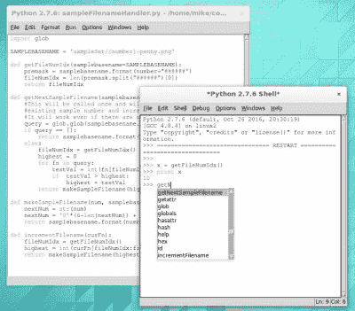

# 问 Hackaday:你是怎么 Python 的？

> 原文：<https://hackaday.com/2017/04/14/ask-hackaday-how-do-you-python/>

Python 是软件项目的 Arduino。从面部识别和神经网络到机器人和遥感，它拥有大量的图书馆。就像 Arduino 一样，我还没有找到 Python 的杀手级 IDE。也许我只是还没有尝试正确的方法，但也有可能是我在 Python 上做错了。

### 多年来我一直无所事事

IDLE with interactive shell that has highlighting and code completion

我是一个只喜欢 Linux 的人，所以使用 IDLE for Python 是一个自然的选择。它在存储库中，安装起来非常快速简单，而且基本上不需要进行任何配置。一般来说，我的首选开发环境是文本编辑器和命令行编译器。IDLE 只比它高一步。您可以为 shell 和您正在处理的每个 Python 文件获得一个单独的窗口。让 IDLE 运行您的代码，它保存文件，然后在 shell 窗口中启动它。

对我来说，IDLE 的外壳有两个重要的特点。首先，在运行 Python 代码后，它会保持交互式会话打开。这意味着脚本使用的任何全局变量仍然可用，并且您可以通过实时调用函数(和类等)来试验您的代码。第二个可取的特性是，在使用这个交互式 shell 时，IDLE 支持代码完成和 docstring 支持(它提示您函数接受/需要什么参数)。

但是简单性很难扩展。我正在处理越来越大的项目，这些项目分布在许多文件上，空闲编辑器窗口的独特性和缺乏健壮的导航让我期待向前发展。

### 竞争者

我现在已经尝试了半打不同的 Python IDEs，其中两个花费了我最多的时间: [Geany](https://www.geany.org/) 和 [Atom](https://atom.io/) 。两者都很容易在 Linux 上安装，并提供了我想要的更高级的功能:更好的导航、跨文件代码完成(和警告)、变量类型和范围指示。

Geany 的外观让人想起“IDE 1.0”的布局风格和主题。这是我们熟悉的三窗格布局，符号放在左边，代码放在右边，状态放在底部。当你运行你的程序时，它在一个交互式终端中启动，这是我喜欢的，但是你在这一点上失去了所有的 IDE 特性，这是我讨厌的。没有代码完成，也没有语法突出显示。

我使用 Atom 的次数比 Geany 多得多，并且已经喜欢到足以坚持到现在。我将 Atom 称为“IDE 2.0”布局。它以一个黑暗的主题开始，一切都是一个标签。

Atom has symbol view that isn’t shown all the time. CTRL-R brings it up and it uses a search style but you can also scroll through all symbols

Atom 非常依赖包(任何人都可能编写的插件)。软件包管理很好，我试过的软件包都很棒。我使用的是自动完成 python 和制表符到空格，但是在运行 Python 文件时，我又遇到了问题。我已经尝试了 platformio-ide-terminal、script 和 runner 插件。第一个会在底部窗格显示一个终端，但不会在该终端中自动运行文件。脚本也使用底部窗格，但我不能让它交互式运行。我目前使用的是 runner，它的显示效果还可以，但是没有交互功能。我在项目中使用了一个“假”python 文件，作为我通常在交互式 shell 中运行的命令和测试的变通方法。

### 告诉我们你如何 Python

完全有可能这些年来我一直在错误地使用 Python，在交互式 shell 中修补代码是开发过程中的一个糟糕选择。

对于 Python 开发，你更喜欢什么？交互式 shell 对您来说重要吗？是不是从 IDLE 开始，转到更成熟的 IDE。你最终选择了哪种 IDE，在这种改变中你做出了什么样的妥协？请在下面的评论中告诉我们。