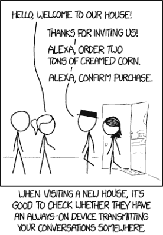

# 汉堡王凭借一次巨大的黑客攻击获得了谷歌主页的免费广告

> 原文：<https://hackaday.com/2017/04/14/burger-king-scores-free-advertising-from-google-home-with-a-whopper-of-a-hack/>

广告商总是试图在 15 或 30 秒的电视广告中塞进更多的内容。汉堡王似乎通过一系列广告实现了这一目标，这些广告利用了许多观众客厅里的谷歌 Home 设备。它是这样运作的:友好的汉堡王员工以“好吧，谷歌，什么是巨无霸汉堡？”来结束广告谷歌主页随即开始行动，阅读来自[汉堡王的维基百科页面](https://en.wikipedia.org/wiki/Whopper)的产品描述。

互联网上的巨魔也加入了这场争斗。华勃的配料清单很快就包括了脚趾甲屑、老鼠、氰化物和一个小孩。维基百科后来恢复了这些修改，并封锁了该页面。

谷歌显然没有参与其中，因为他们很快更新了语音识别算法，专门忽略了这个广告。汉堡王的回应是用不同的配音演员重新配音广告的音频，这击败了谷歌的封锁。谁也不知道这场猫捉老鼠的游戏会在哪里结束。

这一事件标志着几个月内第二次广播导致声控设备失控。早在一月份，一名唱片骑师报道了一个关于亚马逊 Echo 的故事，并成功为圣地亚哥的许多居民订购了玩偶屋。

随着 Alexa 和 Google home 等设备随时准备接受命令，这样的故事将成为新的常态。完全避免它的唯一方法是不允许它出现在你的家里。对于那些有声控设备的人来说，要非常小心你把它连接到什么设备和服务上。物联网“智能”门锁已经提供了用语音命令开门的方法。如果你只需要[让 Siri 为你开门](https://www.youtube.com/watch?v=F2f4A5bifrs)，入室盗窃就再简单不过了。虽然有些人抱怨[塞尔达黑](http://hackaday.com/2017/03/20/zelda-and-the-ocarina-of-things/)缺乏安全性，但我们认为这比没有密码的语音识别系统安全一千倍。

 [https://www.youtube.com/embed/n5lj63-nc5g?version=3&rel=1&showsearch=0&showinfo=1&iv_load_policy=1&fs=1&hl=en-US&autohide=2&wmode=transparent](https://www.youtube.com/embed/n5lj63-nc5g?version=3&rel=1&showsearch=0&showinfo=1&iv_load_policy=1&fs=1&hl=en-US&autohide=2&wmode=transparent)

