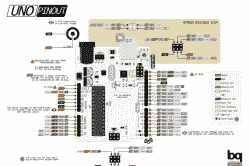

# 用于 KiCad 板渲染的工具

> 原文：<https://hackaday.com/2017/04/17/a-tool-for-kicad-board-renderings/>

如果你正在为一个 PCB 项目制作文档，你最好把电路板渲染得好看一些。但是，那需要很多工作，而且你不是艺术家。输入[Jan]的[新工具](http://blog.honzamrazek.cz/2017/04/do-you-like-nice-pinout-diagrams/)，它获取 KiCad 板文件，用(自定义)图形替换每个封装，并提供一个漂亮的 SVG 表示，准备好进行标记。如果你喜欢一个 Fritzing 布局的输出，但对 PCB 工具有[更高的期望，这就是门票。](http://hackaday.com/2016/10/11/creating-a-pcb-in-everything-friends-dont-let-friends-use-fritzing/)

 我们都爱[【pighixx】的引脚排列图](http://www.pighixxx.com/test/pinoutspg/processors/)。例如，这是他对 Arduino Uno 的看法。原来他做这些[很大程度上是用手](http://www.pighixxx.com/test/questions/question/how-its-made-a-pinout)。那是给你的艺术。

Sparkfun 已经尝试复制大头针标签的图形风格，但他们随后会提供真实物品的照片。[Jan]的图形 PCB 生成器完成了几乎让[pighixx]失业的最后一步。[在 GitHub 上为自己获取代码](https://github.com/yaqwsx/PcbDraw)。