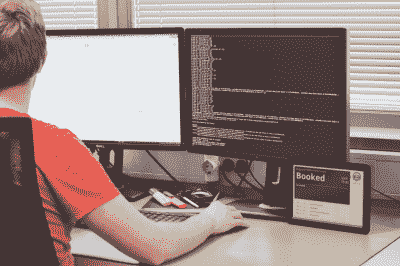

# “请勿打扰”数字助理

> 原文：<https://hackaday.com/2017/04/28/a-do-not-disturb-digital-assistant/>

心流需要一定程度的专注，当这种专注被讨厌的同事打破时，工作就会受到影响，除了浪费时间试图重新参与手头的任务。[ 埃斯特拉·德泽拉克 ]办公室的技术负责人受够了被打断，需要他自己的[私人助理](https://getjoan.com/news/calendar-hack-no-interruptions/)来避开“只有一个问题”的人。

最初，技术负责人[Grega punik]通过电子邮件向办公室发送了他的日程安排，并圈出了他不被打扰的时间，其他开发人员也纷纷效仿。当这条路线的有效性开始减弱时，他将自己正在开发的产品——一个预订会议室的显示屏——变成了自己的个人时间表显示屏，可以选择预订一个时间段来回答问题。在一个很大程度上是开放式概念的办公室——不完全有利于一个“请勿打扰”的工作站——这是一个天赐良机。

 一个支持你的数字助理可以有多种[形状](http://hackaday.com/2014/02/07/meet-raspberri-your-personal-voice-controlled-assistant/)、[尺寸](http://hackaday.com/2017/01/24/thats-no-moon-thats-a-virtual-assistant/)和[功能](http://hackaday.com/2012/07/22/task-scheduler-for-arduino/)，所以如果你发现自己需要一点帮助来度过难关，一个数字朋友可能就是你的不二之选。

【感谢提示， 埃斯特拉 ！]