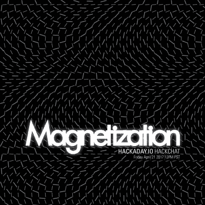

# 征集黑客聊天主持人

> 原文：<https://hackaday.com/2017/04/19/call-for-hack-chat-hosts/>

每周 Hackaday.io 都会推出各种各样的 AMA。[这是 Hack Chat](https://hackaday.io/project/5373-hack-chat) ，在这个聊天室里，我们与业内顶尖人士坐下来讨论制造技术、工程以及如何打造最好的硬件。在过去的几个月里，我们接待了一些硬件名人，从[Sprite_TM]谈论 ESP32、[Lady Ada]和 MicroPython、Raspberry Pi 的[Roger Thornton]讨论如何构建每个人都喜欢的 Linux 计算机、[Samy Kamkar]谈论逆向工程，并听到[bunnie]谈论制造和破坏硬件。

现在，我们正在寻找新的共同主持人来领导讨论，并成为房间里的专家。如果你有技能，我们想听听你的意见。

我们正在寻找专家来引导对他们正在做的事情的讨论。如果你有一个新的硬件产品，并想分享它投入生产的故事，同时从 Hackaday 社区获得一些反馈，这是这样做的地方。我们正在寻找范围广泛的人，他们将允许我们挑选他们的大脑。如果你曾经设计过 16 层 PCB，我们想知道你是如何(以及为什么)做到的。如果你对建造机器人感兴趣，我们想听听你的意见。如果你是嵌入式系统专家，这是你大放异彩的时候了。

如果你想参与其中，[给我们发一封电子邮件](mailto:meetups@hackaday.com)。我们每周进行一次黑客聊天，每周五，太平洋时间中午左右。这是您与互联网上最好的硬件社区之一分享您所知道的知识的绝佳机会。如果你想在 11 月的 Hackaday 超级大会上发表演讲，这也是一个很好的练习。

### 本周:磁铁到底是如何工作的？

 你知道磁铁是如何工作的吗？你当然不知道，没人知道。但是对这个话题了解最深的人之一是杰瑞米·陈，他是纳米磁性有限公司的原型工程师。太平洋标准时间[周五中午，杰瑞米主持了一场关于磁性](https://hackaday.io/event/21232-magnetization-invasion-hack-chat)的黑客聊天。

有什么好谈的？杰里米将涵盖磁铁是如何制造和磁化。他将讲述不同等级的磁铁，以及不同的磁感应机制。他还将研究一些最有趣的磁现象。你多久和一个磁铁专家出去玩一次？本周五见！