# 问 Hackaday:扩散器呢？

> 原文：<https://hackaday.com/2017/04/25/ask-hackaday-what-about-the-diffusers/>

Blinky 领导的项目:我们就是看不够。但是任何直视过 WS2812 的人都知道，一个好的 LED 项目并使其变得伟大的秘诀是扩散器。如果没有扩散器，颜色就不会混合，led 也只是微小的、眩目的光点。理想的漫射器将光子搅乱并分散在 LED 和你的眼睛之间，这样你就不能准确地说出它们的来源。

我们将努力支付扩散器其应得的，并希望你能通过滚动我们的发现为你的下一个项目获得一些灵感。但是这个*是*的一个“问 Hacakday”，所以这里有一个问题:我们错过了什么可怕的 LED 扩散技巧，你最喜欢的是什么，为什么？

## 漫射材料，混合颜色

[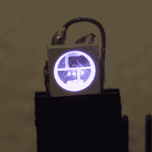](https://hackaday.com/wp-content/uploads/2017/04/dscf9407_thumbnail.png) 仔细观察一个 RGB LED，你会看到三个独立的 LED 芯片，毫不奇怪是红色、绿色和蓝色。我们都知道这一点，但颜色混合的程度仍然令人惊讶，即使是 WS2812 这样的 LED 单元，三个二极管也小得离谱，相距不到一毫米。不知何故，即使在桌子的距离，你仍然会觉得你在看一个红色和蓝色的 LED，而不是一个混合的品红色光源。

一种方法是使用具有足够粗糙表面的漫射材料，以散射穿过它的光。漫射材料包括一些“传统”的东西，如磨砂玻璃或丙烯酸树脂，如[迈克·Szczys]的 [1 像素 Pacman 演示视频](http://hackaday.com/2015/06/01/1-pixel-pacman/)或[这款经典的线性 RGB 时钟](https://hackaday.io/project/18878-linear-rgb-led-clock)所示。大约 50%的透明丙烯酸树脂似乎是合适的。你可以通过[打磨](https://www.instructables.com/id/LED-Diffuser-Cheap-and-Easy/)或[翻滚](http://hackaday.com/2015/11/05/home-made-tumbler-diffuses-clear-leds/)一个清晰的 LED 得到类似的效果。

[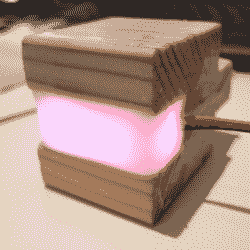](https://hackaday.com/wp-content/uploads/2017/04/dscf9425_thumbnail.png) 再有就是“怪人”的扩散者。一滴[热熔胶](https://www.instructables.com/id/Hot-Glue-LED-Diffusion/)效果很好，因为它很少是透明的。陌生人依然是[涤纶枕芯](http://hackaday.com/2013/01/17/led-cloud-lamp-in-any-color-you-can-image/)。最近，我一直在尝试将蜡烛重新熔化，并将 led 埋入石蜡中——大约 1 厘米的深度可以产生非常均匀的颜色。我也见过在木箱上钻孔，用环氧树脂填充，然后用砂纸打磨。

你总是可以用半透明材料 3D 打印表壳[，这样表壳*就是*扩散器。或者你可以拿起一张纸或一个牛奶罐的剪影。这些低技术含量的选择效果出奇的好。](http://hackaday.com/2017/04/14/hackaday-prize-entry-breathe-your-troubles-away/)

漫射材料的主要变量是材料的透射率以及它与 LED 的距离。更厚、透射性更低的材料往往模糊得更好，但会使 LED 变得更暗——有时这是一件好事。将漫射器放得更远有助于更好地混合颜色，但也模糊了光点，会使图像变得模糊。同样，有时你想要这种效果，[就像这个墙板](http://hackaday.com/2014/07/20/800-led-wall-with-diffuser-panel-is-a-work-of-art/)，有时你不想，就像[迈克]的《吃豆人》。但是到扩散器的距离可能是关键的。在设计案例之前，先好好测试一下。

 [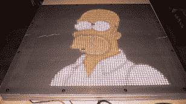](https://hackaday.com/led-24/) Plain-old translucent Acrylic, Up Close [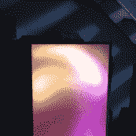](https://hackaday.com/16a425a3e1474c7f9ea3179c4f919e3d-2/) Acrylic Sheet, Spaced Farther Away [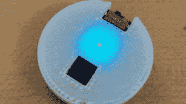](https://hackaday.com/1741841490983044633-e1491016928902/) Transparent PLA = Diffuser [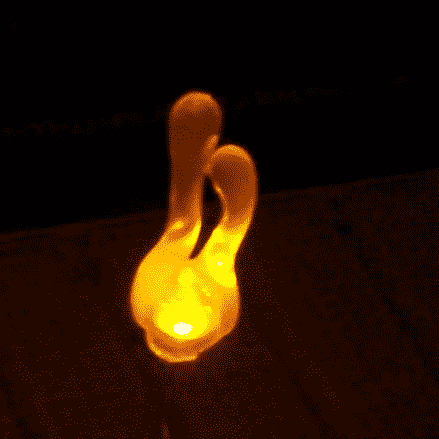](https://hackaday.com/fzeu5eefjd365ak_thumbnail/) Hot Glue [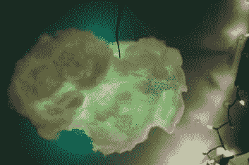](https://hackaday.com/rgb-cloud-lamp-2/) Polyester Pillow Stuffing Cloud [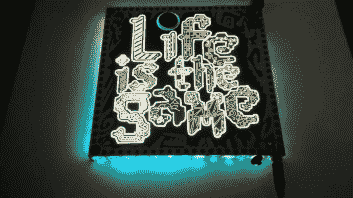](https://hackaday.com/2017/04/25/ask-hackaday-what-about-the-diffusers/the-lifegame-printed-circuit-art-oobckhknlnomp4-shot0001/) [PCB Fiberglass](http://hackaday.com/2013/09/24/backlit-pcb-panel-as-wall-art/) [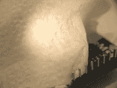](https://hackaday.com/dscf9412/) Paper Towel [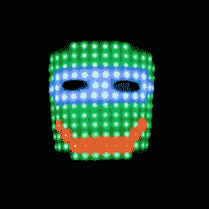](https://hackaday.com/fdlic84igtounqy/) [Molded Acrylic Mask](https://www.instructables.com/id/Wearable-LED-Matrix-Face-Mask/) [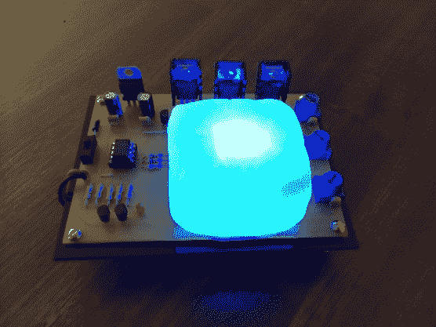](https://hackaday.com/f6sc9gjhy4kwfsa/) [Shapelock / Polymorph](https://www.instructables.com/id/Tiny-Color-Mixer-a-constant-current-3W-RGB-LED-wit/)

## 反射腔，整形光

[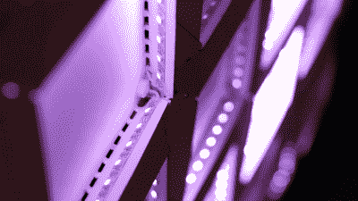](https://hackaday.com/wp-content/uploads/2017/04/ei-frame-2.png) 反光腔的作用与半透明材料相同，但如果更难建造，可以减轻重量。您可以根据自己的意愿，在空腔前部添加或不添加扩散片。两者都可以是非常好的效果。例如，[Micah Elizabeth Scott]的《[欣喜若狂的顿悟](http://www.misc.name/#/ecstatic-epiphany/)》使用折叠的边框，将 led 从浅色表面反弹回来，并将其分散开来，以实现颜色混合和一些成型。没有任何前盖也很好用。

[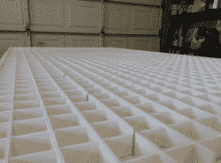](https://hackaday.com/wp-content/uploads/2017/04/img_20150718_110944.jpg)[巨像](https://hackaday.com/2015/10/04/building-a-big-led-display/)使用白色泡沫芯分隔物制作许多独立的反光空腔，覆盖两层白色床单作为正面漫射体。在每个单元格内，颜色是离散的，混合得很好，以实现完美的大像素效果。你也可以使用吸管、卫生纸管，甚至汽水瓶。

[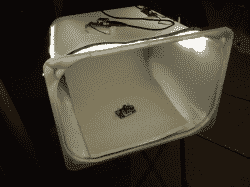](https://hackaday.com/wp-content/uploads/2017/04/dscf9427.jpg) 摄影师的灯箱本质上也是扩散腔。我们在一个木框周围用“牛皮纸”制成的相机中拍摄了许多特写镜头，但我们最近升级到了 IKEA Trofast，为夜间拍照提供了可选的 LED 照明。大多数穿过半透明塑料的光最终在里面反弹，留下非常柔和的阴影和均匀的照明。在白天驾驶时效果更好。如果你想将这个想法发挥到极致，可以看看[【杜古】的模型拍摄平台](https://doogsmodels.com/2013/07/03/photo-studio-upgrade/)。注意 underlit 漫射丙烯酸的巧妙运用。

[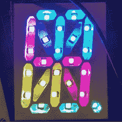](https://hackaday.com/wp-content/uploads/2017/04/5704531443727949370.jpg) 没有什么能阻止你用反光洞做出有趣的形状。三角形的反光单元赋予了[Micah Scott]的“[三角形吸引器](http://www.misc.name/#/triangle-attractor/)”和[Becky Stern]的 [WiFi 墙显示器](http://hackaday.com/2017/03/04/see-the-weather-at-a-glance-with-this-wifi-wall-mounted-display/)各自的风格。如果你不喜欢三角形，你可以 3D 打印出你需要的任何形状的空腔，就像这些 16 段显示器一样。

恰到好处地设计扩散腔与其说是科学，不如说是艺术。一般来说，墙壁的反射性越强，包围的空间越大，颜色混合就越好。绝对值得你花时间去尝试间接照明，光线在离开盒子之前先反弹。将空腔与扩散材料前面板结合起来可以产生一些非常微妙的效果。

 [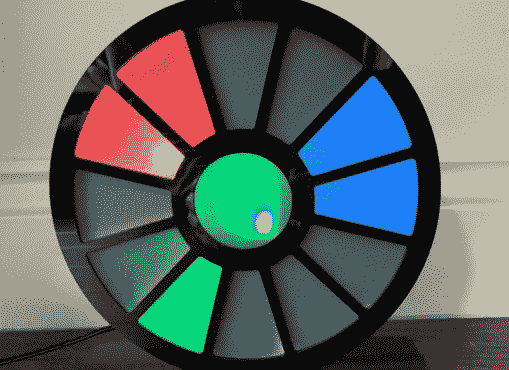](https://hackaday.com/rlab-clock-featured-2/) Pie Wedge Cavities [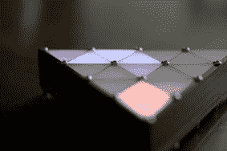](https://hackaday.com/samsung-csc-3/) Triangle Attractor [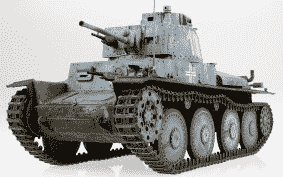](https://hackaday.com/9196461335_e5f64fdbe8_o/) Underlit Through Diffusive Acrylic, Light Bouncing Everywhere [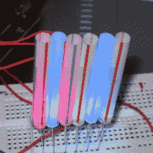](https://hackaday.com/ffq1rfsfkn6c9cn_thumbnail/) Straws [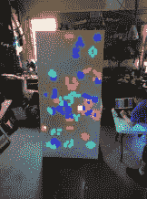](https://hackaday.com/img_20150718_162215/) Colossus in Action [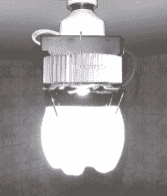](https://hackaday.com/fqdg9nrge057030/) [Sanded PET Drink Bottle](https://www.instructables.com/id/10W-Retro-Futuristic-LED-Lamp/) [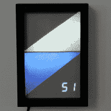](https://hackaday.com/f2a2ccmiz6ck0kl_thumbnail/) Triangle-Styled Weather Display

## 该问

Pshwew！这是一个扩散选项的旋风之旅，任意分为扩散材料和空腔类别，并有重叠。我们错过了什么？你最喜欢的 LED 漫射效果是什么？