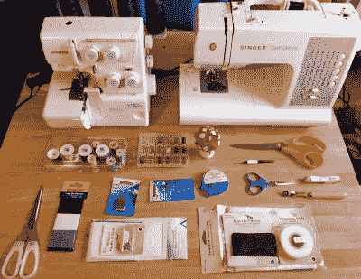
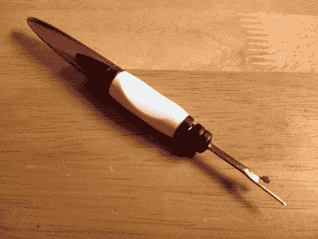
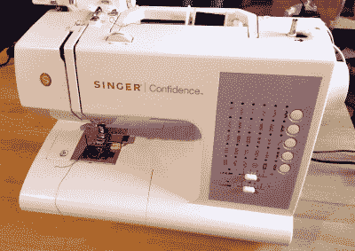
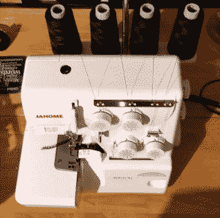
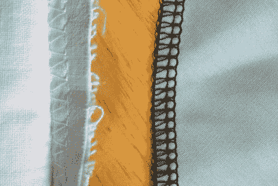
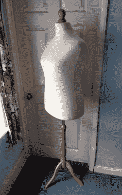

# 纺织工作台

> 原文：<https://hackaday.com/2017/05/23/the-textile-bench/>

你的长凳上有什么？我的主要是电子测试设备，焊接工具和电脑。当我不为 Hackaday 写作时，我的职业是电子工程师，所以这并不奇怪。也许你的和我的一样，或者你已经添加了一台 3D 打印机，一堆木工工具，或者电动工具。

这是我的长椅。但这是我唯一的*板凳吗？在房间的另一边，电子工作台的另一边是一个坚固的折叠餐桌，里面放着我的*另一个*工作台的工具和用品。我可能不是唯一一个在不同活动中有不止一个长凳的人，事实上像你们许多人一样，我在其他地方也有一个凌乱的长凳，用于拆卸 20 世纪 60 年代的汽车零件或制作粘土烤箱。*

My textile bench, with a selection of the equipment used on it.

另一个有问题的长凳不是用来做脏活的，事实上正好相反。这是我的纺织工作台，里面有各种各样的缝纫机和其他设备，让我可以处理各种各样涉及布料的项目。在这个网站上，我制作、修改和修补了各种各样的衣服，我制作了不太成功的风筝、还过得去的凉鞋，以及无数其他项目中的冒险帐篷设计。

你们中的一些人可能想知道为什么我的纺织品长凳是 Hackaday 饲料，毕竟它可能是安全的假设很少读者曾经考虑制作自己的塔夫绸舞会礼服。但只专注于纺织工作的一个方面就忽略了这一点，因为制造商世界的这些不同线索之间存在着如此多的交叉潜力。因此，我将带你们参观我的纺织工作台，并向你们介绍它的主要工具。幸运的话，这将揭开其中一些的神秘面纱，也许会鼓励你去尝试一下。

## 手工工具和测量

你可能会认为这篇文章直接指向机床，缝纫机。但它们只是画面的一部分，它们周围的其他工具如何使用才是纺织成功与失败的关键。

首先出场的是我收藏的 **剪刀和剪刀** 。我有三把剪刀，一把橙色手柄的大剪刀用来剪布料，一把普通的家用剪刀用来剪纸样和其他纸张，还有一把小剪刀用来剪线或类似的东西。这些都要小心，尤其是布料剪刀。钝的或损坏的剪刀会损坏你的布料，所以任何拿我的剪刀剪除了布料以外的东西的人都会倒霉。

My stitch ripper. Very useful tool, it covers up for my mistakes.

我的纺织工作台上最小也可能是最便宜的工具是我的**拆线器**。这是钩、钉和刀的组合，就像文本学家的通用删除按钮。有了它，你可以拆开接缝，要么是为了改造而拆除一件物品，要么是为了消除你不可避免的错误。这个和剪刀真的是你在纺织工作台上最常使用的工具。

纺织工程师的计量要求没有电子工程师那么苛刻，所以在我的纺织工作台上，最接近仪器的东西就是织物卷尺。你会问，为什么是布料的？想象一下用冷弹簧钢工程师的卷尺进行测量。出乎意料的是，从工程的角度来看，我用英寸而不是毫米来测量纺织品，它们似乎是这个领域的首选单位。

## 杂物和消耗品

在上图中，你会看到一系列的杂物和消耗品。项目的次要组成部分，或其施工中使用的小零件。最明显的是别针，我有一个装满裁缝别针的针垫，每个大约一英寸长，一端有一个小塑料球。别针是纺织品的万能固定器，它们被用来在缝纫前将所有东西准确地固定到位。因此，我经常会在一个作品中同时放入大量的它们，并且在之后必须小心地移除它们。在针缝的情况下，当你把针放进缝纫机时，针会被取出。

至于消耗品，你会在我的工具箱里找到弹性的、熨烫过的接口——比如一个粘贴式织物加强筋和支撑物、修补胶带和一盒线轴。还有一个装着不同颜色线的缝纫机线轴的盒子，因为我有两台不同年代的缝纫机，所以我必须保持两种不同的线轴尺寸。

## 缝纫机和拷贝机

Cue a comment thread about plastic gears…

处理完小问题后，我们来看看机器。我有几台缝纫机和一台包缝机，它们都是用来以自己独特的方式缝合布料的。

我的主要缝纫机是现代辛格国产机。它已经是我的好几年了，它有一个基本的计算机化的管理系统，管理着大量的专业缝线，用它我建造了各种各样的项目。我在过去已经谈过如何为你的工作台选择缝纫机，但是如果你能负担得起，我可以推荐一台类似的日常现代机器。

From a time when you had to be a weightlifter to own a sewing machine.

我长凳上的另一台缝纫机是 20 世纪 50 年代的复古歌手，201K。它只缝一针，一条直线，但它比你今天能找到的几乎任何机器都缝得更好、更结实。它的制造标准超过了许多现代重型或工业机器，事实上这也是我使用它的原因。它适用于皮革、鞋类、帆布、帐篷、遮阳篷或其他家用机器难以应对的项目。

然而，201K 的重量确实相当于一艘小型战舰，而且不适合胆小的人移动。

我的纺织工作台上的最后一台机器是 Janome 包缝机。如果你对包缝机不熟悉，可以把它想象成一台制造接缝和修整接缝的机器，这样接缝就不会磨损。当你简单地用一条缝线将两片织物缝合在一起，并且没有任何技术来保护边缘时，织物的切割边缘没有任何东西来固定它，因此它的编织开始分开。包缝机通过从上面和下面在切边上延伸一个针脚来防止这种情况，有效地保护了切边。你可以在附带的图片中清楚地看到这一点，左边是歌手做的磨损的接缝边缘，右边是 Janome 的一个锁边。

  Overlocker  Fraying edge versus overlock edge

这种功能是在包缝机比普通缝纫机复杂得多的情况下产生的。它有四个线轴和两个针，设置起来相当复杂，它有一个摆动刀片，可以在织物上切割直边。

锁边机可能不像缝纫机那样容易在二手市场上买到，它们也不是每个人的母亲或祖母都会有的一件无处不在的家用设备。然而，如果你有机会买到便宜的，或者买得起新的，那么它们是非常值得的，这是一台能让你的纺织工作更上一层楼的机器。

还有最后一件纺织设备没有放在我的长凳上，它实在太大了。裁缝的假人是一个非常有用的工具，一个人形的模型，你可以在上面钉上织物或图案，以创建三维形状。我用我的纸样来调整半成品服装的合身程度，当我做衣服时，我用纸样来得到我需要的形状，我也用纸样来制作我自己的纸样。对于我的纺织工作来说，这是一个有利的时刻，让我离开 2D 的桌子，进入第三维空间，让我以一种前所未有的方式掌握自己的图案。

One size, fits only me.

如果你正在寻找一个裁缝的假人，你可能会幸运地找到一个二手的。特制的可以在一系列尺寸范围内调节，而且买新的也不便宜，但幸运的是，如果你只需要一个尺寸，还有一个便宜的选择。我的裁缝的假人是一个假的，由膨胀聚苯乙烯制成，有织物覆盖，用于商店橱窗展示，这些有各种尺寸，价格不贵。我的来自亚马逊，花了我大约 20 英镑(25 美元)。

所有这些设备代表了一个装备相当好的纺织工作台，它占据了相当大的空间，我甚至还没有给你看包含我的随机织物或图案库存的盒子。如果你对纺织品感兴趣，你不必购买这里显示的所有设备，这代表了多年积累的结果。但是，如果你看看手工工具和消耗品，然后把它们与一台耐用的家用缝纫机搭配起来，你应该可以处理大多数纺织品，而且不需要花费太多。即使它有时会覆盖他们。