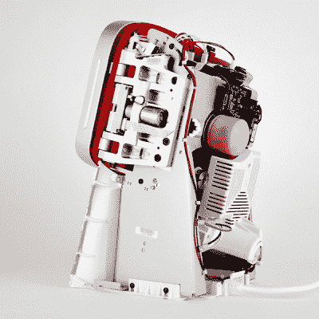

# Juicero:关于何时减少工程的教训

> 原文：<https://hackaday.com/2017/04/26/juicero-a-lesson-on-when-to-engineer-less/>

硬件风投公司 Bolt 的产品设计师和创始人本·爱因斯坦(Ben Einstein)最近得到了一台 Juicero 压榨机。这种台式榨汁机只能与装满切碎的水果和蔬菜的专有袋子一起工作，目前在科技媒体上被认为是硅谷已经疯了的证据，在硬件建设方面没有未来，物联网是文明的一种瘟疫。嘿，至少他们最后一个是对的。

[这款 iFixit 风格的拆卸工具](https://blog.bolt.io/heres-why-juicero-s-press-is-so-expensive-6add74594e50)深入挖掘了 Juicero 搅拌机所有血淋淋的细节。它很漂亮，是技术的奇迹，考虑到这台机器的工程设计，它注定会失败。不是因为它没有完成手头的任务，而是因为它用一种看起来令人愉快但对生产成本具有毁灭性的过度工程水平来完成任务。

## 也许不仅仅是工程问题…

在谷歌新闻中输入“Juicero ”,你会看到硅谷本月发生了翻天覆地的变化。硬件创业公司的未来现在成了问题。Juicero 是世界上第一个冷榨果汁系统，现在正处于困境。这家筹集了 1 亿美元资金的公司现在正被拿来与 Theranos、优步、安然以及最近记忆中的所有其他公司相比较。Juicero 的创造者，曾经比史蒂夫·乔布斯更受欢迎，现在正在利用每一个可用的渠道进行损害控制。

也许，仅仅是也许，用一台机器将预先包装好的水果和蔬菜挤压成果汁的想法并不是一个好主意。这台机器最初价值 700 美元，果汁包是通过订阅模式购买的，每周 35 美元。只需 2500 美元，你就可以拥有一整年想要的新鲜榨果汁。也许消费者不喜欢在他们的食物中使用数字版权管理。正如 1 亿美元的资金所显示的那样，Juicero 对其创造者来说是一个巨大的成功。对于我们其他人来说，我们留下了一个奇妙的教训，告诉我们什么时候应该少设计，而不是多设计。

## 看看就知道了！

抛开围绕一台使用专有 DRM 包装的 700 美元果汁机的疯狂，任何人每年都会在果汁上花费 2000 美元的想法，以及制造果汁的机器是整个经济的领头羊的概念，这个小小的 kerfluffle 确实产生了一件不可思议的事情。我们可以看到从未在单一产品中出现过的设计选择。

本的拆卸包括巨大的塑料外壳，以及将该产品推向市场所需的八次模具修改。如果你不熟悉注塑成型，它是昂贵的，你真的，真的想尽量减少多少模具修改进入你的第一个产品。最好的设计师可以通过两三次修改来完成一个模具。它花了 Juicero 八，可能超过 100 万美元。

拆卸继续到电源，这是一项大规模的定制工作，将墙上的电源转换为 330V DC 用于电机，3.3，5 和 12V 用于设备的大脑。该装置的“传动装置”由至少五个加工硬化的齿轮组成。我们的老朋友会告诉你，机加工齿轮在最好的 prosumer 级 DEWALT 或 Milwaukee 工具中很少见——它们通常配有更便宜的烧结金属齿轮。从各方面来看，果汁饮料是一种过量的运动。

Juicero 是一台过度建造、过度工程化的机器，而且制造这种机器的成本过高，超出了真正想要台式榨汁机的人的市场需求。虽然 Juicero 可以对这种设计进行更多的修改，用冲压钢取代昂贵的机械零件，并简化一切，但即使这样也不够。Juicero 的设计有一个致命的缺陷:它会一次性压缩整个果汁包。那是 64 平方英寸的水果和蔬菜果肉，必须一次全部压缩。在一篇肯定会入选明年普利策提名的文章中，[彭博发现你可以简单地挤压这些果汁袋](https://www.bloomberg.com/news/features/2017-04-19/silicon-valley-s-400-juicer-may-be-feeling-the-squeeze)。Juicero 不仅仅是过度设计。你可以用一个更简单的机械装置通过滚筒挤压这个袋子来得到同样多的果汁。

有一种说法是，任何白痴都可以建造一座可以承载负荷的桥梁，但只有工程师才能建造一座*勉强*承载负荷的桥梁。这是一个可取的特点；一座可以承载任何负荷的桥梁也会带来天文数字的成本。根据市场调查确定的价格点进行设计是一项工程，而 Juicero 是近年来这类工程中最引人注目的失败。当然，Juicero 对*食品*进行了数字版权管理也于事无补，但 K-cups 的成功告诉我，这可能不是很多消费者优先考虑的事情。